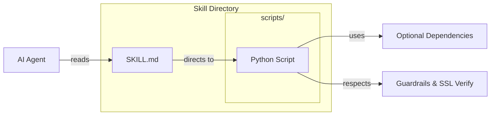

# AGENTS.md

## ⭐ The Atomicity Edict — every skill is atomic; a skill-workflow is only a grouping (READ FIRST)

This is the governing rule of this repository. Every other convention below is an
application of it.

- **Every skill is ATOMIC.** A skill has exactly **one purpose, one trigger surface,
  one primary capability**. Its `SKILL.md` body describes that single capability and
  nothing more. An atomic skill **must not** contain a multi-step orchestration — no
  numbered `### Step N:` sequence, no `depends_on`, no "first do A, then B, then C"
  pipeline. If a capability needs ordered/parallel stages, it is **not a skill — it is
  a skill-workflow.**

- **A skill-workflow is PURELY the grouping of atomic skills.** It lives in
  `universal_skills/workflows/<domain>/<name>/` and is a topological DAG whose every
  step **references an existing atomic skill** (or a single MCP tool) by name, declares
  its `depends_on`, and carries **no inline business logic of its own**. The workflow
  decides *ordering and composition*; the atomic skills it names do the *work*.

- **Claude-compatible is mandatory** (for both skills and workflows). Each is a
  `SKILL.md` directory with valid frontmatter — `name` kebab-case **== directory
  name**; `description` ≤ 1024 chars, trigger-oriented, and **self-sufficient without
  the body** (agents route on the description alone). It must install cleanly to
  `~/.claude/skills/` via `skill-installer`.

- **Skill-workflows are dual-mode: one DAG, two executors.** The `depends_on` DAG (+
  `references/team.yaml`) is the single source of truth. From it, a workflow's
  `SKILL.md` body MUST also render a **Claude-executable layer** — an `## Execution`
  section stating, per step, what runs **in parallel** vs **after** (so an agent with
  no DAG engine executes it via its own parallel tool-calls / subagents, invoking the
  named atomic skills in dependency order) — and end with the standard **delegation
  footer**:

  > **Execution:** If graph-os is reachable, offload the whole DAG via
  > `graph_orchestrate action=execute_workflow` (or the `kg-delegation-router` skill)
  > for true parallel/swarm execution. Otherwise execute the steps natively in
  > dependency order: run steps with no unmet `depends_on` in parallel, then their
  > dependents.

  The machine layer (frontmatter DAG + `team.yaml`) drives the agent-utilities graph-os
  orchestrator unchanged; the rendered `## Execution` layer is what lets Claude (or any
  agent) run the *same* workflow natively. `scripts/check_atomicity.py` enforces both.

- **Enforcement.** `python scripts/check_atomicity.py` is a pre-commit/CI gate: it
  **fails** on an atomic skill that hides a multi-step DAG, and validates that
  workflows carry the dual-mode layers and reference resolvable atomic skills. Author
  new skills with `skill-builder` (atomic) and new workflows with
  `skill-workflow-builder` (which scaffolds both layers).

## Tech Stack & Architecture
- **Language**: Python 3.10+
- **Architecture**: A modular library of "Universal Skills". Each skill is a self-contained directory containing instructions (`SKILL.md`) and implementation scripts (`scripts/`).
- **Discovery**: Skills are discovered and managed via `universal_skills.skill_utilities`.
- **Key Principles**:
    - **Self-Documenting**: `SKILL.md` provides everything an agent needs to know to use the skill.
    - **Guardrailed**: Strict `ImportError` handling for optional dependencies.
    - **Configurable**: Skills can be toggled via environment variables (e.g., `SKILL_NAME_ENABLE=False`).

## Skill Architecture Diagram


## Commands (run these exactly)
# Installation
pip install -e "."
pip install -e ".[all]"
pip install -e ".[skill-name]"

# Development
ruff check --fix .
ruff format .

## Project Structure Quick Reference
- `universal_skills/skills/` → The core repository of skills. Each subdirectory is a unique skill.
- `universal_skills/skill_utilities.py` → Logic for discovering skill paths and checking ENABLE/DISABLE flags.
- `pyproject.toml` → Defines optional dependencies for every individual skill.

## File Tree (Top Level)
```text
.
├── universal_skills/
│   ├── skills/                # All universal skills
│   │   ├── agent-browser/
│   │   ├── agent-workflows/
│   │   ├── code-enhancer/         # 12-domain code analysis & grading
│   │   ├── systems-manager/
│   │   └── ... (40+ skills)
│   ├── skill_utilities.py     # Utilities for loading skills
│   └── __init__.py
├── tests/                     # Skill validation tests
├── pyproject.toml
└── README.md
```

## Code Style & Conventions
**Always:**
- Include a `SKILL.md` in every new skill directory.
- Ensure any new `SKILL.md` is tracked in `.bumpversion.cfg` to maintain version parity.
- Use the standard `try/except ImportError` guardrail for all external library imports.
- Implement the `--insecure` flag and `SSL_VERIFY` env var check in all network-calling scripts.
- Follow the directory structure: `SKILL.md`, `scripts/`, `resources/` (optional).

**Good example (Skill Script Header):**
```python
try:
    import requests
    from agent_utilities.base_utilities import to_boolean
except ImportError:
    print("Error: Missing required dependencies for the 'skill-name' skill.")
    print("Please install them by running: pip install 'universal-skills[skill-name]'")
    sys.exit(1)
```

## Dos and Don'ts
**Do:**
- Keep scripts focused and CLI-first.
- Use `to_boolean` for environment variable parsing to ensure consistency.
- Add new skill dependencies to `pyproject.toml` under `[project.optional-dependencies]`.

**Don't:**
- Add top-level dependencies to `universal-skills` (it should remain essentially dependency-free at the core).
- Include large binary blobs or secrets in skill resources.

## Safety & Boundaries
**Always do:**
- Verify that scripts exit with non-zero codes on failure.
- Ensure `SKILL.md` contains clear examples and tool definitions.

**Ask first:**
- Creating a new skill that overlaps with an existing one.
- Adding mandatory dependencies to the core package.

**Never do:**
- Disable SSL verification by default in any script.
- Commit code without running the `ruff` linter.

## When Stuck
- Check the `README.md` for a complete list of skills and their enable flags.
- Refer to `skill_utilities.py` to see how paths are computed.
- Review existing skills like `web-search` or `systems-manager` for reference implementations.
```

## ⛔ No Scratch or Temporary Files in Repository

**NEVER write any of the following to this repository:**
- Temporary test scripts (`test_*.py`, `debug_*.py` outside of `tests/`)
- Scratch scripts or experimental one-off files
- Log files (`.log`, `.txt` command output)
- Random text files with command output or debug dumps
- Any file that is NOT production source code, tests in `tests/`, or documentation

**Why:** These files expose private filesystem paths, credentials, and internal infrastructure details when pushed to GitHub publicly.

**Where to put scratch work instead:**
- Use `~/workspace/scratch/` for temporary scripts and experiments
- Use `~/workspace/reports/` for command output and reports
- Keep test scripts in the `tests/` directory following proper pytest conventions

## Working Discipline — think, simplify, stay surgical, verify

These four habits cut the most common LLM coding mistakes. For trivial tasks, use
judgment; the bias here is correctness over speed.

- **Think before coding.** State your assumptions explicitly. If a request has more than
  one reasonable reading, surface the options instead of silently picking one. If a
  simpler approach exists, say so and push back when warranted. When something is
  genuinely unclear, stop and name what's confusing — ask, don't guess.
- **Simplicity first.** Write the minimum code that solves the stated problem — no
  speculative features, no abstraction for single-use code, no configurability that
  wasn't requested, no error handling for impossible states. If you wrote 200 lines and
  it could be 50, rewrite it. (Name code from its purpose, never `wave0`/`phase2`/`v2`.)
- **Stay surgical.** Every changed line should trace directly to the task. Don't refactor,
  reformat, or "improve" working code adjacent to your change; match the existing style
  even where you'd do it differently. Remove only the imports/symbols your own change
  orphaned; if you spot unrelated dead code, mention it rather than deleting it inline.
  *Exception — the Quality Bar below:* lint/format/type errors the pre-commit gate flags
  get fixed regardless of who introduced them. In short: **surgical on behavior, clean on
  lint.**
- **Verify against a goal.** Turn the task into a checkable outcome before you start:
  "fix the bug" → "write a failing test that reproduces it, then make it pass"; "add
  validation" → "tests for the invalid inputs pass". For multi-step work, state the short
  plan and the check for each step, then loop until the checks pass.

## Quality Bar — Leave the Codebase Clean (REQUIRED)

After completing any code change, run the project's pre-commit suite and drive it
**fully green** before committing:

```bash
pre-commit run --all-files
```

Resolve **every** issue it reports — failures, lint errors, type errors, and
warnings — **including problems that pre-date your change and were not caused by
your edits**. The standing goal is a clean, working codebase with **no errors and
no warnings**. Do not silence checks (`# noqa`, `# type: ignore`, `SKIP=`,
`--no-verify`) to force green unless the exception is already documented in this
file as a known, unavoidable limitation. Only commit once `pre-commit run
--all-files` passes cleanly; if a check legitimately cannot pass, stop and explain
why rather than bypassing it.

## Working with Git Worktrees (multi-session)

Multiple agents/sessions work the `agent-packages/*` repos concurrently. **Do not
edit the canonical checkout** (`/home/apps/workspace/agent-packages/<repo>`) — a
background `repository-manager` sync can reset its working tree and discard
uncommitted edits. Take your own git worktree on your own branch instead:

```bash
# preferred — repository-manager MCP:
rm_worktree add <repo> <your-branch>      # -> /home/apps/worktrees/<repo>/<your-branch>

# raw-git fallback:
git -C agent-packages/<repo> checkout main
git -C agent-packages/<repo> worktree add /home/apps/worktrees/<repo>/<branch> -b <branch>
```

Work in the worktree and **commit often** (commits survive a working-tree reset).
Each session must use a **distinct branch** — git allows a branch in only one
worktree, which is what keeps concurrent sessions from colliding. Worktrees live
under `/home/apps/worktrees/` (outside the workspace scan, so the sync leaves them
alone).

**Finishing work in a worktree** — run this sequence before calling it done:
1. **Pre-commit green** — `pre-commit run --all-files`; resolve every issue per the
   Quality Bar above (including pre-existing), no `--no-verify`.
2. **Commit** in the worktree.
3. **Merge to main locally** — `rm_worktree merge <repo> <branch> --into main`
   (or `git merge --no-ff`). Push only when the user asks.
4. **Clean up** — remove the worktree and delete the merged branch:
   `rm_worktree remove <repo> <branch> --delete-branch`; `rm_worktree prune` clears
   stale entries. (Raw-git: `git worktree remove <path> && git branch -d <branch>`.)
