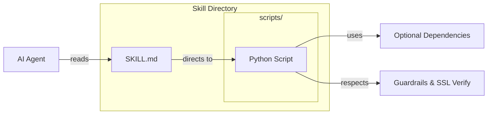

# AGENTS.md

## Tech Stack & Architecture
- **Language**: Python 3.10+
- **Architecture**: A modular library of "Universal Skills". Each skill is a self-contained directory containing instructions (`SKILL.md`) and implementation scripts (`scripts/`).
- **Discovery**: Skills are discovered and managed via `universal_skills.skill_utilities`.
- **Key Principles**:
    - **Self-Documenting**: `SKILL.md` provides everything an agent needs to know to use the skill.
    - **Guardrailed**: Strict `ImportError` handling for optional dependencies.
    - **Configurable**: Skills can be toggled via environment variables (e.g., `SKILL_NAME_ENABLE=False`).

## Skill Architecture Diagram


## Commands (run these exactly)
# Installation
pip install -e "."
pip install -e ".[all]"
pip install -e ".[skill-name]"

# Development
ruff check --fix .
ruff format .

## Project Structure Quick Reference
- `universal_skills/skills/` → The core repository of skills. Each subdirectory is a unique skill.
- `universal_skills/skill_utilities.py` → Logic for discovering skill paths and checking ENABLE/DISABLE flags.
- `pyproject.toml` → Defines optional dependencies for every individual skill.

## File Tree (Top Level)
```text
.
├── universal_skills/
│   ├── skills/                # All universal skills
│   │   ├── agent-browser/
│   │   ├── agent-workflows/
│   │   ├── code-enhancer/         # 12-domain code analysis & grading
│   │   ├── systems-manager/
│   │   └── ... (40+ skills)
│   ├── skill_utilities.py     # Utilities for loading skills
│   └── __init__.py
├── tests/                     # Skill validation tests
├── pyproject.toml
└── README.md
```

## Code Style & Conventions
**Always:**
- Include a `SKILL.md` in every new skill directory.
- Ensure any new `SKILL.md` is tracked in `.bumpversion.cfg` to maintain version parity.
- Use the standard `try/except ImportError` guardrail for all external library imports.
- Implement the `--insecure` flag and `SSL_VERIFY` env var check in all network-calling scripts.
- Follow the directory structure: `SKILL.md`, `scripts/`, `resources/` (optional).

**Good example (Skill Script Header):**
```python
try:
    import requests
    from agent_utilities.base_utilities import to_boolean
except ImportError:
    print("Error: Missing required dependencies for the 'skill-name' skill.")
    print("Please install them by running: pip install 'universal-skills[skill-name]'")
    sys.exit(1)
```

## Dos and Don'ts
**Do:**
- Keep scripts focused and CLI-first.
- Use `to_boolean` for environment variable parsing to ensure consistency.
- Add new skill dependencies to `pyproject.toml` under `[project.optional-dependencies]`.

**Don't:**
- Add top-level dependencies to `universal-skills` (it should remain essentially dependency-free at the core).
- Include large binary blobs or secrets in skill resources.

## Safety & Boundaries
**Always do:**
- Verify that scripts exit with non-zero codes on failure.
- Ensure `SKILL.md` contains clear examples and tool definitions.

**Ask first:**
- Creating a new skill that overlaps with an existing one.
- Adding mandatory dependencies to the core package.

**Never do:**
- Disable SSL verification by default in any script.
- Commit code without running the `ruff` linter.

## When Stuck
- Check the `README.md` for a complete list of skills and their enable flags.
- Refer to `skill_utilities.py` to see how paths are computed.
- Review existing skills like `web-search` or `systems-manager` for reference implementations.
```

## ⛔ No Scratch or Temporary Files in Repository

**NEVER write any of the following to this repository:**
- Temporary test scripts (`test_*.py`, `debug_*.py` outside of `tests/`)
- Scratch scripts or experimental one-off files
- Log files (`.log`, `.txt` command output)
- Random text files with command output or debug dumps
- Any file that is NOT production source code, tests in `tests/`, or documentation

**Why:** These files expose private filesystem paths, credentials, and internal infrastructure details when pushed to GitHub publicly.

**Where to put scratch work instead:**
- Use `~/workspace/scratch/` for temporary scripts and experiments
- Use `~/workspace/reports/` for command output and reports
- Keep test scripts in the `tests/` directory following proper pytest conventions

## Working with Git Worktrees (multi-session)

Multiple agents/sessions work the `agent-packages/*` repos concurrently. **Do not
edit the canonical checkout** (`/home/apps/workspace/agent-packages/<repo>`) — a
background `repository-manager` sync can reset its working tree and discard
uncommitted edits. Take your own git worktree on your own branch instead:

```bash
# preferred — repository-manager MCP:
rm_worktree add <repo> <your-branch>      # -> /home/apps/worktrees/<repo>/<your-branch>

# raw-git fallback:
git -C agent-packages/<repo> checkout main
git -C agent-packages/<repo> worktree add /home/apps/worktrees/<repo>/<branch> -b <branch>
```

Work in the worktree, **commit often** (commits survive a working-tree reset),
then merge to main locally (`rm_worktree merge <repo> <branch>`, or `git merge
--no-ff`). Each session must use a **distinct branch** — git allows a branch in
only one worktree, which is what keeps concurrent sessions from colliding.
Worktrees live under `/home/apps/worktrees/` (outside the workspace scan, so the
sync leaves them alone). Push only when asked.
