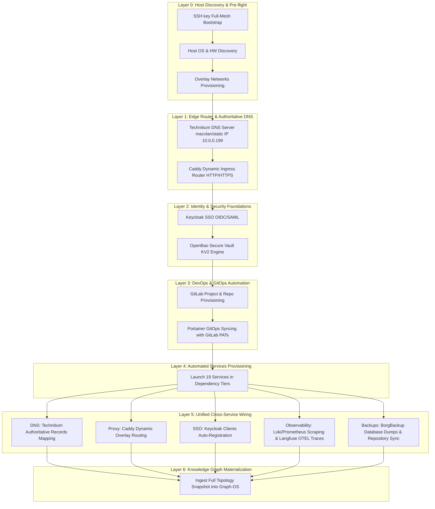

# universal-skills — Concept Overview

> **Category**: Skills | **Ecosystem Role**: MCP Server + A2A Agent
> Built on [`agent-utilities`](https://github.com/Knuckles-Team/agent-utilities) — the unified AGI Harness.

## Description

Universal skill library providing cross-cutting agent capabilities.

## Enterprise Readiness

All agents in the ecosystem inherit enterprise-grade infrastructure from `agent-utilities`:

| Feature | Status | Source |
|:--------|:-------|:-------|
| **JWT/OIDC Authentication** | ✅ Built-in | `agent-utilities[auth]` — Authlib JWKS + API key middleware |
| **OpenTelemetry Instrumentation** | ✅ Built-in | `agent-utilities[logfire]` — OTLP export, FastAPI auto-instrumentation |
| **HashiCorp Vault Integration** | ✅ Built-in | `agent-utilities[vault]` — `secret://`, `env://`, `vault://` URI schemes |
| **Audit Logging** | ✅ Built-in | Append-only compliance trail with 30+ action types (CONCEPT:OS-5.4) |
| **Token Usage Analytics** | ✅ Built-in | 4-bucket tracking with budget alerting (CONCEPT:OS-5.4) |
| **Prompt Injection Defense** | ✅ Built-in | 25+ pattern scanner + jailbreak taxonomy (CONCEPT:OS-5.1) |
| **Guardrail Engine** | ✅ Built-in | Input/output interception with block/redact/warn (CONCEPT:OS-5.3) |
| **Action Execution Pipeline** | ✅ Built-in | Token, cost, duration, and node transition limits Dry-run / commit / rollback phases (CONCEPT:ORCH-1.4) |
| **Resource Scheduling** | ✅ Built-in | Priority queuing + preemption limits (CONCEPT:OS-5.2) |
| **Session Concurrency** | ✅ Built-in | Enqueue/reject/interrupt/rollback (CONCEPT:OS-5.3) |

## Concept Registry

This project implements or inherits the following ecosystem concepts:

| Concept ID | Description | Source |
|:-----------|:------------|:-------|
| AHE-3.4 | Distributed Agentic Evolution | `agent-utilities` (inherited) |
| ECO-4.1 | MCP & Universal Skills | `agent-utilities` (inherited) |
| ECO-4.8 | **Dynamic Skill Evolution** | `agent-utilities` (inherited) |

> 📖 **Full Registry**: See [`agent-utilities/docs/overview.md`](https://github.com/Knuckles-Team/agent-utilities/blob/main/docs/overview.md) for the complete 5-Pillar concept index.

## Architecture

This project follows the standardized agent-package pattern:

```
universal-skills/
├── universal_skills/        # Source code
│   ├── __init__.py
│   ├── agent_server.py      # Entry point (create_graph_agent_server)
│   ├── api_client.py        # REST/GraphQL API wrapper
│   └── mcp_server.py        # FastMCP tool definitions
├── tests/                   # Test suite
├── docs/                    # Documentation
├── pyproject.toml           # Package metadata
├── mcp_config.json          # MCP server configuration
├── main_agent.json          # Agent identity & system prompt
└── Dockerfile               # Container deployment
```

## MCP Configuration

### stdio Mode
```json
{
  "mcpServers": {
    "universal-skills": {
      "command": "uv",
      "args": ["run", "--with", "universal-skills", "universal-mcp"],
      "env": {}
    }
  }
}
```

### Streamable HTTP Mode
```bash
universal-mcp --transport streamable-http --port 8001
```

## Day 0 Bootstrap & Multi-Service Wiring Orchestrator

The package includes a comprehensive, graph-driven **Day 0 Bootstrap & Multi-Service Wiring Orchestrator** workflow. It maps the automated top-down provisioning and configuration of all **19 homelab services** starting from a single bare-metal server:


