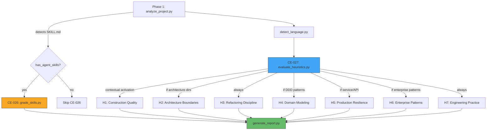

# Engineering Heuristics Reference (CE-027)

Unified heuristic framework synthesized from 13 industry-standard software
engineering books.  Each heuristic category maps book-level decision rules to
concrete, measurable code checks.

## Contextual Activation

Not all heuristics apply to every project.  Categories activate based on
detected project characteristics:

| Category | Activated When | Default Weight |
|----------|---------------|----------------|
| H1: Construction Quality | Always | 20% |
| H2: Architecture Boundaries | >5 modules or architecture dirs detected | 15% |
| H3: Refactoring Discipline | Always | 10% |
| H4: Domain Modeling | DDD patterns detected | 10% |
| H5: Production Resilience | Service/API deps detected | 15% |
| H6: Enterprise Patterns | Repository/service/handler dirs detected | 10% |
| H7: Engineering Practice | Always | 20% |

Active category weights are **normalized to 100%** so the domain score
reflects only what is relevant to the project.

---

## H1: Construction Quality

**Sources**: Clean Code (Martin), Code Complete (McConnell)

### Decision Rules (synthesized)

- Functions should be small (≤50 lines), focused, and at one level of
  abstraction.
- Parameters should be few (≤5) and meaningful — avoid flag arguments and
  grab-bag lists.
- Keep nesting depth shallow (≤4) — prefer early returns and extraction.
- Separate setup, validation, computation, and side effects when they are
  different concerns.
- Choose clarity and explicitness over clever compactness.
- Validate inputs at trust boundaries; use assertions for programmer
  assumptions.

### Automated Checks

| Check | Threshold A | Threshold F | Deduction |
|-------|------------|------------|-----------|
| Avg function length | <20 lines | ≥75 lines | -10 to -20 |
| Functions >50 lines | <5% | >20% | -5 to -20 |
| Functions >5 params | 0% | ≥20% | up to -15 |
| Max nesting depth >4 | 0 funcs | >5 funcs | -3 per func |

---

## H2: Architecture Boundaries

**Sources**: Clean Architecture (Martin), A Philosophy of Software Design
(Ousterhout)

### Decision Rules (synthesized)

- **Dependency rule**: source dependencies point toward policy, never toward
  frameworks or delivery mechanisms.
- **Deep modules**: a small interface hiding meaningful complexity beats extra
  pass-through layers.
- Domain must stay pure — no HTTP objects, ORM models, or vendor payloads in
  core business logic.
- Prefer feature-oriented directory structure over layer-oriented buckets.
- Pull complexity downward — the layer owning the detail should absorb it.

### Automated Checks

| Check | What | Deduction |
|-------|------|-----------|
| Domain→infrastructure imports | Dependency rule violations | -5 to -25 |
| Layer-oriented top-level dirs | controllers/services/repos at root | -10 |
| Public-to-private interface ratio | Module depth metric | -5 to -15 |

---

## H3: Refactoring Discipline

**Sources**: Refactoring (Fowler), Working Effectively with Legacy Code
(Feathers)

### Decision Rules (synthesized)

- Get a safety net (tests, types, assertions) before structural changes.
- Refactor the smell blocking the current change — not everything in sight.
- Prefer small, verifiable steps over dramatic rewrites.
- When behavior is uncertain, characterize before editing.
- Keep refactoring separate from behavior changes when practical.

### Automated Checks

| Check | What | Deduction |
|-------|------|-----------|
| Tests directory exists | Safety net presence | -30 if missing |
| Pre-commit config | Verification pipeline | -10 if missing |
| Type hint coverage | Assumption explicitness | -5 to -15 |

---

## H4: Domain Modeling

**Sources**: Domain-Driven Design (Evans), DDD Distilled (Vernon),
Implementing DDD (Vernon)

### Decision Rules (synthesized)

- Apply rich modeling only where business complexity justifies it.
- One ubiquitous language per bounded context — let it drive code names.
- Keep aggregates small, built around true invariants.
- Domain logic lives in the domain layer, not in services.
- Stay practical: simple domains get simple patterns.

### Automated Checks

| Check | What | Deduction |
|-------|------|-----------|
| Aggregate directory size | >10 files = too large | -10 |
| Business logic in services | Validation/compute in service layer | -10 |

---

## H5: Production Resilience

**Sources**: Release It! (Nygard), Designing Data-Intensive Applications
(Kleppmann)

### Decision Rules (synthesized)

- Every external call gets a timeout by default.
- Retry only when safe under duplication; bound with backoff/jitter.
- Isolate failure with circuit breakers and bulkheads.
- Make consistency boundaries explicit — don't rely on wishful exactly-once.
- Make logs, metrics, and traces sufficient for stress diagnosis.

### Automated Checks

| Check | What | Deduction |
|-------|------|-----------|
| HTTP timeout coverage | `timeout=` on requests/httpx calls | -10 to -20 |
| Retry/backoff patterns | tenacity/backoff usage | -15 if missing |
| Circuit breaker presence | pybreaker/custom pattern | -10 if missing |

---

## H6: Enterprise Patterns

**Sources**: Patterns of Enterprise Application Architecture (Fowler)

### Decision Rules (synthesized)

- Choose business-logic pattern deliberately (transaction script vs domain
  model).
- Service layer coordinates, doesn't compute.
- Make transaction boundaries and lock strategies explicit.
- Remote boundaries should be coarse-grained and intentional.

### Automated Checks

| Check | What | Deduction |
|-------|------|-----------|
| Transaction boundaries | `transaction`/`commit`/`atomic` usage | -10 if missing |
| Service file size | >300 lines = fat service | -10 |

---

## H7: Engineering Practice

**Sources**: The Pragmatic Programmer (Hunt, Thomas)

### Decision Rules (synthesized)

- DRY means one authoritative source of knowledge — don't duplicate business
  rules across layers.
- Automate repetitive work: CI, pre-commit, Makefile/justfile.
- Shorten feedback loops — cheap early failures over late expensive surprises.
- Apply the broken windows rule: leave touched code slightly better.
- Own the result — surface trade-offs instead of hiding behind defaults.

### Automated Checks

| Check | What | Deduction |
|-------|------|-----------|
| CI + pre-commit + Makefile | Automation coverage (0-3) | -10 to -20 |
| Near-duplicate file clusters | DRY violation signal | -10 |
| TODO/FIXME/HACK density | Broken windows count | -5 to -10 |

---

## Attribution

Heuristics synthesized from rule sets in the
[agent-rules-books](https://github.com/maciej-ciemborowicz/agent-rules-books)
project by Maciej Ciemborowicz (MIT License).  The mini variants of all 13
books were used as source material.  Rules are not copied verbatim — they are
distilled into measurable automated checks for the code-enhancer pipeline.

## Architecture Flow

