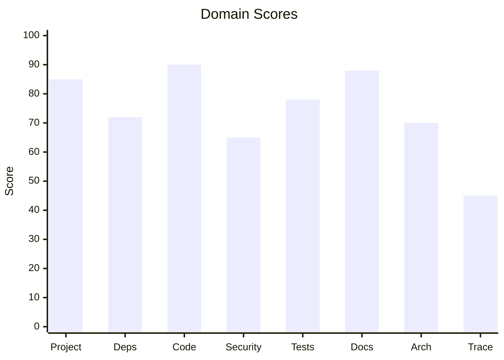
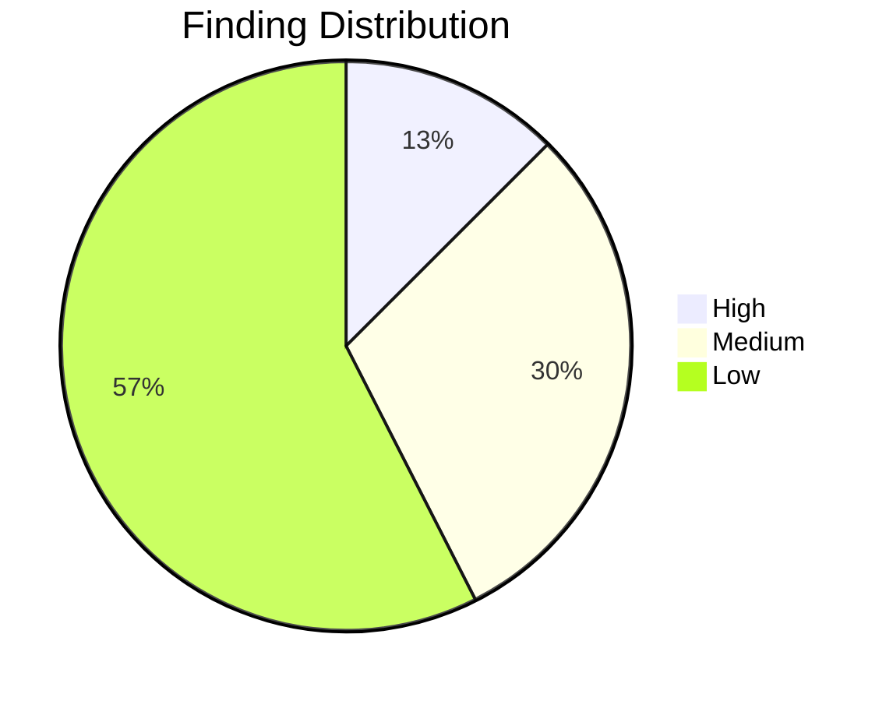

# Report Template Reference

Templates and patterns for the code-enhancer report output.

## Mermaid Chart Templates

### Bar Chart (Domain Scores)


### Pie Chart (Finding Distribution)


## Table Patterns

### Traffic Light Table
```markdown
| Domain | Grade | Score | Status |
|--------|-------|-------|--------|
| Security | 🔴 F | 45/100 | `█████████░░░░░░░░░░░` 45/100 |
| Tests | 🟡 C | 72/100 | `██████████████░░░░░░` 72/100 |
| Project | 🟢 A | 95/100 | `███████████████████░` 95/100 |
```

### Score Bar
```
`████████████████░░░░` 80/100
```

## GitHub Alert Patterns

```markdown
> [!TIP]
> Grade A — Excellent. No action needed.

> [!NOTE]
> Grade B/C — Review findings and prioritize improvements.

> [!WARNING]
> Grade D — Significant issues. Address before next release.

> [!CAUTION]
> Grade F — Critical problems. Immediate action required.
```

## Badge Templates

```markdown


```

## Report Structure

```markdown
# 🔬 Code Enhancement Report
> Generated: {timestamp} | Target: {project} | Overall GPA: {gpa}/4.0

## 📊 Executive Summary
{mermaid_chart}
{traffic_light_table}

## 📋 Domain Scorecards
### {Domain} — {emoji} Grade: {grade} ({score}/100)
{score_bar}
> [!{alert}]
> {summary}
| Criterion | Points | Evidence | Reasoning |
...

## 🎯 Prioritized Action Items
| # | Priority | Domain | Action | Impact | Risk |
...

## 🔄 SDD Handoff
Link to .specify/specs/ output.
```
