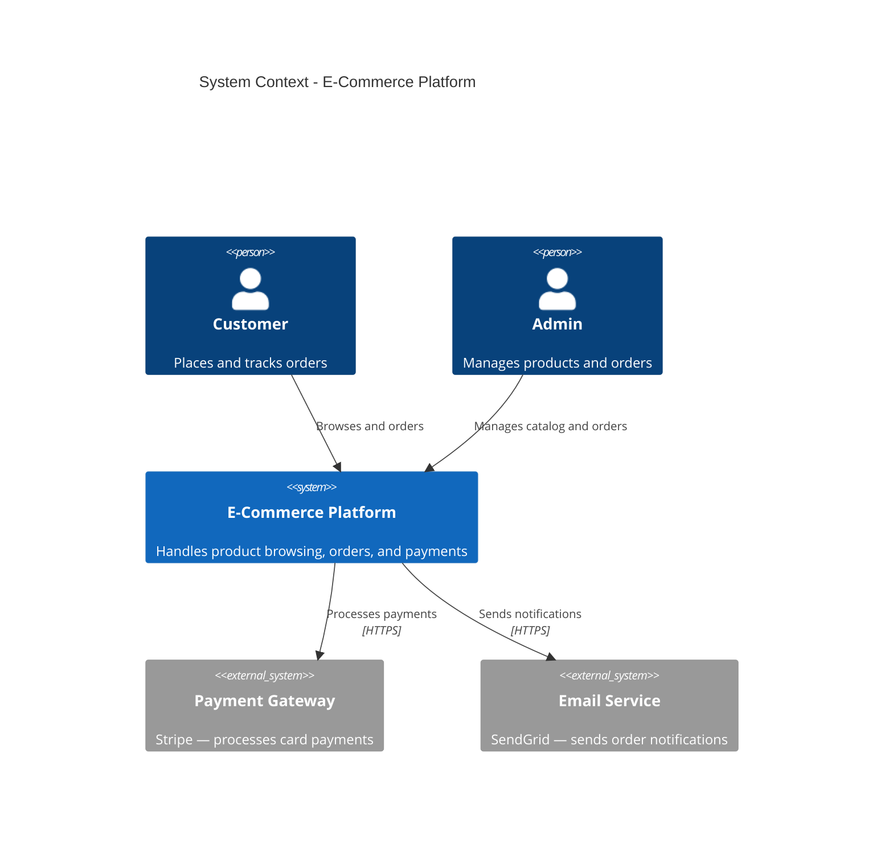
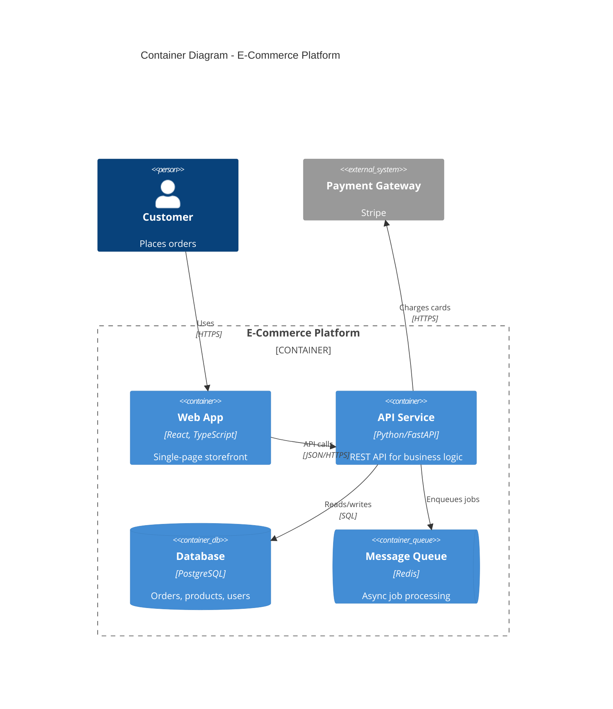
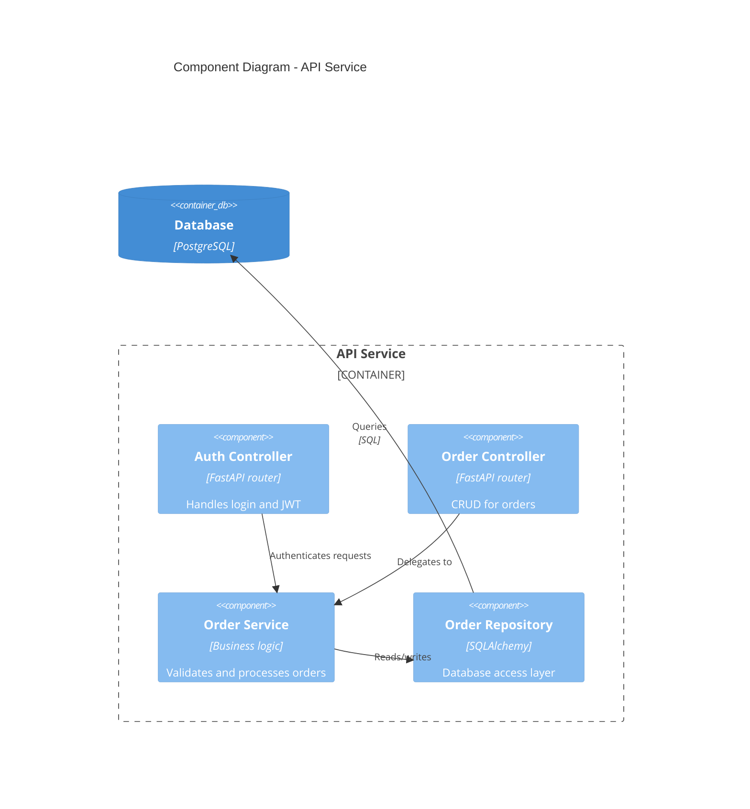
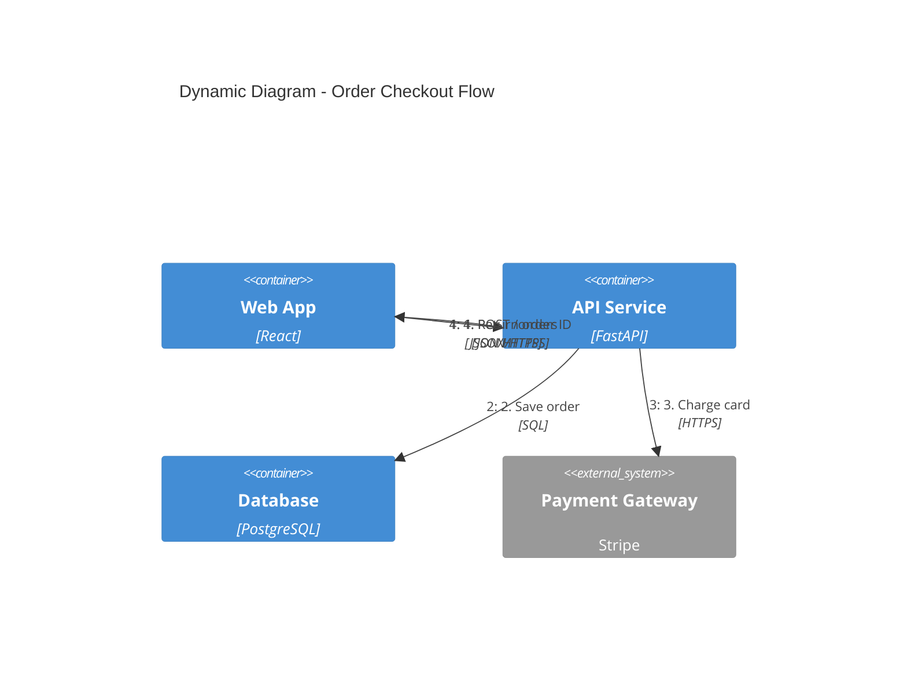
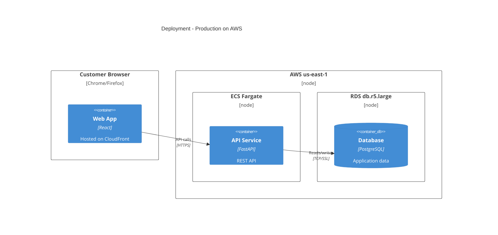

# C4 Architecture Documentation

This skill covers two complementary jobs. Pick by what the user is asking:

- **Model** the architecture → C4 diagrams (the rest of this file). Use when the
  ask is to *document / visualize / diagram* a system.
- **Decide** the architecture → see **[Architecture Decisions](#architecture-decisions)**
  at the bottom. Use when the ask is a forward-looking *"should we split / merge /
  extract this?"*, a saga/consistency-model choice, or an ADR — questions about the
  *structure* of the system, not how to draw it.

Generate software architecture documentation using the C4 model. C4 describes architecture at four zoom levels: Context → Container → Component → Code (deployment). Use Mermaid syntax for all diagrams.

---

## KG-Backed Extraction (Source of Truth)

To ensure 100% accuracy, you MUST build your C4 diagrams using real data from the Knowledge Graph rather than relying solely on static analysis.

1. **Query the Graph**: Use the `kg_query` or `kg_pillar_view` tools from the `agent-utilities-kg` MCP server to extract the actual component nodes, container boundaries, and `DEPENDS_ON` relationships.
2. **Translate to Mermaid**: Map the returned graph topology directly into the C4 Mermaid syntax. This guarantees the diagram perfectly reflects the real, running system architecture.

---

## C4 Diagram Levels

Select the appropriate level based on the audience and documentation need:

| Level | Diagram Type | Audience | Shows | When to Create |
|-------|-------------|----------|-------|----------------|
| 1 | **C4Context** | Everyone | System + external actors | Always (required) |
| 2 | **C4Container** | Technical | Apps, databases, services | Always (required) |
| 3 | **C4Component** | Developers | Internal components | Only when it adds value |
| 4 | **C4Deployment** | DevOps | Infrastructure nodes | For production systems |
| - | **C4Dynamic** | Technical | Request flows (numbered) | For complex workflows |

> [!TIP]
> **Context + Container diagrams are sufficient for most software development teams.** Only create Component/Code diagrams when they genuinely add value.

---

## Quick Start Examples

### Level 1: System Context



### Level 2: Container Diagram



### Level 3: Component Diagram



### Dynamic Diagram (Request Flow)



### Deployment Diagram



---

## Element Syntax

### People and Systems

```
Person(alias, "Label", "Description")
Person_Ext(alias, "Label", "Description")       # External person
System(alias, "Label", "Description")
System_Ext(alias, "Label", "Description")       # External system
SystemDb(alias, "Label", "Description")         # Database system
SystemQueue(alias, "Label", "Description")      # Queue system
```

### Containers

```
Container(alias, "Label", "Technology", "Description")
Container_Ext(alias, "Label", "Technology", "Description")
ContainerDb(alias, "Label", "Technology", "Description")
ContainerQueue(alias, "Label", "Technology", "Description")
```

### Components

```
Component(alias, "Label", "Technology", "Description")
Component_Ext(alias, "Label", "Technology", "Description")
ComponentDb(alias, "Label", "Technology", "Description")
```

### Boundaries

```
Enterprise_Boundary(alias, "Label") { ... }
System_Boundary(alias, "Label") { ... }
Container_Boundary(alias, "Label") { ... }
```

### Relationships

```
Rel(from, to, "Label")
Rel(from, to, "Label", "Technology")
BiRel(from, to, "Label")                        # Bidirectional
Rel_U(from, to, "Label")                        # Upward
Rel_D(from, to, "Label")                        # Downward
Rel_L(from, to, "Label")                        # Leftward
Rel_R(from, to, "Label")                        # Rightward
```

### Styling and Layout

```
UpdateLayoutConfig($c4ShapeInRow="3", $c4BoundaryInRow="1")
UpdateElementStyle(alias, $fontColor="red", $bgColor="grey", $borderColor="red")
UpdateRelStyle(from, to, $textColor="blue", $lineColor="blue", $offsetX="5", $offsetY="-10")
```

---

## Best Practices

1. **Every element must have** — name, technology (where applicable), and description
2. **Use unidirectional arrows** — bidirectional arrows create ambiguity; use two arrows if truly bidirectional
3. **Label arrows with action verbs** — "Sends events to", "Reads from", "Authenticates via"
4. **Include technology labels** — "JSON/HTTPS", "SQL", "gRPC"
5. **Stay under 20 elements per diagram** — split complex systems into multiple diagrams
6. **Always include a title** — `title System Context diagram for [System Name]`
7. **Start at Level 1** — context diagrams frame the scope before drilling into containers

### Common Mistakes to Avoid

- Confusing containers (deployable units) with components (non-deployable logical parts)
- Modeling shared libraries as containers
- Showing a message broker (Kafka) as a single box instead of individual topics
- Adding undefined abstraction levels (e.g., "subcomponents")
- Removing type labels to "simplify" — they communicate essential technology context

---

## Output Location

Write architecture documentation to `docs/architecture/` with this naming convention:

- `c4-context.md` — System context diagram
- `c4-containers.md` — Container diagram
- `c4-components-{feature}.md` — Component diagrams per feature
- `c4-deployment.md` — Deployment diagram
- `c4-dynamic-{flow}.md` — Dynamic diagrams for specific flows

---

## Audience-Appropriate Detail

| Audience | Recommended Diagrams |
|----------|---------------------|
| Executives | System Context only |
| Product Managers | Context + Container |
| Architects | Context + Container + key Components |
| Developers | All levels as needed |
| DevOps | Container + Deployment |

---

## Architecture Decisions

For *decision* questions (split/merge/extract, monolith-vs-microservices, saga &
consistency design, ADR drafting) — not diagram requests — reason from canonical
references rather than intuition. Grounded in the **software-architect** skill by
Chris Graffagnino (MIT); the seven distilled sources live under
`references/architecture-decisions/` (see its `ATTRIBUTION.md`).

### The seven references — progressive disclosure

Load the **first two always**; load the rest only when the question touches their
domain (keeps reasoning grounded without overload).

| Reference (`references/architecture-decisions/…`) | Gives you | Load when |
|---|---|---|
| `hohpe-architect-principles.md` | Posture, framing, "map the map" | **Always** |
| `richards-ford-architect-principles.md` | Trade-off method, ADR template, "-ilities" | **Always** |
| `hard-parts-pattern-catalog.md` | Distributed-systems pattern lookup | Patterns at stake |
| `moseley-marks-tar-pit.md` | Essential vs accidental complexity | **Every** design |
| `kleppmann-data-intensive-applications.md` | Consistency, replication, isolation | Data flow involved |
| `evans-vernon-ddd-distilled.md` | Bounded contexts, aggregates | Boundaries at stake |
| `skelton-pais-team-topologies.md` | Conway's Law, fracture planes, cognitive load | Team structure involved |

### Decision workflow

1. **Reframe before answering.** Reject false binaries ("micro vs mono" = design-time
   modularity × runtime modularity). Name the architecture characteristics actually at
   stake. Call out an answer-in-search-of-a-question (a pre-committed tech being
   rationalized).
2. **Name the trade-off dimensions** — for distributed questions, the three coupling
   axes: communication (sync/async), consistency (atomic/eventual), coordination
   (orchestrated/choreographed); plus coupling, complexity, responsiveness, scale.
3. **Walk the four lenses** (load each reference as its lens activates):
   - **Semantic (DDD)** — does the boundary follow the domain / ubiquitous language?
   - **Data (DDIA)** — what consistency model does this *implicitly* require? Name it
     (linearizable / causal / eventual); is "exactly-once" really "effectively-once via
     idempotence"?
   - **Complexity (Tar Pit)** — essential vs accidental state for every cache/projection;
     could it be re-derived? *Applies to every question.*
   - **Org (Team Topologies)** — how many stream-aligned teams does this need? Aligned to
     a real fracture plane? **If team count is unknown, ask before recommending a split.**
4. **Recommend as the least-worst combination of trade-offs**, not "the best." Name the
   conscious trade-offs and **what evidence would flip the decision** (latency > X, team
   count < N). State what you don't know (SLOs, team count, domain framing).

### Mode cheatsheet

- **Review** — Hohpe §10: an architecture is *suitable or not*, not good/bad. Check they
  understood needs and made trade-offs consciously; don't hunt for flaws to justify the review.
- **Decomposition** — is there a real modularity *driver*? Walk disintegrators **and**
  integrators; match the boundary to a DDD context and a team fracture plane.
- **Distributed transaction / consistency** — distributed ACID is rarely affordable; prefer
  event-based eventual consistency + sagas; name the consistency level precisely; inventory
  the accidental state a saga adds (log, compensations, DLQs).
- **Complexity diagnosis** — locate state, locate control, classify essential/accidental,
  apply Avoid + Separate.

### ADR template (offer this as the output artifact)

```
Context       — The problem, in one or two sentences. Alternatives considered.
Decision      — The decision and its detailed justification.
Consequences  — What changes after this; the trade-offs accepted.
                Optionally: the fitness functions that will guard it.
```

Keep ADRs to one or two pages of plain markdown; write to `docs/architecture/adr/`.
