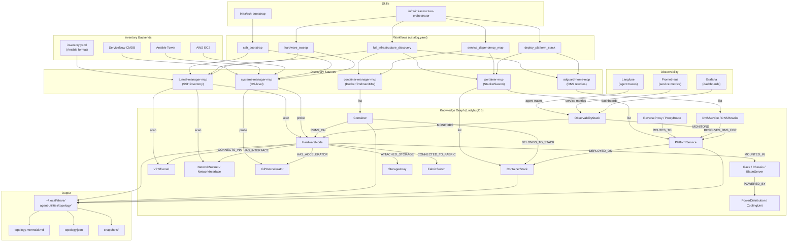

# Infrastructure Orchestrator — Architecture Documentation

## System Overview

The Infrastructure Orchestrator is a native, graph-driven system for discovering,
mapping, and managing homelab and enterprise infrastructure through the agent-utilities
Knowledge Graph.

## Architecture Diagram

## KG Schema Extensions (CONCEPT:OS-5.3)

### New Node Types

| Category | Nodes | BFO Alignment |
|----------|-------|---------------|
| **Compute** | `Container`, `ContainerStack`, `BladeServer`, `GPUAccelerator` | IndependentContinuant, Object |
| **Networking** | `NetworkSubnet`, `NetworkInterface`, `VPNTunnel`, `FabricSwitch` | IndependentContinuant |
| **Routing** | `ReverseProxy`, `ProxyRoute` | IndependentContinuant |
| **DNS** | `DNSService`, `DNSRewrite` | IndependentContinuant |
| **Observability** | `ObservabilityStack`, `MetricsExporter` | IndependentContinuant |
| **Registry** | `ContainerRegistry`, `DDClient` | IndependentContinuant, Process |
| **Enterprise** | `Rack`, `Chassis`, `StorageArray`, `PowerDistribution`, `CoolingUnit` | Object |

### New Edge Types

| Category | Edges |
|----------|-------|
| **Topology** | `RUNS_ON`, `DEPLOYED_ON`, `BELONGS_TO_STACK` |
| **Routing** | `ROUTES_TO`, `RESOLVES_DNS_FOR` |
| **Observability** | `MONITORS`, `EXPORTS_METRICS_TO` |
| **Networking** | `CONNECTS_VIA`, `HAS_INTERFACE`, `MANAGES_DNS_FOR`, `UPDATES_IP_FOR` |
| **Enterprise** | `MOUNTED_IN`, `HAS_ACCELERATOR`, `CONNECTED_TO_FABRIC`, `POWERED_BY`, `COOLED_BY`, `ATTACHED_STORAGE`, `BUILDS_IMAGE_FOR` |

## OWL Ontology

Infrastructure ontology at `ontology_infrastructure.ttl`:
- BFO-aligned class hierarchy
- Vendor-neutral (no brand names in schema)
- Imported by base `ontology.ttl`
- Covers: compute, networking, routing, DNS, observability, data centre

## MCP Service Mapping

| MCP Server | Service Managed | `.arpa` Endpoint |
|---|---|---|
| `portainer-mcp` | Portainer CE | `portainer.arpa` |
| `adguard-home-mcp` | AdGuard Home | `10.0.0.199` |
| `langfuse-mcp` | Langfuse | `langfuse.arpa` |
| `gitlab-mcp` | GitLab CE | `gitlab.arpa` |
| `searxng-mcp` | SearXNG | `searxng.arpa` |
| `stirlingpdf-mcp` | Stirling PDF | `stirlingpdf.arpa` |
| `mealie-mcp` | Mealie | `mealie.arpa` |
| `jellyfin-mcp` | Jellyfin | `jellyfin.arpa` |
| `uptime-kuma-mcp` | Uptime Kuma | `uptime.arpa` |
| `qbittorrent-mcp` | qBittorrent | `qbittorrent.arpa` |
| `home-assistant-mcp` | Home Assistant | `home-assistant.arpa` |
| `nextcloud-mcp` | Nextcloud | `nextcloud.arpa` |
| `plane-mcp` | Plane | `plane.arpa` |
| `postiz-mcp` | Postiz | `postiz.arpa` |
| `owncast-mcp` | Owncast | `owncast.arpa` |
| `wger-mcp` | Wger | `wger.arpa` |
| `archivebox-mcp` | ArchiveBox | `archivebox.arpa` |

## Hardware Inventory

| Host | IP | Role |
|------|------|------|
| `r510` | `10.0.0.10` | Docker Swarm worker |
| `r710` | `10.0.0.11` | Docker Swarm manager |
| `rw710` | `10.0.0.12` | Docker Swarm worker |
| `r820` | `10.0.0.13` | Docker Swarm worker |
| `gb10` | `10.0.0.18` | LLM inference / Docker host |
| `dns_vm` | `10.0.0.199` | DNS server (AdGuard Home) |

## File Locations

| File | Purpose |
|------|---------|
| `agent_utilities/models/schema_definition.py` | KG node/edge schema |
| `agent_utilities/knowledge_graph/ontology.ttl` | Base OWL ontology |
| `agent_utilities/knowledge_graph/ontology_infrastructure.ttl` | Infrastructure OWL module |
| `agent_utilities/workflows/catalog.yaml` | Workflow definitions |
| `~/.config/agent-utilities/inventory.yaml` | Host inventory |
| `~/.config/agent-utilities/mcp_config.json` | MCP server config |
| `~/.local/share/agent-utilities/topology/` | Topology map output |
