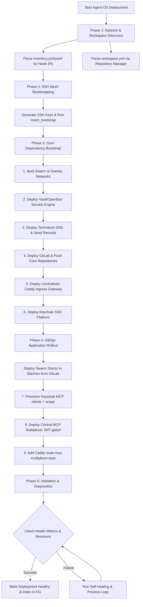

# Agent OS Deployment & Orchestration Skill

The **Agent OS Deployment & Orchestration** skill provides a unified, scale-agnostic framework to bootstrap, recover, migrate, and scale Agent OS across local environments (homelabs) and large-scale enterprise clusters (up to millions of physical/virtual nodes).

This workflow leverages:
- **`tunnel-manager-mcp`** to discover, scan, and establish secure SSH mesh connectivity across all nodes listed in host inventory files.
- **`repository-manager`** and **`workspace.yml`** to detect pre-existing development contexts and Git configuration sources.
- **`portainer-agent`** / **`container-manager-mcp`** to orchestrate Swarm/Kubernetes containers.
- **`technitium-dns-mcp`** and **`caddy-mcp`** to centralize name resolution and secure ingress routing.

---

## Core Capabilities

### 1. Inventory Discovery & Network Scanning
* **Host Parsing**: Automatically scans `inventory.yml` or `inventory.yaml` files (e.g. from XDG config or custom workspace paths) to build an active host topology.
* **Workspace Introspection**: Parses `workspace.yml` using `repository-manager` to establish pre-existing codebase locations and configuration origins.
* **Tunnel Manager Bootstrapping**: Discovers nodes, establishes full-mesh SSH credentials, and tests host reachability concurrently.

### 2. Zero-Dependency Bootstrapping (Enterprise Roadmap)
Orchestrates deployment in a rigorous, dependency-resolved order to handle bootstrapping on raw/empty storage nodes without circular dependencies:
1. **OS Prep & Docker Swarm**: Sets up basic node runtimes and clusters overlay networks.
2. **Root of Trust (Vault/OpenBao)**: Launches secure secret engines to distribute encryption keys.
3. **Core Name Resolution (Technitium DNS)**: Boots authoritative DNS servers to allow name mapping.
4. **Declarative Git Source (GitLab)**: Stands up code/configuration repositories.
5. **Gateway Routing (Caddy Ingress)**: Establishes central reverse proxy mapping.
6. **Local Identity SSO (Keycloak)**: Connects authentication providers to client databases.
7. **GitOps Applications**: Launches applications directly from Git-backed repositories.

### 3. Scaled Ingress & DNS Migration
* **DNS Provider Adapter Layer**: Exports host configuration entries from legacy systems (AdGuard Home, Pi-hole, Bind9, dnsmasq) and maps them cleanly into authoritative Technitium DNS zones.
* **Traffic Centralization**: Decouples services from legacy Traefik tags or direct host port bindings, routing all traffic securely via Caddy reverse proxies on overlay networks.

---

## Architecture Flow



---

## Steps

### Step 1: network-topology-sweep
Discover target inventory hosts, verify SSH connectivity, and scan interface segments, subnets, and VLAN setups across all hardware nodes:
- Requires: `tunnel-manager-mcp`, `systems-manager-mcp`
- Output: Discovered active network interfaces and subnet scopes.

### Step 2: hardware-profile-sweep [depends_on: network-topology-sweep]
Run low-level hardware resource discovery (CPU models, free RAM capacity, disk partitions, and GPU accelerators) across reachable hosts:
- Requires: `systems-manager-mcp`, `tunnel-manager-mcp`
- Output: System resource specifications and GPUAccelerator profiles.

### Step 3: dns-migration-utility [depends_on: network-topology-sweep]
Ingest, clean, and convert legacy resolver configurations (from AdGuard Home, Pi-hole, bind9, etc.) into unified A/CNAME records:
- Requires: `systems-manager-mcp`
- Output: Normalized DNS zone records payload.

### Step 4: dns-record-manager [depends_on: dns-migration-utility]
Register the normalized DNS rewrites as authoritative primary records on Technitium DNS:
- Requires: `technitium-dns-mcp`
- Output: Authoritative zone resolution mappings active.

### Step 5: gitlab-repository-seeder [depends_on: hardware-profile-sweep]
Seed repository configurations, project layouts, and personal access tokens on GitLab CE:
- Requires: `gitlab-mcp`
- Output: Private repos populated with compose stacks and active GitLab PATs.

### Step 6: portainer-sync-agent [depends_on: gitlab-repository-seeder]
Register the GitOps stack configurations on Portainer referencing GitLab PATs for automated pull-updates:
- Requires: `portainer-mcp`
- Output: Active, sync-configured application stacks running on Swarm nodes.

### Step 7: mcp-multiplexer-deployment [depends_on: portainer-sync-agent]
Provision JWT identity and deploy the **central MCP multiplexer** — one
streamable-http aggregator (`mcp-multiplexer.arpa`) that fronts the whole `*-mcp`
fleet, verifies a Keycloak Bearer token at ingress, and (Phase 3) authorizes each
principal via Eunomia. See the **Central MCP Multiplexer** runbook below.
- Requires: `keycloak` reachable, `caddy` ingress live, the `*-mcp` fleet deployed.
- Output: `mcp-multiplexer.arpa` serving, rejecting unauthenticated requests (401),
  accepting `claude-code` client_credentials tokens.

---

## Central MCP Multiplexer (JWT-gated ingress)

The multiplexer is the single MCP endpoint every client connects to instead of each
spawning ~52 child connections. It is **zero-trust**: a request must present a valid
Keycloak JWT (`aud: mcp-fleet`), and the token's `azp`/`client_id` is the principal
Eunomia authorizes. Deploy it **after** Caddy + Keycloak + the `*-mcp` fleet are up.

Files live in `services/mcp-multiplexer/` (`compose.dev.yml` editable-source variant,
`compose.yml` baked-image prod, `.env`, `mcp_config_central.json`, `mint_token.py`) and
`services/keycloak/create_mcp_clients.py`. (Implements the dynamic MCP tool gateway,
agent-utilities concept ECO-4.36.)

### 1. Provision Keycloak identity (machine clients + audience scope)
```bash
KEYCLOAK_ADMIN_PASSWORD=… python services/keycloak/create_mcp_clients.py
```
This is idempotent and creates:
- a **client scope `mcp-fleet`** carrying an *audience protocol mapper* — without it
  Keycloak omits `aud` and FastMCP's `JWTVerifier` rejects every token (the classic
  Keycloak gotcha);
- a confidential **`client_credentials` client `claude-code`** (our own client, 8h
  token lifespan) with that scope as a default scope.

The client secret is written to `services/keycloak/mcp_clients.json` (git-ignored) —
store it in OpenBao and `services/mcp-multiplexer/.env` (`CLAUDE_CODE_CLIENT_SECRET`),
**never** commit it. Verify a minted token carries the audience:
```bash
python services/mcp-multiplexer/mint_token.py | cut -d. -f2 | base64 -d 2>/dev/null
# expect:  "aud":"mcp-fleet"  "iss":".../realms/homelab"  "azp":"claude-code"
```

### 2. Deploy the multiplexer with JWT enabled
The JWT verification path is already wired in `agent_utilities/mcp/server_factory.py`
(`create_mcp_server` → `_configure_jwt_auth`); the multiplexer just needs the config.
These values are **non-secret** (the JWKS is a public Keycloak endpoint fetched at
runtime), so supply them through the **Portainer stack Env** (or `.env` for plain
`docker-compose`) and reference them in the compose as plain `${VAR}`:
```
MCP_AUTH_TYPE                    = jwt          # set "none" for a pre-Keycloak day-0 bootstrap
FASTMCP_SERVER_AUTH_JWT_JWKS_URI = http://keycloak.arpa/realms/homelab/protocol/openid-connect/certs
FASTMCP_SERVER_AUTH_JWT_ISSUER   = http://keycloak.arpa/realms/homelab
FASTMCP_SERVER_AUTH_JWT_AUDIENCE = mcp-fleet
```
Deploy via Portainer (string stack, pass these in the stack **Env** array) or
`docker stack deploy -c compose.yml mcp-multiplexer`.
> **Portainer caveat (cost us a crash-loop):** Portainer string-stacks do their
> `${VAR}` substitution at **deploy** time and support **neither** `${VAR:-default}`
> **nor** a `$VAR` that isn't in the stack Env — an unset var bakes an empty string
> (`--auth-type ""` → `invalid choice: ''`). Fix: put every value in the stack **Env**
> and use plain `${VAR}` (no `:-`). Then the `MCP_AUTH_TYPE` toggle works at deploy time.

### 2b. Authorization: zero-trust Eunomia (plan Phase 3)
Identity (who) is established; authorization (what they may do) is the embedded
**Eunomia** PDP. Set in the stack Env:
```
EUNOMIA_TYPE        = embedded            # in-process PDP — no hot-path dep on a remote Eunomia
EUNOMIA_POLICY_FILE = /eunomia_policy.json
```
and mount `services/mcp-multiplexer/eunomia_policy.json` at that path. The policy is
**default-deny**; only listed principals may `list`/`execute`. Our own client is
allow-all:
```json
{ "default_effect": "deny",
  "rules": [{ "name": "claude-code-allow-all", "effect": "allow",
    "principal_conditions": [{"path":"uri","operator":"equals","value":"agent:claude-code"}],
    "resource_conditions": [], "actions": ["list","execute"] }] }
```
Crucially, with `--auth-type jwt` the principal is the **cryptographically verified
JWT** (`azp`/`client_id` → `agent:<id>`), not the spoofable `x-agent-id` header —
`agent_utilities/mcp/eunomia_principal.JwtPrincipalEunomiaMiddleware` enforces this.
So `tools/list` returns only what the principal is allowed, and a disallowed
`tools/call` is denied. Add a client by appending a rule (or use the
`mcp-client-onboarder` flow, plan Phase 4). Embedded is chosen over remote
`eunomia.arpa` so an Eunomia outage can never lock the gateway out.

### 3. Add the Caddy route (git-SoT, applied via bootstrap — not Portainer-git)
Caddy is the ingress, so it is git-backed-as-source-of-truth but **not** deployed
through Portainer-from-git (it can't deploy through itself on a fresh day-0). Add to
`services/caddy/Caddyfile` (and expose admin so `caddy-mcp` can manage routes):
```
{
    admin 0.0.0.0:2019     # lets caddy-mcp manage routes over the overlay
}
http://mcp-multiplexer.arpa {
    reverse_proxy mcp-multiplexer_mcp-multiplexer:8000
}
```
Apply on the node running caddy: sync the repo `Caddyfile` → `/home/apps/caddy/Caddyfile`,
then `docker service update --force caddy_caddy` (the admin-address change needs a task
restart, not just `caddy reload`).

### 4. Point clients at the multiplexer
Mint a token and wire the client. For our own client (`~/.claude.json`):
```bash
python services/mcp-multiplexer/mint_token.py --export ~/.config/mcp-multiplexer.env
```
```json
"mcp-multiplexer": {
  "type": "http", "url": "http://mcp-multiplexer.arpa/mcp",
  "headers": { "Authorization": "Bearer ${CLAUDE_MCP_JWT}" }
}
```

### 5. Verify
```bash
# unauthenticated → 401
curl -s -o /dev/null -w "%{http_code}\n" http://mcp-multiplexer.arpa/mcp -X POST \
  -H 'Content-Type: application/json' -d '{"jsonrpc":"2.0","id":1,"method":"initialize"}'
# with a token → MCP initialize succeeds
TOKEN=$(python services/mcp-multiplexer/mint_token.py)
curl -s http://mcp-multiplexer.arpa/mcp -X POST -H "Authorization: Bearer $TOKEN" \
  -H 'Content-Type: application/json' -H 'Accept: application/json, text/event-stream' \
  -d '{"jsonrpc":"2.0","id":1,"method":"initialize","params":{"protocolVersion":"2025-06-18","capabilities":{},"clientInfo":{"name":"t","version":"1"}}}'
```
Onboarding additional clients (templates, per-principal Eunomia policies, TTL/ephemeral)
is the `mcp-client-onboarder` flow (plan Phase 4).

---

## Editable streamable-http connector dev loop

The multiplexer's `compose.dev.yml` proved an **edit-locally / run-in-Docker** loop
that any `*-mcp` connector can reuse: instead of a baked image, run
`python:3.11-slim`, bind-mount the connector's **source**, `pip install` it at
container start, and run its console script over streamable-http. Edits on the host
go live on a container restart — no image rebuild, no registry round-trip.

`scripts/gen_editable_compose.py` generates a `compose.dev.yml` next to each
`services/<name>-mcp/compose.yml` whose source exists at
`agent-packages/agents/<name>-mcp`, derived from the production compose (networks /
dns / env / healthcheck / logging preserved):

```bash
python scripts/gen_editable_compose.py                  # all source-backed connectors
python scripts/gen_editable_compose.py --only caddy-mcp --dry-run
```

The transform: `image → python:3.11-slim`; `command → sh -c "pip install
--no-cache-dir /src && exec <orig console script>"`; add `…/agents/<name>:/src:ro`;
bump the healthcheck `start_period` (first boot installs deps); and **pin the
service to the node holding the source** (`${SERVER:-RW710}`) — a bind-mount only
exists on its own node. Deploy the `compose.dev.yml` as a Portainer string-stack
(or `docker stack deploy -c compose.dev.yml <name>`). Switch back to the baked
`compose.yml` for production.

> Connectors whose source isn't under `agent-packages/agents/<name>-mcp` (external
> images, or a differently-named source) are skipped — wire those by hand or extend
> the generator with an explicit source map.

## Verification Plan

Verify the complete state of the ecosystem:

```bash
# Test local DNS resolution across multiple client subnets
dig @10.0.0.199 my-service.arpa +short

# Verify Caddy Ingress reverse proxy returns correct HTTP status
curl -sf -o /dev/null -H "Host: my-service.arpa" http://10.0.0.12

# Check Node Cluster state via Systems Manager
python /path/to/universal_skills/universal_skills/infra/agent-os-deployment/scripts/verify_cluster.py
```

## References
- [infrastructure-orchestrator](../infrastructure-orchestrator/SKILL.md) — Platform deployment and discovery
- [mcp-client](../../agent-tools/mcp-client/SKILL.md) — Universal MCP connection logic
- [workspace-manager](../../../core/workspace-manager/SKILL.md) — Workspace configurations
