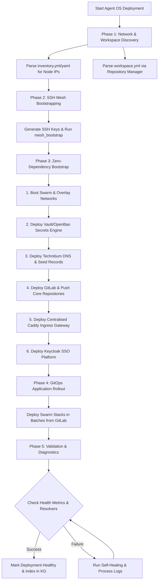

# Agent OS Deployment & Orchestration Skill

The **Agent OS Deployment & Orchestration** skill provides a unified, scale-agnostic framework to bootstrap, recover, migrate, and scale Agent OS across local environments (homelabs) and large-scale enterprise clusters (up to millions of physical/virtual nodes).

This workflow leverages:
- **`tunnel-manager-mcp`** to discover, scan, and establish secure SSH mesh connectivity across all nodes listed in host inventory files.
- **`repository-manager`** and **`workspace.yml`** to detect pre-existing development contexts and Git configuration sources.
- **`portainer-agent`** / **`container-manager-mcp`** to orchestrate Swarm/Kubernetes containers.
- **`technitium-dns-mcp`** and **`caddy-mcp`** to centralize name resolution and secure ingress routing.

---

## Core Capabilities

### 1. Inventory Discovery & Network Scanning
* **Host Parsing**: Automatically scans `inventory.yml` or `inventory.yaml` files (e.g. from XDG config or custom workspace paths) to build an active host topology.
* **Workspace Introspection**: Parses `workspace.yml` using `repository-manager` to establish pre-existing codebase locations and configuration origins.
* **Tunnel Manager Bootstrapping**: Discovers nodes, establishes full-mesh SSH credentials, and tests host reachability concurrently.

### 2. Zero-Dependency Bootstrapping (Enterprise Roadmap)
Orchestrates deployment in a rigorous, dependency-resolved order to handle bootstrapping on raw/empty storage nodes without circular dependencies:
1. **OS Prep & Docker Swarm**: Sets up basic node runtimes and clusters overlay networks.
2. **Root of Trust (Vault/OpenBao)**: Launches secure secret engines to distribute encryption keys.
3. **Core Name Resolution (Technitium DNS)**: Boots authoritative DNS servers to allow name mapping.
4. **Declarative Git Source (GitLab)**: Stands up code/configuration repositories.
5. **Gateway Routing (Caddy Ingress)**: Establishes central reverse proxy mapping.
6. **Local Identity SSO (Keycloak)**: Connects authentication providers to client databases.
7. **GitOps Applications**: Launches applications directly from Git-backed repositories.

### 3. Scaled Ingress & DNS Migration
* **DNS Provider Adapter Layer**: Exports host configuration entries from legacy systems (AdGuard Home, Pi-hole, Bind9, dnsmasq) and maps them cleanly into authoritative Technitium DNS zones.
* **Traffic Centralization**: Decouples services from legacy Traefik tags or direct host port bindings, routing all traffic securely via Caddy reverse proxies on overlay networks.

---

## Architecture Flow



---

## Steps

### Step 1: network-topology-sweep
Discover target inventory hosts, verify SSH connectivity, and scan interface segments, subnets, and VLAN setups across all hardware nodes:
- Requires: `tunnel-manager-mcp`, `systems-manager-mcp`
- Output: Discovered active network interfaces and subnet scopes.

### Step 2: hardware-profile-sweep [depends_on: network-topology-sweep]
Run low-level hardware resource discovery (CPU models, free RAM capacity, disk partitions, and GPU accelerators) across reachable hosts:
- Requires: `systems-manager-mcp`, `tunnel-manager-mcp`
- Output: System resource specifications and GPUAccelerator profiles.

### Step 3: dns-migration-utility [depends_on: network-topology-sweep]
Ingest, clean, and convert legacy resolver configurations (from AdGuard Home, Pi-hole, bind9, etc.) into unified A/CNAME records:
- Requires: `systems-manager-mcp`
- Output: Normalized DNS zone records payload.

### Step 4: dns-record-manager [depends_on: dns-migration-utility]
Register the normalized DNS rewrites as authoritative primary records on Technitium DNS:
- Requires: `technitium-dns-mcp`
- Output: Authoritative zone resolution mappings active.

### Step 5: gitlab-repository-seeder [depends_on: hardware-profile-sweep]
Seed repository configurations, project layouts, and personal access tokens on GitLab CE:
- Requires: `gitlab-mcp`
- Output: Private repos populated with compose stacks and active GitLab PATs.

### Step 6: portainer-sync-agent [depends_on: gitlab-repository-seeder]
Register the GitOps stack configurations on Portainer referencing GitLab PATs for automated pull-updates:
- Requires: `portainer-mcp`
- Output: Active, sync-configured application stacks running on Swarm nodes.

---


## Verification Plan

Verify the complete state of the ecosystem:

```bash
# Test local DNS resolution across multiple client subnets
dig @10.0.0.199 my-service.arpa +short

# Verify Caddy Ingress reverse proxy returns correct HTTP status
curl -sf -o /dev/null -H "Host: my-service.arpa" http://10.0.0.12

# Check Node Cluster state via Systems Manager
python /path/to/universal_skills/universal_skills/infra/agent-os-deployment/scripts/verify_cluster.py
```

## References
- [infrastructure-orchestrator](../infrastructure-orchestrator/SKILL.md) — Platform deployment and discovery
- [mcp-client](../../agent-tools/mcp-client/SKILL.md) — Universal MCP connection logic
- [workspace-manager](../../../core/workspace-manager/SKILL.md) — Workspace configurations
