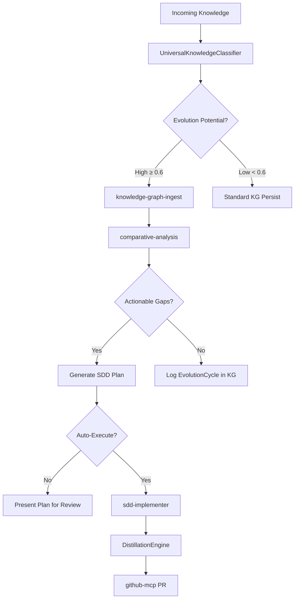

# Universal Knowledge Assimilation Engine

Multi-source content discovery → classify → ingest → evolve pipeline.
Extends the pull-based `agent-utilities-evolution` skill with a **push-based**
pathway where any high-signal content from ANY source automatically triggers
the self-evolution loop.

## Architecture



## Execution Steps

### Step 0: scout
Discover content from multiple sources. Gather the latest high-signal content
using the following tools in parallel:

**X Search** (trending AI/ML/agent topics):
```
Use x_search with query: "agent frameworks OR multi-agent OR knowledge graph OR MCP tools OR pydantic AI"
```

**ScholarX** (recent research papers):
```
Use mcp_scholarx-mcp_sx_search with action: "recent", categories: "cs.AI,cs.MA,cs.CL,cs.SE", days: 3
```

**GitHub Trending** (emerging repositories):
```
Use mcp_github-mcp_github with action to search repositories sorted by stars, topic: "ai-agents OR knowledge-graph OR mcp-server"
```

**KG Memory** (pending evolution candidates):
```
Use mcp_graph-os_graph_query with cypher:
"MATCH (e:EvolutionCandidate {status: 'pending'}) RETURN e.id, e.source_type, e.evolution_score ORDER BY e.evolution_score DESC LIMIT 10"
```

Expected: content items from at least 2 sources with metadata

### Step 1: classify
Score each discovered item using the UniversalKnowledgeClassifier.

For each content item from Step 0:

1. Gather existing KG topics for context matching:
```
Use mcp_graph-os_graph_query with cypher:
"MATCH (c) WHERE c:Concept OR c:KBConcept OR c:ResearchTopic
 RETURN c.name LIMIT 30"
```

2. If the item is an X post, use `browse_x_post` with `auto_ingest=True` to
   simultaneously retrieve full content and classify/ingest it.

3. For other items, classify manually:
   - Research papers: `source_type="research_paper"`, content = abstract + title
   - GitHub repos: `source_type="github_repo"`, content = README + description
   - Documents: `source_type="document"`, content = extracted text

4. Route based on classification action:
   - `skip` → ignore
   - `decay` → create ephemeral node only
   - `ingest` → persist to KG with concepts
   - `ingest_and_evolve` → persist + create EvolutionCandidateNode → proceed to Step 2

Expected: classified items with importance scores and evolution potential
Depends On: Step 0

### Step 2: ingest
Ingest high-value and evolution-candidate content into the Knowledge Graph.

For items classified as `ingest` or `ingest_and_evolve`:

1. **X Posts/Articles**: Already ingested via `XIngestionBridge` in Step 1 (auto_ingest).
   For X Articles, fetch full article via `read_url_content` and ingest via:
   ```
   Use mcp_graph-os_graph_ingest with action: "ingest", target_path: "<article_url>"
   ```

2. **Research Papers**: Download PDF and ingest:
   ```
   Use mcp_scholarx-mcp_sx_storage with action: "download", paper_ids: "<id>"
   Use mcp_graph-os_graph_ingest with action: "ingest", target_path: "<downloaded_path>"
   ```

3. **GitHub Repos**: Ingest repository:
   ```
   Use mcp_graph-os_graph_ingest with action: "ingest", target_path: "<repo_url>"
   ```

4. For each ingested item, link to extracted concepts:
   ```
   Use mcp_graph-os_graph_write with action: "add_edge",
   source_id: "<item_id>", target_id: "<concept_id>", rel_type: "ABOUT"
   ```

Expected: items persisted to KG with proper node types and concept edges
Depends On: Step 1

### Step 3: analyze
Run comparative analysis on evolution candidates against agent-utilities.

For each EvolutionCandidateNode created in Steps 1-2:

1. Run relevance sweep:
   ```
   Use mcp_graph-os_graph_analyze with action: "relevance_sweep",
   query: "<evolution_reasoning>", target: "agent-utilities"
   ```

2. Run deep extraction for actionable gaps:
   ```
   Use mcp_graph-os_graph_analyze with action: "deep_extract",
   query: "What specific features, patterns, or techniques from this content could be implemented in agent-utilities?",
   target: "<source_node_id>"
   ```

3. If actionable gaps found, update the EvolutionCandidate status to "analyzed":
   ```
   Use mcp_graph-os_graph_write with action: "add_node",
   node_id: "<evo_candidate_id>",
   properties: '{"status": "analyzed", "gaps_found": <count>}'
   ```

Expected: gap analysis and feature recommendations for each evolution candidate
Depends On: Step 2

### Step 4: plan
Generate SDD implementation plans for actionable gaps.

For each analyzed EvolutionCandidate with actionable gaps:

1. Generate SDD plan incorporating:
   - All feature recommendations from comparative analysis
   - Constitution-mandated artifacts (docs, AGENTS.md, CHANGELOG, tests, C4 diagrams)
   - Cross-reference with existing SDD plans to avoid duplication

2. Present the plan for user review (do NOT auto-execute without explicit approval)

3. Log the evolution cycle in the KG:
   ```
   Use mcp_graph-os_graph_write with action: "add_node",
   node_type: "EvolutionCycle",
   properties: '{"triggered_by": "knowledge_assimilation", "items_scanned": <N>, "candidates_created": <N>, "plans_generated": <N>}'
   ```

4. If the cycle generated useful distillation patterns, log them:
   ```
   Use mcp_graph-os_graph_write with action: "store_memory",
   properties: '{"type": "procedural", "content": "<pattern_description>", "importance": 0.8}'
   ```

Expected: SDD plans ready for review, evolution cycle logged in KG
Depends On: Step 3

## Tiered Memory Strategy

| Content Tier | Action | KG Node Type | Decay Behavior |
|-------------|--------|--------------|----------------|
| `critical` (≥0.9) | `ingest_and_evolve` | Article/SocialPost (permanent) + EvolutionCandidate | Never decays |
| `high_value` (0.7–0.9) | `ingest` | Article/SocialPost (permanent) | Never decays |
| `standard` (0.4–0.7) | `ingest` | SocialPost/Observation | Slow decay (5%/day) |
| `ephemeral` (≤0.3) | `decay` | SocialPost | Fast decay (10%/day) |
| `skip` | `skip` | Not persisted | N/A |

## Content Source Configuration

| Source | Default Query | Frequency | MCP Tool |
|--------|--------------|-----------|----------|
| X Search | AI agents, MCP, knowledge graphs | On-demand | `x_search` |
| ScholarX | cs.AI, cs.MA, cs.CL, cs.SE | Daily | `mcp_scholarx-mcp_sx_search` |
| GitHub Trending | ai-agents, knowledge-graph, mcp-server | Daily | `mcp_github-mcp_github` |
| KG Pending | EvolutionCandidate.status = "pending" | Every cycle | `mcp_graph-os_graph_query` |

## Difference from agent-utilities-evolution

| Dimension | agent-utilities-evolution (pull) | knowledge-assimilation (push) |
|-----------|--------------------------------|-------------------------------|
| **Trigger** | Cron (60 min) or manual | Incoming high-potential content |
| **Sources** | ScholarX papers only | X + ScholarX + GitHub + KG memory |
| **Classifier** | `dynamic_scorer.py` (keyword-based) | `UniversalKnowledgeClassifier` (LLM-backed) |
| **KG Node** | `ResearchTopic` | `EvolutionCandidateNode` |
| **Output** | SDD plan only | SDD plan + distilled skills + PRs |
| **X Integration** | None | Native via `browse_x_post(auto_ingest=True)` |

Both pipelines share downstream tools: `comparative-analysis`, `sdd-implementer`,
`DistillationEngine`.

## References

- [agent-utilities-evolution](../agent-utilities-evolution/SKILL.md) — Pull-based evolution
- [research-scanner](../research-scanner/SKILL.md) — Paper discovery
- [comparative-analysis](../comparative-analysis/SKILL.md) — Feature extraction
- [x-assistant guide](../../../../agent-utilities/docs/guides/x-assistant.md) — X tools
- [knowledge-assimilation guide](../../../../agent-utilities/docs/guides/knowledge-assimilation.md) — MCP pattern

## Execution

Run this workflow as a dependency-ordered DAG. Steps with no unmet `depends_on` run in parallel; dependents run after their prerequisites complete.

- **Run first (in parallel):** Step 0 — scout; Step 1 — classify; Step 2 — ingest; Step 3 — analyze; Step 4 — plan

**Execution:** If graph-os is reachable, offload the whole DAG via `graph_orchestrate action=execute_workflow` (or the `kg-delegate` skill) for true parallel/swarm execution. Otherwise execute the steps natively in dependency order: run steps with no unmet `depends_on` in parallel, then their dependents.
