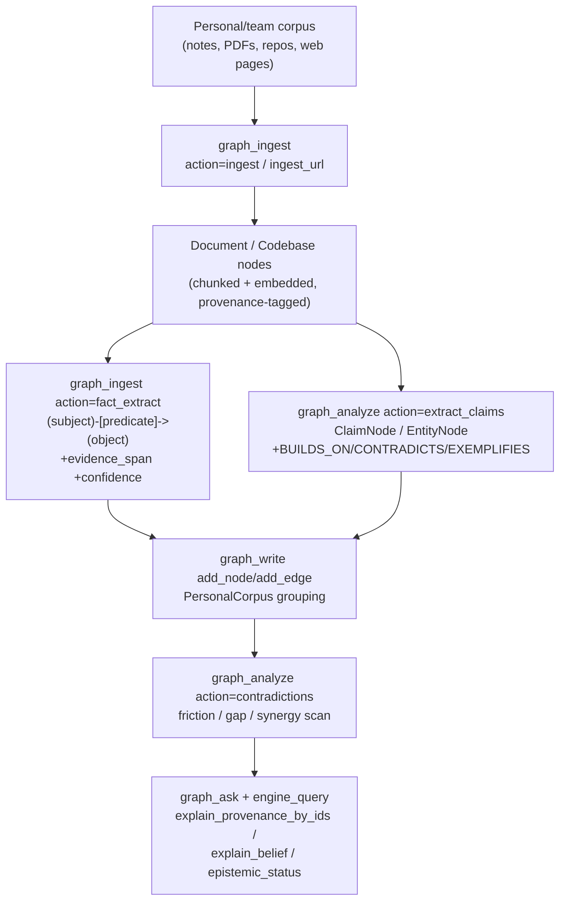

# Second Brain Sync Workflow

Points a folder of notes, PDFs, git repositories, or web pages at the epistemic
Knowledge Graph and turns it into claims + evidence with provenance — not just
searchable text. This is the **personal/team-corpus** sibling of
`knowledge-assimilation` (which does the same job for research/code content
discovered from X/ScholarX/GitHub): same engine primitives
(`graph_ingest`/`graph_analyze`/the KG), different source and no evolution-score
classifier — every source the user points at gets ingested and extracted at
uniform depth. See `references/walkthrough.md` for a full worked example with
sample tool calls and outputs.

## Architecture



## Execution Steps

### Step 0: collect
Resolve what the user wants ingested: a local notes folder or Obsidian vault
path, PDF file(s), git repo path(s)/URL(s), or web page/bookmark URLs. No tool
call — just build the source list (each item tagged `file`, `dir`, `repo`, or
`url`).

Expected: `source_manifest` (list of `{path_or_url, kind}`)

### Step 1: ingest
For each source in the manifest, ingest it into the KG with full provenance.

**Local notes / PDFs / directories / repos** — `content_type` is
auto-detected per path (DOCUMENT for notes/PDFs, CODEBASE for a repo); heavy
paths run as a background job:
```
Use graph_ingest with action="ingest",
  target_path="<file, dir, repo path, or JSON/comma-separated list of paths>"
```
Poll a returned job with `graph_ingest action="job_status" job_id="<id>"`.

**Web pages / bookmarks** — runs inline via the unified resolver
(ArchiveBox → crawl4ai → requests), and auto-detects + pulls cited papers for
a research roundup:
```
Use graph_ingest with action="ingest_url", target_path="<url>"
```

Expected: `ingested_sources` (Document/Codebase node ids and/or job ids)
Depends On: Step 0

### Step 2: extract
Turn each ingested document into atomic facts and typed claims with evidence
spans and confidence — this is what makes the second brain *queryable*, not
just full-text-searchable.

1. **Atomic triples** (subject-predicate-object edges, `confidence` 0-100,
   `evidence_span`, `source_file`, semantically deduped across rounds/files):
   ```
   Use graph_ingest with action="fact_extract", target_path="<ingested file path>"
   ```
   For a large corpus, submit as a GPU-slot-scheduled job instead of blocking
   inline (poll with `action="extract_status"`, pull results with
   `action="extract_jsonl"`):
   ```
   Use graph_ingest with action="extract_submit", target_path="<file>", max_depth=<rounds>
   ```

2. **Entities + claims** (the MAGMA epistemic view — entities, claims, and
   implicit `BUILDS_ON`/`CONTRADICTS`/`EXEMPLIFIES` relationships, persisted
   as `ClaimNode`/`EntityNode`):
   ```
   Use graph_analyze with action="extract_claims",
     query="<document text>", node_id="<document node id>"
   ```

Expected: `facts` (ExtractedFact list with evidence_span/confidence/tags) +
`claims`/`entities` persisted to the graph
Depends On: Step 1

### Step 3: link_corpus
Give the ingested material one stable identity so later queries can scope to
"my second brain" instead of the whole KG.
```
Use graph_write with action="add_node", node_id="corpus:<slug>",
  node_type="PersonalCorpus", properties='{"name": "<corpus name>", "owner": "<agent_id>"}'
```
Then link each ingested Document/Codebase node to it:
```
Use graph_write with action="add_edge",
  source_id="<document_or_codebase_id>", target_id="corpus:<slug>", rel_type="PART_OF"
```
Expected: `corpus_id` + membership edges
Depends On: Step 2

### Step 4: analyze
Run gap/synergy analysis: for each new claim or fact, check what it agrees
with, contradicts, or leaves uncovered in the rest of the corpus/graph.

**Contradiction / friction surface** (propose-only — never auto-resolves):
```
Use graph_analyze with action="contradictions",
  query="<new claim text>", node_id="<claim_or_fact_id>"
```
Returns `[{new_id, conflict_id, similarity, severity, reason}, ...]`. Read the
result as a gap/synergy signal: a high-similarity hit with no flagged conflict
is **reinforcing/synergistic** knowledge; a flagged conflict is a genuine
**contradiction** to reconcile (human judgment, never auto-resolved); no
neighbours at all is a **coverage gap** — nothing else in the corpus speaks to
that claim yet.

**Currency-upgraded coverage view** (confidence/provenance/bitemporal window/
contradictions for the whole corpus in one round-trip):
```
Use graph_query with
  cypher="MATCH (c)-[:PART_OF]->(:PersonalCorpus {name:'<corpus name>'}) RETURN c.id AS id",
  envelope="bundle"
```
Expected: `friction_findings` + `evidence_bundle` (coverage/contradiction summary)
Depends On: Step 3

### Step 5: query_back
Answer questions over the second brain with full epistemic justification, not
bare rows.

1. **Ask in plain English**, grounded and cited:
   ```
   Use graph_ask with question="<question about the corpus>", envelope="bundle"
   ```
2. **Currency-upgrade any id list** from Step 4/5.1 — calibrated confidence +
   provenance + bitemporal valid/tx time:
   ```
   Use engine_query with action="explain_provenance_by_ids",
     params_json='{"ids": ["<id1>", "<id2>"]}'
   ```
3. **Why do we believe it** — the justification tree (`Asserted` /
   `DerivedSupport` / `DerivedContradiction` / `BayesianUpdate`):
   ```
   Use engine_query with action="explain_belief", params_json='{"node_id": "<claim_id>"}'
   ```
4. **Acceptance capstone** — believed? since when? on what evidence? what
   would invalidate it? (opt-in `epistemic-tms` engine feature; degrades
   cleanly to `{"error": "..."}` if the connected engine lacks it):
   ```
   Use engine_query with action="epistemic_status", params_json='{"node_id": "<claim_id>"}'
   ```

See the `kg-epistemic-answer` skill for the full four-layer epistemic-answer
pattern (this step reuses it directly).

Expected: `epistemic_answers` (grounded rows + justification + belief status)
Depends On: Step 4

## Output
- Personal/team corpus fully ingested as Document/Codebase nodes, grouped
  under one `PersonalCorpus` node
- Atomic facts (`evidence_span` + `confidence` + `source_file`) and typed
  claims/entities, semantically deduplicated
- A friction/gap/synergy report over the new material vs. what the graph
  already knows
- Every downstream question answerable with calibrated confidence, citations,
  and a justification tree — not just rows

## Difference from knowledge-assimilation

| Dimension | `knowledge-assimilation` (research/code, push-based) | `second-brain-sync` (personal/team corpus) |
|---|---|---|
| Sources | X, ScholarX, GitHub trending, KG pending candidates | user-supplied notes/PDFs/repos/web pages (an Obsidian vault, a Nextcloud export, a folder, bookmarks) |
| Classifier | `UniversalKnowledgeClassifier` (0-1 evolution-potential score gates depth) | none — every source is ingested and extracted at uniform depth |
| Extraction | Article/SocialPost nodes + `ABOUT` concept edges | `fact_extract` atomic triples + `extract_claims` entities/claims, both evidence-spanned |
| Downstream | `comparative-analysis` relevance_sweep/deep_extract → SDD implementation plan | `contradictions` friction scan → `kg-epistemic-answer` query-back |
| Trigger | incoming high-signal content (cron or push) | "build my second brain" / point at a corpus |

Both pipelines write into the same graph and compose freely — an assimilated
research paper and a personal note on the same topic land as separate
documents that `graph_ask`/`graph_query` can cross-reference.

## References
- [knowledge-assimilation](../knowledge-assimilation/SKILL.md) — sibling push-based pipeline for research/code content
- `references/walkthrough.md` — end-to-end "build my epistemic second brain" walkthrough with sample tool calls and outputs
- `agent_utilities/knowledge_graph/extraction/fact_extractor.py` — atomic-triple extraction core (`graph_ingest action=fact_extract`)
- `agent_utilities/knowledge_graph/kb/entity_claim_extractor.py` — entity/claim extraction core (`graph_analyze action=extract_claims`)
- `agent_utilities/knowledge_graph/adaptation/contradiction_detector.py` — friction/contradiction surface (`graph_analyze action=contradictions`)
- `agent_utilities/skills/kg-epistemic-answer/SKILL.md` — the four-layer epistemic-answer pattern used in Step 5

## Execution

Run this workflow as a dependency-ordered DAG. Steps with no unmet `depends_on` run in parallel; dependents run after their prerequisites complete. This pipeline is mostly linear (each step consumes the previous step's graph writes), but Step 1 fans out — every source in the Step 0 manifest ingests independently and can run concurrently.

- **Run first:** Step 0 — collect
- **After level 0 (fan out per source):** Step 1 — ingest
- **After level 1 (fan out per document):** Step 2 — extract
- **After level 2:** Step 3 — link_corpus
- **After level 3:** Step 4 — analyze
- **After level 4:** Step 5 — query_back

**Execution:** If graph-os is reachable, offload the whole DAG via `graph_orchestrate action=execute_workflow` (or the `kg-delegate` skill) for true parallel/swarm execution. Otherwise execute the steps natively in dependency order: run steps with no unmet `depends_on` in parallel, then their dependents.
