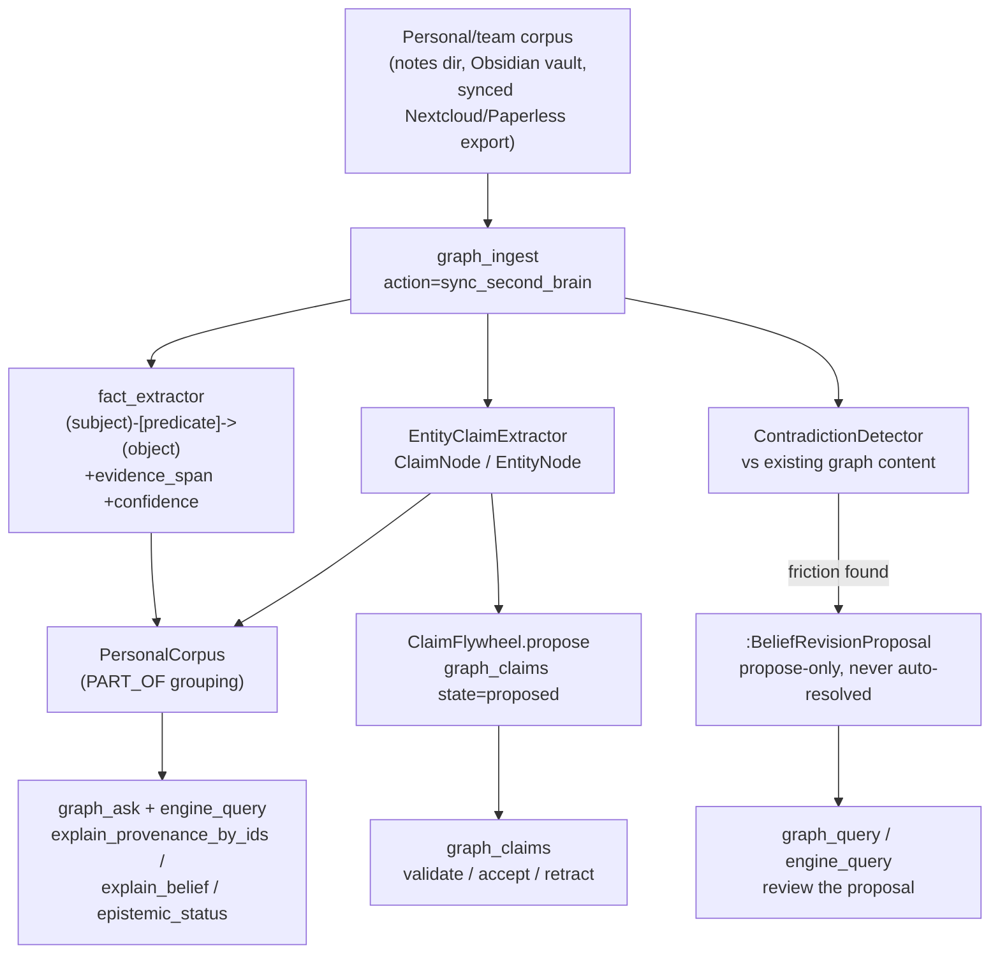

# Second Brain Sync Workflow

Points a folder of notes, PDFs, git repositories, or web pages at the epistemic
Knowledge Graph and turns it into claims + evidence with provenance — not just
searchable text. For a **markdown/text notes corpus** (an Obsidian vault, a
plain notes folder, or a synced Nextcloud/Paperless export — see Step 0), the
whole pipeline — ingest, atomic-triple facts, typed claims, governed proposal,
and contradiction scan — runs in **one call** (`sync_second_brain`, Step 1).
Larger or non-note sources (PDFs, repos, web pages) use the per-source tool
calls in "Larger or non-note sources" below. This is the **personal/team-
corpus** sibling of `knowledge-assimilation` (which does the same job for
research/code content discovered from X/ScholarX/GitHub): same engine
primitives, different source and no evolution-score classifier — every source
the user points at gets ingested and extracted at uniform depth. See
`references/walkthrough.md` for a full worked example with sample tool calls
and outputs.

## Architecture



## Execution Steps

### Step 0: collect
Resolve what the user wants synced: a local notes folder, an Obsidian vault
path, or PDF file(s)/git repo path(s)/URL(s) for the "larger or non-note
sources" path below. No tool call — just build the source list (each item
tagged `file`, `dir`, `repo`, or `url`).

**Nextcloud or Paperless-ngx sources** aren't read directly by this skill —
reuse the existing connector presets/skills that already own those APIs
(`AU-KG.ingest.mcp-tool-connector` — one reuse path, never a new connector):
run the `nextcloud-files`/`nextcloud-ingest` skill (or `paperless-documents`/
`paperless-ngx-kg-ingestion`) to pull the notes/documents into a local sync
directory (or straight into KG Document nodes), then point Step 1's
`target_path` at that materialized directory.

Expected: `source_manifest` (list of `{path_or_url, kind}`)

### Step 1: sync
For a markdown/text notes directory or file, run the whole pipeline in ONE
call — no separate ingest/extract/link/analyze round-trips:
```
Use graph_ingest with action="sync_second_brain",
  target_path="<notes dir or file>", corpus_name="<corpus name>"
```
Optionally restrict to notes changed since the last sync:
```
Use graph_ingest with action="sync_second_brain",
  target_path="<notes dir or file>", corpus_name="<corpus name>",
  base_path="<ISO-8601 timestamp or epoch seconds — the 'since' cursor>"
```
Per note, this: (1) extracts atomic facts (`evidence_span` + `confidence`,
citing the source note) and persists them as graph edges; (2) extracts typed
entities/claims and PROPOSES each new claim into the governed `ClaimFlywheel`
lifecycle (`graph_claims` reads the SAME state — a claim is never silently
accepted); (3) scans each new claim against existing graph content and
persists any contradiction as a propose-only `:BeliefRevisionProposal` (Step 2
reviews these). Re-running over an unchanged corpus is a no-op (content-hash
idempotent — no duplicate facts/claims/proposals).

Response (trimmed):
```jsonc
{
  "corpus_id": "corpus:home-lab-2026",
  "notes_seen": 4, "notes_synced": 4, "notes_skipped_unchanged": 0,
  "facts": 11, "claims": 4,
  "claims_proposed": ["claim:9f2a...", "claim:1c7b...", "..."],
  "contradictions": [
    {"proposal_id": "BeliefRevisionProposal:claim:1c7b...:2026-07-23T...",
     "new_id": "claim:1c7b...", "conflict_id": "claim:eg-bitemporal-1",
     "severity": "medium", "similarity": 0.52}
  ],
  "errors": []
}
```
Expected: `sync_result` (facts/claims counts, `claims_proposed` ids,
`contradictions` — each already a persisted reviewable proposal)
Depends On: Step 0

### Step 2: review
The contradiction scan is **propose-only — it NEVER auto-resolves.** Review
both surfaces before acting:

**Pending claims** (governed lifecycle — every claim `sync_second_brain` just
proposed sits here until a human/agent reviews it):
```
Use graph_claims with action="list", state="proposed"
```
Then, once satisfied a claim holds up: `graph_claims action="validate"
claim_id="<id>" valid=true` → `graph_claims action="accept" claim_id="<id>"`
(or `action="deprecate"`/`"retract"` to reject it — never silently promoted).

**Contradiction proposals** — read every `:BeliefRevisionProposal` Step 1
surfaced (same node shape the loop's own periodic belief-revision pass
persists, so this is the SAME query an operator already runs for that):
```
Use graph_query with
  cypher="MATCH (p:BeliefRevisionProposal) WHERE p.corpus_id = $corpus_id
          AND p.status = 'proposal' RETURN p",
  params_json='{"corpus_id": "<corpus_id from Step 1>"}'
```
Each proposal carries `reason`/`severity`/`similarity` (why it was flagged),
`old_confidence`/`new_confidence`/`delta`/`reasoning_trace` (the explainable
confidence-propagation math), and `new_contradicted_by_node_ids` (what it
conflicts with) — a human decides which belief survives; nothing here is
mutated automatically.

Expected: `pending_claims` + `friction_proposals` (both reviewable, neither
auto-resolved)
Depends On: Step 1

### Step 3: query_back
Answer questions over the second brain with full epistemic justification, not
bare rows.

1. **Ask in plain English**, grounded and cited:
   ```
   Use graph_ask with question="<question about the corpus>", envelope="bundle"
   ```
2. **Currency-upgrade any id list** from Step 1/3.1 — calibrated confidence +
   provenance + bitemporal valid/tx time:
   ```
   Use engine_query with action="explain_provenance_by_ids",
     params_json='{"ids": ["<id1>", "<id2>"]}'
   ```
3. **Why do we believe it** — the justification tree (`Asserted` /
   `DerivedSupport` / `DerivedContradiction` / `BayesianUpdate`):
   ```
   Use engine_query with action="explain_belief", params_json='{"node_id": "<claim_id>"}'
   ```
4. **Acceptance capstone** — believed? since when? on what evidence? what
   would invalidate it? (opt-in `epistemic-tms` engine feature; degrades
   cleanly to `{"error": "..."}` if the connected engine lacks it):
   ```
   Use engine_query with action="epistemic_status", params_json='{"node_id": "<claim_id>"}'
   ```

See the `kg-epistemic-answer` skill for the full four-layer epistemic-answer
pattern (this step reuses it directly).

Expected: `epistemic_answers` (grounded rows + justification + belief status)
Depends On: Step 1

## Larger or non-note sources (PDFs, repos, web pages)

`sync_second_brain` covers a markdown/text notes directory. For a PDF, a git
repository, or a bookmarked web page, ingest and extract with the individual
tools instead — the same fact/claim/contradiction primitives, driven per
source rather than in one call:

```
Use graph_ingest with action="ingest", target_path="<file, dir, repo path>"
# heavy paths (a big PDF/repo) run as a background job — poll with:
Use graph_ingest with action="job_status", job_id="<id>"

Use graph_ingest with action="ingest_url", target_path="<url>"
# runs inline (ArchiveBox -> crawl4ai -> requests), returns the Document node id

Use graph_ingest with action="fact_extract", target_path="<ingested file path>"
# or, for a large document: action="extract_submit" (GPU-slot-scheduled job)

Use graph_analyze with action="extract_claims",
  query="<document text>", node_id="<document node id>"
```
Then link the result into the SAME `PersonalCorpus` Step 1 creates
(`graph_write action="add_edge" source_id="<doc id>"
target_id="<corpus_id>" rel_type="PART_OF"`) and continue at Step 2/3 above —
both review paths (`graph_claims`, the `:BeliefRevisionProposal` query) work
identically regardless of which path ingested the material.

## Output
- Personal/team corpus fully ingested (facts + typed claims/entities,
  semantically deduplicated), grouped under one `PersonalCorpus` node
- Every fact carries `evidence_span` + `confidence` + `source_file`; every
  claim is PROPOSED into the governed `ClaimFlywheel` lifecycle, never
  silently accepted
- Every contradiction against existing KG content is a persisted, reviewable
  `:BeliefRevisionProposal` — propose-only, the same surface the loop's own
  belief-revision pass uses, so no new UI is needed to review it
- Re-syncing an unchanged corpus is idempotent: zero new facts, claims, or
  proposals
- Every downstream question answerable with calibrated confidence, citations,
  and a justification tree — not just rows

## Difference from knowledge-assimilation

| Dimension | `knowledge-assimilation` (research/code, push-based) | `second-brain-sync` (personal/team corpus) |
|---|---|---|
| Sources | X, ScholarX, GitHub trending, KG pending candidates | user-supplied notes/PDFs/repos/web pages (an Obsidian vault, a Nextcloud export, a folder, bookmarks) |
| Classifier | `UniversalKnowledgeClassifier` (0-1 evolution-potential score gates depth) | none — every source is ingested and extracted at uniform depth |
| Extraction | Article/SocialPost nodes + `ABOUT` concept edges | one-call `sync_second_brain` (fact_extractor + EntityClaimExtractor), both evidence/confidence carrying |
| Claim governance | `materialize_claims` / mining-flywheel via the research pipeline | every claim PROPOSED into `ClaimFlywheel` (`graph_claims`) — never silently accepted |
| Downstream | `comparative-analysis` relevance_sweep/deep_extract → SDD implementation plan | `:BeliefRevisionProposal` review (Step 2) → `kg-epistemic-answer` query-back (Step 3) |
| Trigger | incoming high-signal content (cron or push) | "build my second brain" / point at a corpus |

Both pipelines write into the same graph and compose freely — an assimilated
research paper and a personal note on the same topic land as separate
documents that `graph_ask`/`graph_query` can cross-reference.

## References
- [knowledge-assimilation](../knowledge-assimilation/SKILL.md) — sibling push-based pipeline for research/code content
- `references/walkthrough.md` — end-to-end "build my epistemic second brain" walkthrough with sample tool calls and outputs
- `agent_utilities/knowledge_graph/extraction/second_brain_sync.py` — the one-call composition (`sync_second_brain`, `graph_ingest action=sync_second_brain`)
- `agent_utilities/knowledge_graph/extraction/fact_extractor.py` — atomic-triple extraction core
- `agent_utilities/knowledge_graph/kb/entity_claim_extractor.py` — entity/claim extraction core (content-addressed `claim_node_id`)
- `agent_utilities/knowledge_graph/adaptation/contradiction_detector.py` — friction/contradiction surface (`graph_analyze action=contradictions`)
- `agent_utilities/knowledge_graph/adaptation/belief_revision.py` — the `:BeliefRevisionProposal` confidence-propagation math (`recompute_confidence`/`explain_revision`)
- `agent_utilities/knowledge_graph/research/claim_flywheel.py` — the governed claim lifecycle (`graph_claims` MCP tool)
- `agent_utilities/skills/kg-epistemic-answer/SKILL.md` — the four-layer epistemic-answer pattern used in Step 3

## Execution

Run this workflow as a dependency-ordered DAG. Steps with no unmet `depends_on` run in parallel; dependents run after their prerequisites complete. Step 2 and Step 3 both depend only on Step 1 and run in parallel with each other (review and query-back don't need to wait on one another).

- **Run first:** Step 0 — collect
- **After level 0:** Step 1 — sync
- **After level 1 (fan out, parallel):** Step 2 — review, Step 3 — query_back

**Execution:** If graph-os is reachable, offload the whole DAG via `graph_orchestrate action=execute_workflow` (or the `kg-delegate` skill) for true parallel/swarm execution. Otherwise execute the steps natively in dependency order: run steps with no unmet `depends_on` in parallel, then their dependents.
