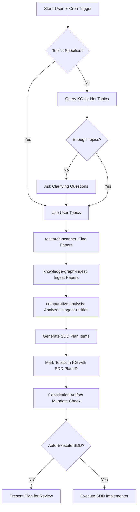

# Agent Utilities Evolution Skill

Autonomous research-driven development pipeline for evolving the `agent-utilities` codebase.

## Overview

This skill orchestrates 4 existing capabilities into a unified evolution pipeline:

1. **Topic Detection** — Query the KG for hot topics, unresolved concepts, and high-scoring
   unimplemented research findings
2. **Research Scanner** — Find new papers matching those topics via `scholarx` MCP
3. **Knowledge Graph Ingest** — Ingest discovered papers and codebases into the KG
4. **Comparative Analysis** — Analyze ingested items against `agent-utilities` for gaps
   and feature extraction
5. **SDD Plan Generation** — Create implementation plans with constitution-mandated artifacts

## Architecture



## Background Daemon

The evolution pipeline runs as a background daemon (`KG-Evolution-Daemon`) in the
`agent-utilities` engine task manager. It triggers every **60 minutes** and:

1. Queries the KG for unresolved `ResearchTopic` / `Concept` nodes not yet addressed
2. Runs a lightweight research scan for those topics
3. Ingests any new highly-relevant papers
4. Runs comparative analysis to extract actionable features
5. Logs evolution cycle results as `EvolutionCycle` nodes in the KG

The daemon is enabled by default and can be configured via `KG_EVOLUTION_INTERVAL`
environment variable (seconds, default: 3600).

## Execution Steps

### Step 1: Topic Detection (KG-First)

Query the Knowledge Graph for research topics that haven't been addressed yet:

```
Use mcp_agent-utilities-kg_kg_query with:

cypher: "MATCH (c) WHERE (c:ConceptNode OR c:Concept)
         AND NOT exists { MATCH (c)-[:ADDRESSED_BY]->(:SDDPlan) }
         RETURN c.id AS id, c.name AS name, c.description AS description
         ORDER BY c.name LIMIT 15"
```

**Fallback topic sources** (if no unresolved concepts found):
1. Extract from `Concept` nodes with pillar tags (ORCH, KG, AHE, ECO, OS)
2. Mine from recent comparative analysis gaps via `kg_search`
3. Check `RELEVANCE_SCORED` edges for high-scoring unimplemented papers

If fewer than 3 topics are found from any source, **ask clarifying questions**:

### Step 2: Clarifying Questions (if needed)

| Question | Default | When to Ask |
|----------|---------|-------------|
| Target research areas | KG-derived topics | Always if no topics found |
| arxiv categories to scan | cs.AI, cs.MA, cs.CL, cs.SE | If user doesn't specify |
| Papers per scan | All RSS Feed Available | If user wants to cap it |
| Target codebase | agent-utilities | If user doesn't specify |
| Auto-execute SDD? | No (generate plan only) | Always ask before execution |

### Step 3: Research Scan

Delegate to the `research-scanner` skill:

1. Use the detected topics to build search queries
2. Search via `mcp_scholarx_sx_search` with action `recent` for last 7 days
3. Also run `search` action with topic keywords for broader coverage
4. Score papers using `dynamic_scorer.py` from the research-scanner skill:

```bash
python /home/apps/workspace/agent-packages/skills/universal-skills/universal_skills/research/research-scanner/scripts/dynamic_scorer.py \
    --papers papers.json \
    --min-score 3.0 \
    --output top_papers.json
```

### Step 4: Download & Ingest

1. Download top-scoring papers via `mcp_scholarx_sx_storage` with action `bulk_download`
2. Ingest the downloaded PDFs via `mcp_agent-utilities-kg_kg_ingest`
3. Monitor ingestion progress via `mcp_agent-utilities-kg_kg_jobs`

### Step 5: Comparative Analysis

Run comparative analysis against the target codebase (default: `agent-utilities`):

1. Use `mcp_agent-utilities-kg_kg_analyze` with action `relevance_sweep` to score
   all ingested items against `agent-utilities`
2. Query rankings via `mcp_agent-utilities-kg_kg_analyze` with action `relevance_rankings`
3. For top-ranked items, run `deep_extract` to get structured feature recommendations

### Step 6: SDD Plan Generation

Generate an SDD implementation plan incorporating:

1. All feature recommendations from comparative analysis
2. **Constitution-mandated artifacts** (ALWAYS include these):
   - `/docs` updates
   - `AGENTS.md` updates
   - `CHANGELOG.md` entries
   - `README.md` updates
   - `.specify/` sync
   - C4 architecture diagrams
   - Pytests for all new functionality
3. Cross-reference with existing SDD plans to avoid duplication

### Step 7: Topic Tracking

After plan generation, mark topics as addressed in the KG:

```
Use mcp_agent-utilities-kg_kg_write with:

action: "upsert_node"
node_type: "SDDPlan"
properties: {"id": "<plan_id>", "created_at": "<timestamp>", "status": "proposed"}

Then for each topic:
action: "create_edge"
source_id: "<topic_id>"
target_id: "<plan_id>"
rel_type: "ADDRESSED_BY"
```

## Constitution Enforcement

Before finalizing any SDD plan, **verify against the constitution**:

```
Use mcp_agent-utilities-kg_kg_inspect with view: "constitution"
```

Cross-check that the plan includes ALL 7 mandatory post-modification artifacts.
A plan that omits any artifact is **INVALID** and must be revised.

## Evolution Cycle Node

Each evolution cycle is logged in the KG for tracking:

```
Use mcp_agent-utilities-kg_kg_write with:

action: "upsert_node"
node_type: "EvolutionCycle"
properties: {
    "id": "evo_cycle_<timestamp>",
    "triggered_by": "daemon|user",
    "topics_scanned": <count>,
    "papers_found": <count>,
    "papers_ingested": <count>,
    "recommendations_generated": <count>,
    "sdd_plan_id": "<plan_id or null>",
    "created_at": "<timestamp>"
}
```

## Dynamic Scorer Topic Export

The `dynamic_scorer.py` in `research-scanner` auto-detects topics from the KG.
This skill extends that by also **exporting** the detected topics back to the KG
as `ResearchTopic` nodes for tracking:

```
For each detected topic:
Use mcp_agent-utilities-kg_kg_write with:

action: "upsert_node"
node_type: "ResearchTopic"
properties: {
    "id": "topic_<slug>",
    "name": "<topic_name>",
    "source": "dynamic_scorer",
    "detected_at": "<timestamp>",
    "pillar": "<ORCH|KG|AHE|ECO|OS>"
}
```

## References

- [research-scanner](../research-scanner/SKILL.md) — Paper discovery and scoring
- [comparative-analysis](../comparative-analysis/SKILL.md) — Feature extraction
- [knowledge-graph-ingest](../../automation/knowledge-graph-ingest/SKILL.md) — Bulk ingestion
- [sdd-implementer](../../development/sdd-implementer/SKILL.md) — Task execution
