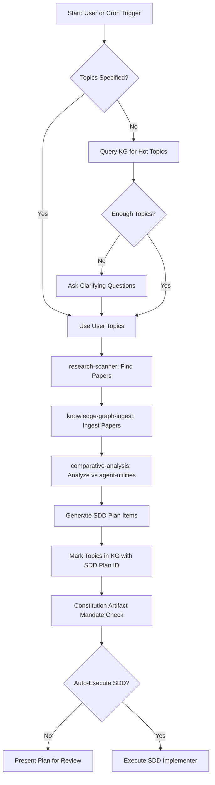

# Agent Utilities Evolution Skill

Autonomous research-driven development and code health pipeline for evolving
the `agent-utilities` codebase. Combines research discovery with code-enhancer
analysis domains tailored for the 5-pillar KG-driven architecture.

## Overview

This skill orchestrates **7 capabilities** into a unified evolution pipeline:

### Research Pipeline
1. **Topic Detection** — Query the KG for hot topics, unresolved concepts, and high-scoring
   unimplemented research findings
2. **Research Scanner** — Find new papers matching those topics via `scholarx` MCP
3. **Knowledge Graph Ingest** — Ingest discovered papers and codebases into the KG
4. **Comparative Analysis** — Analyze ingested items against `agent-utilities` for gaps
   and feature extraction
5. **SDD Plan Generation** — Create implementation plans with constitution-mandated artifacts

### Code Health Pipeline (adapted from code-enhancer)
6. **Wiring Sweep** — AST-based import graph, dead code, concept traceability analysis
   (see `scripts/wiring_sweep.py`)
7. **Architecture Review** — C4 compliance, pillar concept coverage, hot-path integration
   audit tailored to the 5-pillar architecture (ORCH, KG, AHE, ECO, OS)

### Code-Enhancer Domains (agent-utilities-specific)

The following analysis domains from the `code-enhancer` skill are natively integrated,
tailored for the agent-utilities 5-pillar architecture:

| Domain | What It Checks | agent-utilities Specialization |
|--------|---------------|-------------------------------|
| **Concept Traceability** | 1:1:1 Code→Tests→Docs coverage for all `CONCEPT:X-Y.Z` tags | Validates against `docs/concept_map.md` registry; checks pillar doc pages |
| **Architecture Review** | C4 component compliance, SOLID principles, deep modules | Validates all 5 pillars have matching C4 diagrams in `architecture_c4.md`; checks mixin MRO integrity |
| **Dependency Audit** | `pyproject.toml` deps, version currency | Checks `pydantic-ai`, `pydantic-graph`, `kuzu`, `mcp` version alignment |
| **Test Coverage** | Concept-tagged pytest coverage, FIRST rubric | Validates every concept has at least 1 tagged test; checks async test patterns |
| **Engineering Heuristics** | Deep module analysis, duplication, naming | Checks for mixin anti-patterns, proper `properties=dict(...)` API usage, consistent logging |
| **Security Analysis** | Secret exposure, guardrail coverage | Validates `OS-5.1` security concepts, checks env var exposure in MCP configs |
| **Documentation Governance** | README, AGENTS.md, /docs completeness | Validates pillar summaries reference all registered concepts |

## Architecture



## Background Daemon

The evolution pipeline runs as a background daemon (`KG-Evolution-Daemon`) in the
`agent-utilities` engine task manager. It triggers every **60 minutes** and:

1. Queries the KG for unresolved `ResearchTopic` / `Concept` nodes not yet addressed
2. Runs a lightweight research scan for those topics
3. Ingests any new highly-relevant papers
4. Runs comparative analysis to extract actionable features
5. Logs evolution cycle results as `EvolutionCycle` nodes in the KG

The daemon is enabled by default and can be configured via `KG_EVOLUTION_INTERVAL`
environment variable (seconds, default: 3600).

## Execution Steps

### Step 1: Topic Detection (KG-First)

Query the Knowledge Graph for research topics that haven't been addressed yet:

```
Use mcp_agent-utilities-kg_kg_query with:

cypher: "MATCH (c) WHERE (c:ConceptNode OR c:Concept)
         AND NOT exists { MATCH (c)-[:ADDRESSED_BY]->(:SDDPlan) }
         RETURN c.id AS id, c.name AS name, c.description AS description
         ORDER BY c.name LIMIT 15"
```

**Fallback topic sources** (if no unresolved concepts found):
1. Extract from `Concept` nodes with pillar tags (ORCH, KG, AHE, ECO, OS)
2. Mine from recent comparative analysis gaps via `kg_search`
3. Check `RELEVANCE_SCORED` edges for high-scoring unimplemented papers

If fewer than 3 topics are found from any source, **ask clarifying questions**:

### Step 2: Clarifying Questions (if needed)

| Question | Default | When to Ask |
|----------|---------|-------------|
| Target research areas | KG-derived topics | Always if no topics found |
| arxiv categories to scan | cs.AI, cs.MA, cs.CL, cs.SE | If user doesn't specify |
| Papers per scan | All RSS Feed Available | If user wants to cap it |
| Target codebase | agent-utilities | If user doesn't specify |
| Auto-execute SDD? | No (generate plan only) | Always ask before execution |

### Step 3: Research Scan

Delegate to the `research-scanner` skill:

1. Use the detected topics to build search queries
2. Search via `mcp_scholarx_sx_search` with action `recent` for last 7 days
3. Also run `search` action with topic keywords for broader coverage
4. Score papers using `dynamic_scorer.py` from the research-scanner skill:

```bash
python /home/apps/workspace/agent-packages/skills/universal-skills/universal_skills/research/research-scanner/scripts/dynamic_scorer.py \
    --papers papers.json \
    --min-score 3.0 \
    --output top_papers.json
```

### Step 4: Download & Ingest

1. Download top-scoring papers via `mcp_scholarx_sx_storage` with action `bulk_download`
2. Ingest the downloaded PDFs via `mcp_agent-utilities-kg_kg_ingest`
3. Monitor ingestion progress via `mcp_agent-utilities-kg_kg_jobs`

### Step 5: Comparative Analysis

Run comparative analysis against the target codebase (default: `agent-utilities`):

1. Use `mcp_agent-utilities-kg_kg_analyze` with action `relevance_sweep` to score
   all ingested items against `agent-utilities`
2. Query rankings via `mcp_agent-utilities-kg_kg_analyze` with action `relevance_rankings`
3. For top-ranked items, run `deep_extract` to get structured feature recommendations

### Step 6: SDD Plan Generation

Generate an SDD implementation plan incorporating:

1. All feature recommendations from comparative analysis
2. **Constitution-mandated artifacts** (ALWAYS include these):
   - `/docs` updates
   - `AGENTS.md` updates
   - `CHANGELOG.md` entries
   - `README.md` updates
   - `.specify/` sync
   - C4 architecture diagrams
   - Pytests for all new functionality
3. Cross-reference with existing SDD plans to avoid duplication

### Step 7: Topic Tracking

After plan generation, mark topics as addressed in the KG:

```
Use mcp_agent-utilities-kg_kg_write with:

action: "upsert_node"
node_type: "SDDPlan"
properties: {"id": "<plan_id>", "created_at": "<timestamp>", "status": "proposed"}

Then for each topic:
action: "create_edge"
source_id: "<topic_id>"
target_id: "<plan_id>"
rel_type: "ADDRESSED_BY"
```

## Constitution Enforcement

Before finalizing any SDD plan, **verify against the constitution**:

```
Use mcp_agent-utilities-kg_kg_inspect with view: "constitution"
```

Cross-check that the plan includes ALL 7 mandatory post-modification artifacts.
A plan that omits any artifact is **INVALID** and must be revised.

## Evolution Cycle Node

Each evolution cycle is logged in the KG for tracking:

```
Use mcp_agent-utilities-kg_kg_write with:

action: "upsert_node"
node_type: "EvolutionCycle"
properties: {
    "id": "evo_cycle_<timestamp>",
    "triggered_by": "daemon|user",
    "topics_scanned": <count>,
    "papers_found": <count>,
    "papers_ingested": <count>,
    "recommendations_generated": <count>,
    "sdd_plan_id": "<plan_id or null>",
    "created_at": "<timestamp>"
}
```

## Dynamic Scorer Topic Export

The `dynamic_scorer.py` in `research-scanner` auto-detects topics from the KG.
This skill extends that by also **exporting** the detected topics back to the KG
as `ResearchTopic` nodes for tracking:

```
For each detected topic:
Use mcp_agent-utilities-kg_kg_write with:

action: "upsert_node"
node_type: "ResearchTopic"
properties: {
    "id": "topic_<slug>",
    "name": "<topic_name>",
    "source": "dynamic_scorer",
    "detected_at": "<timestamp>",
    "pillar": "<ORCH|KG|AHE|ECO|OS>"
}
```

## Wiring Sweep — AST-Based Codebase Analysis

The evolution skill includes a standalone AST-based analysis tool for detecting
dead code, concept traceability gaps, and import graph anomalies.

### Usage

```bash
# Full sweep with markdown report
python scripts/wiring_sweep.py /path/to/agent-utilities

# JSON output for CI integration
python scripts/wiring_sweep.py /path/to/agent-utilities --json

# Write report to file
python scripts/wiring_sweep.py /path/to/agent-utilities --output report.md
```

The script path is:
```
universal_skills/research/agent-utilities-evolution/scripts/wiring_sweep.py
```

### What It Analyzes

| Analysis | Description |
|----------|-------------|
| **Import Graph** | Builds module-to-module dependency edges from all `import` / `from ... import` statements |
| **Orphan Modules** | Finds `.py` files never imported by any non-test, non-init module |
| **Concept Traceability** | Cross-references `CONCEPT:X-Y.Z` tags across code → tests → docs |
| **Dead Definitions** | Functions/classes defined but never referenced in any other file |
| **Health Score** | 0-100 composite score (40pt concept coverage + 25pt orphans + 25pt dead code + 10pt syntax) |

### Health Score Grading

| Score | Grade | Meaning |
|-------|-------|---------|
| 80-100 | 🟢 | Healthy — all concepts wired, minimal dead code |
| 60-79 | 🟡 | Needs attention — some gaps in traceability or orphaned modules |
| 0-59 | 🔴 | Critical — significant wiring gaps or dead code |

### CI Integration

The script exits with code 1 if the health score is below 60, making it suitable
for use as a pre-commit check or CI gate:

```yaml
# .pre-commit-config.yaml
- repo: local
  hooks:
    - id: wiring-sweep
      name: Wiring Sweep
      entry: python scripts/wiring_sweep.py . --json
      language: system
      pass_filenames: false
```

### Triggers

When the user says any of:
- "wiring sweep", "run wiring sweep"
- "concept audit", "concept traceability check"
- "dead code analysis", "find dead code"
- "traceability check"
- "code health", "check code health"

Execute the sweep:

```bash
python /path/to/universal_skills/research/agent-utilities-evolution/scripts/wiring_sweep.py \
    /home/apps/workspace/agent-packages/agent-utilities \
    --output /tmp/wiring_sweep_report.md
```

Then present the markdown report to the user and highlight:
1. Any concepts with `missing_tests` or `missing_docs`
2. Orphan modules with high line counts (likely unmigrated code)
3. Dead definitions that may need cleanup

## Ecosystem Standardization

The evolution pipeline also governs cross-project standardization across the
agent-packages ecosystem. This ensures all 36+ agents maintain consistent
structure, documentation, and concept traceability.

### CONCEPT ID Bridge Strategy

All agent-packages projects connect to agent-utilities via `CONCEPT:ECO-4.0`
(Unified Toolkit Ingestion). Each project has:

- A unique CONCEPT prefix (e.g., `PORT-` for portainer-agent, `SNOW-` for servicenow-api)
- A `docs/concepts.md` registry mapping local concepts to cross-project references
- Tool descriptions annotated with CONCEPT IDs for KG ingestion

**Prefix Registry** (39 unique prefixes, zero collisions):

| Prefix | Project | | Prefix | Project |
|--------|---------|---|--------|--------|
| `ABOX` | archivebox-api | | `ARR` | arr-mcp |
| `ATL` | atlassian-agent | | `AU` | agent-utilities |
| `CMGR` | container-manager-mcp | | `DSCI` | data-science-mcp |
| `DOCDB` | documentdb-mcp | | `GENIUS` | genius-agent |
| `GH` | github-agent | | `GL` | gitlab-api |
| `HASS` | home-assistant-agent | | `JELLYFIN` | jellyfin-mcp |
| `LF` | langfuse-agent | | `LIX` | leanix-agent |
| `LM` | listmonk-api | | `MEAL` | mealie-mcp |
| `MDLD` | media-downloader | | `MSFT` | microsoft-agent |
| `NC` | nextcloud-agent | | `OC` | owncast-agent |
| `PA` | postiz-agent | | `PLANE` | plane-agent |
| `PORT` | portainer-agent | | `QBT` | qbittorrent-agent |
| `RM` | repository-manager | | `SNOW` | servicenow-api |
| `SRX` | searxng-mcp | | `SX` | scholarx |
| `SYS` | systems-manager | | `STIRLINGPDF` | stirlingpdf-agent |
| `TUI` | agent-terminal-ui | | `TUN` | tunnel-manager |
| `UKA` | uptime-kuma-agent | | `VEC` | vector-mcp |
| `WEBUI` | agent-webui | | `WGER` | wger-agent |
| `ANSIBLE` | ansible-tower-mcp | | | |

### Cross-Project Synergy Mapping

When ingesting any agent-package codebase via the KG, the following synergies
are automatically detected and mapped:

1. **ECO-4.0 → All agents**: Every agent's MCP tools are discoverable via unified ingestion
2. **ORCH-1.2 → All agents**: Confidence-gated routing applies to all MCP tool domains
3. **OS-5.* → All agents**: Security, scheduling, guardrails are inherited from agent-utilities
4. **KG-2.* → All agents**: Knowledge graph concepts bridge all codebase ingestion

### Standardization Audit Checklist

As part of each evolution cycle, verify:

- [ ] Every agent has `docs/concepts.md` with unique prefix
- [ ] No CONCEPT prefix collisions across ecosystem
- [ ] All `auth.py` use standard env var patterns (`_URL`, `_TOKEN`, `_SSL_VERIFY`)
- [ ] All agents have `CHANGELOG.md`
- [ ] No `legacy_readme.md` files remain in docs/
- [ ] `mcp/` subdirectory standard is documented (existing agents migrated over time)

## References

- [research-scanner](../research-scanner/SKILL.md) — Paper discovery and scoring
- [comparative-analysis](../comparative-analysis/SKILL.md) — Feature extraction
- [knowledge-graph-ingest](../../automation/knowledge-graph-ingest/SKILL.md) — Bulk ingestion
- [sdd-implementer](../../development/sdd-implementer/SKILL.md) — Task execution
