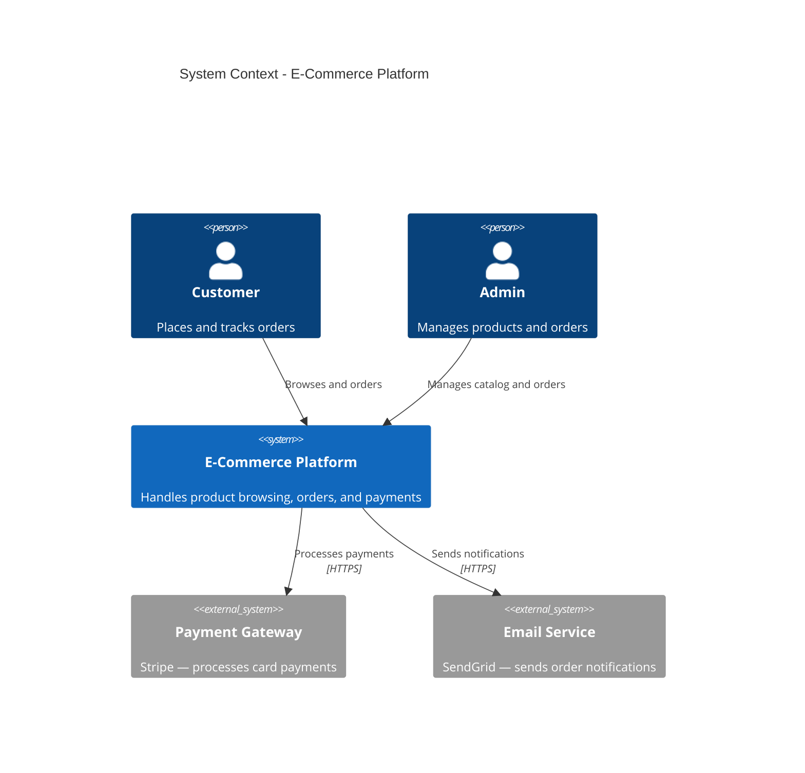
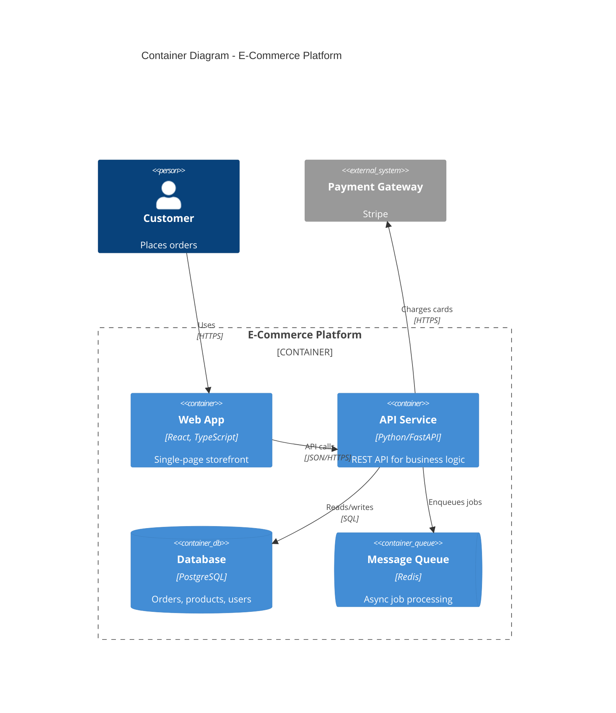
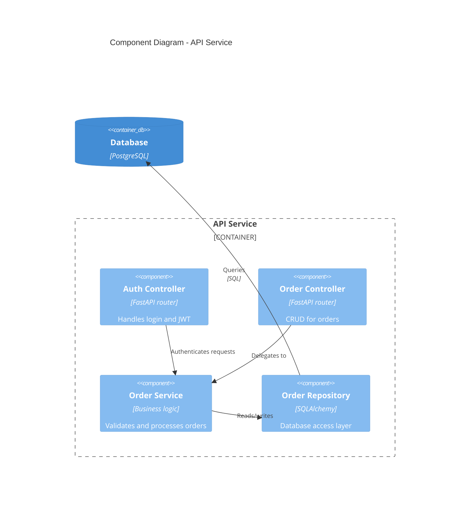
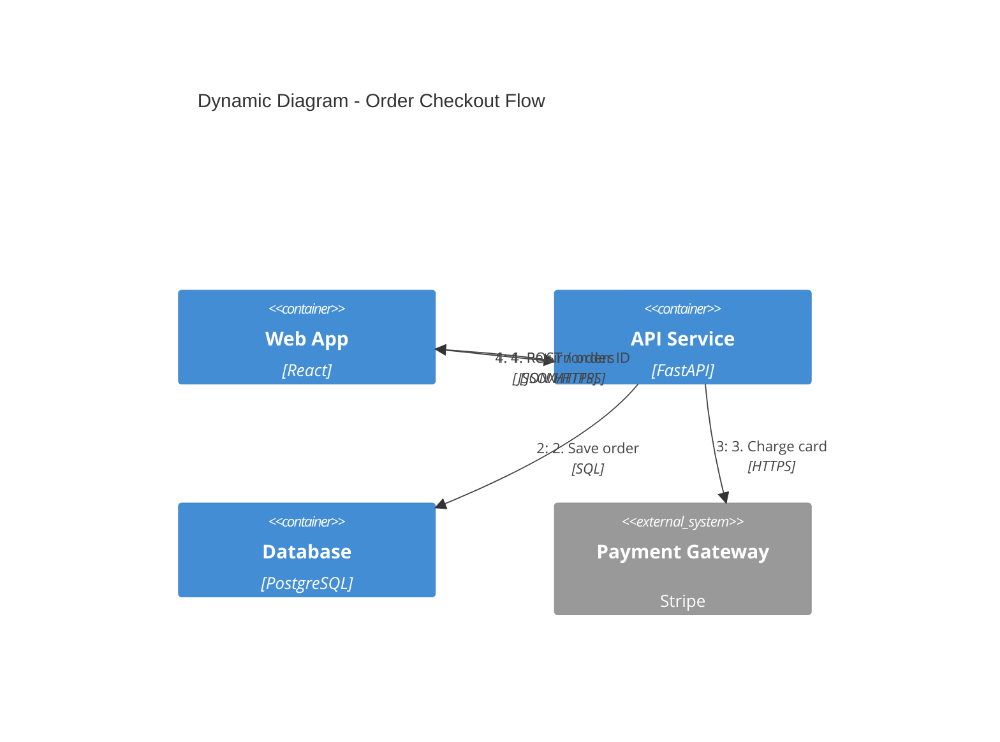
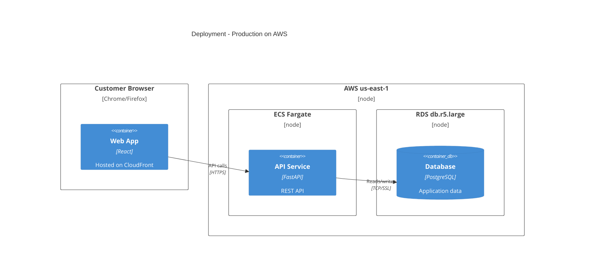

# C4 Architecture Documentation

Generate software architecture documentation using the C4 model. C4 describes architecture at four zoom levels: Context → Container → Component → Code (deployment). Use Mermaid syntax for all diagrams.

---

## C4 Diagram Levels

Select the appropriate level based on the audience and documentation need:

| Level | Diagram Type | Audience | Shows | When to Create |
|-------|-------------|----------|-------|----------------|
| 1 | **C4Context** | Everyone | System + external actors | Always (required) |
| 2 | **C4Container** | Technical | Apps, databases, services | Always (required) |
| 3 | **C4Component** | Developers | Internal components | Only when it adds value |
| 4 | **C4Deployment** | DevOps | Infrastructure nodes | For production systems |
| - | **C4Dynamic** | Technical | Request flows (numbered) | For complex workflows |

> [!TIP]
> **Context + Container diagrams are sufficient for most software development teams.** Only create Component/Code diagrams when they genuinely add value.

---

## Quick Start Examples

### Level 1: System Context



### Level 2: Container Diagram



### Level 3: Component Diagram



### Dynamic Diagram (Request Flow)



### Deployment Diagram



---

## Element Syntax

### People and Systems

```
Person(alias, "Label", "Description")
Person_Ext(alias, "Label", "Description")       # External person
System(alias, "Label", "Description")
System_Ext(alias, "Label", "Description")       # External system
SystemDb(alias, "Label", "Description")         # Database system
SystemQueue(alias, "Label", "Description")      # Queue system
```

### Containers

```
Container(alias, "Label", "Technology", "Description")
Container_Ext(alias, "Label", "Technology", "Description")
ContainerDb(alias, "Label", "Technology", "Description")
ContainerQueue(alias, "Label", "Technology", "Description")
```

### Components

```
Component(alias, "Label", "Technology", "Description")
Component_Ext(alias, "Label", "Technology", "Description")
ComponentDb(alias, "Label", "Technology", "Description")
```

### Boundaries

```
Enterprise_Boundary(alias, "Label") { ... }
System_Boundary(alias, "Label") { ... }
Container_Boundary(alias, "Label") { ... }
```

### Relationships

```
Rel(from, to, "Label")
Rel(from, to, "Label", "Technology")
BiRel(from, to, "Label")                        # Bidirectional
Rel_U(from, to, "Label")                        # Upward
Rel_D(from, to, "Label")                        # Downward
Rel_L(from, to, "Label")                        # Leftward
Rel_R(from, to, "Label")                        # Rightward
```

### Styling and Layout

```
UpdateLayoutConfig($c4ShapeInRow="3", $c4BoundaryInRow="1")
UpdateElementStyle(alias, $fontColor="red", $bgColor="grey", $borderColor="red")
UpdateRelStyle(from, to, $textColor="blue", $lineColor="blue", $offsetX="5", $offsetY="-10")
```

---

## Best Practices

1. **Every element must have** — name, technology (where applicable), and description
2. **Use unidirectional arrows** — bidirectional arrows create ambiguity; use two arrows if truly bidirectional
3. **Label arrows with action verbs** — "Sends events to", "Reads from", "Authenticates via"
4. **Include technology labels** — "JSON/HTTPS", "SQL", "gRPC"
5. **Stay under 20 elements per diagram** — split complex systems into multiple diagrams
6. **Always include a title** — `title System Context diagram for [System Name]`
7. **Start at Level 1** — context diagrams frame the scope before drilling into containers

### Common Mistakes to Avoid

- Confusing containers (deployable units) with components (non-deployable logical parts)
- Modeling shared libraries as containers
- Showing a message broker (Kafka) as a single box instead of individual topics
- Adding undefined abstraction levels (e.g., "subcomponents")
- Removing type labels to "simplify" — they communicate essential technology context

---

## Output Location

Write architecture documentation to `docs/architecture/` with this naming convention:

- `c4-context.md` — System context diagram
- `c4-containers.md` — Container diagram
- `c4-components-{feature}.md` — Component diagrams per feature
- `c4-deployment.md` — Deployment diagram
- `c4-dynamic-{flow}.md` — Dynamic diagrams for specific flows

---

## Audience-Appropriate Detail

| Audience | Recommended Diagrams |
|----------|---------------------|
| Executives | System Context only |
| Product Managers | Context + Container |
| Architects | Context + Container + key Components |
| Developers | All levels as needed |
| DevOps | Container + Deployment |
