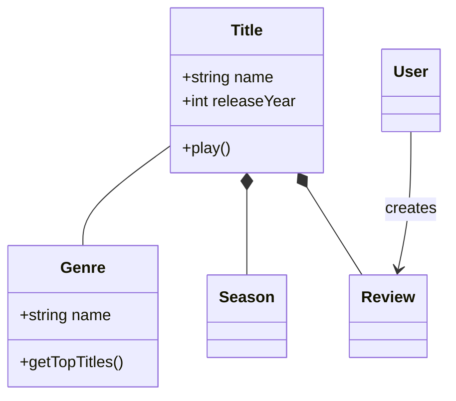
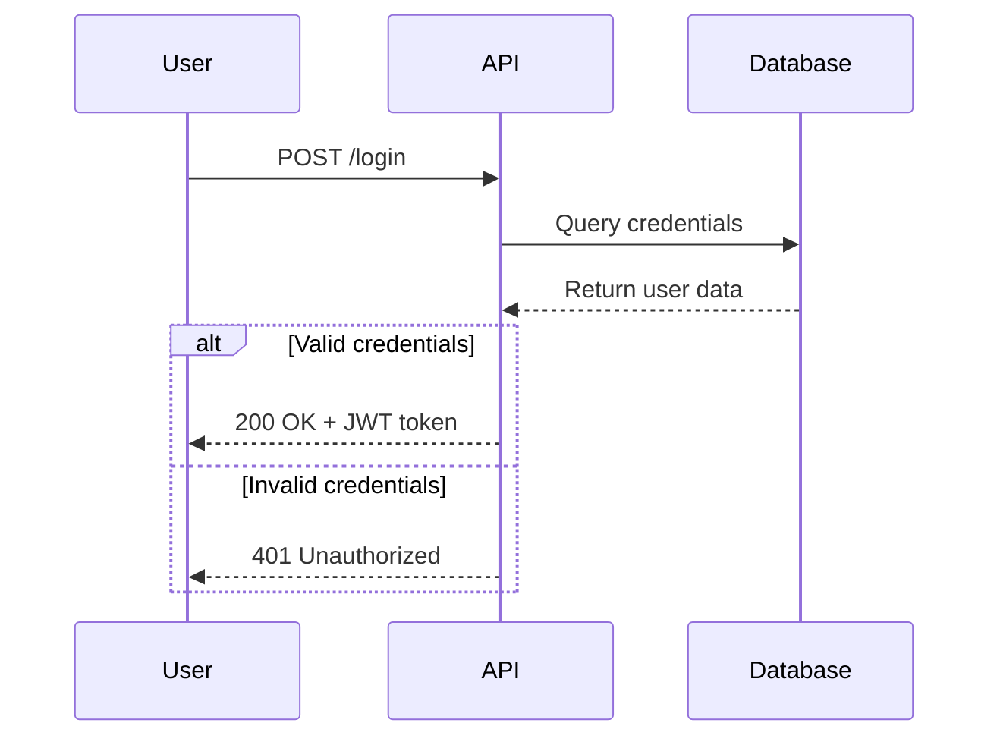
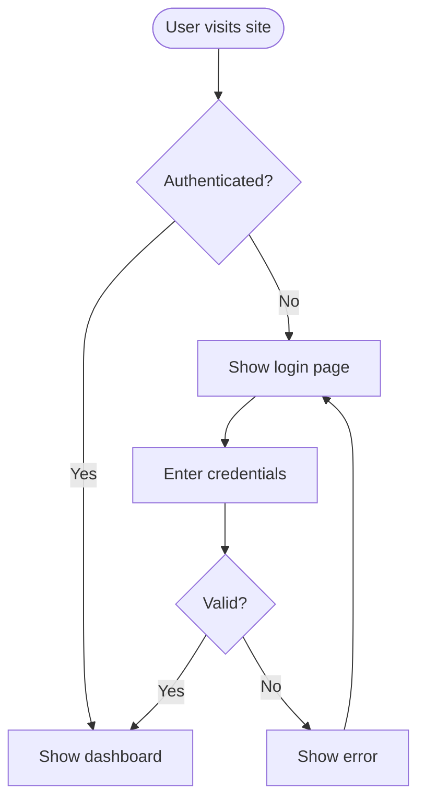
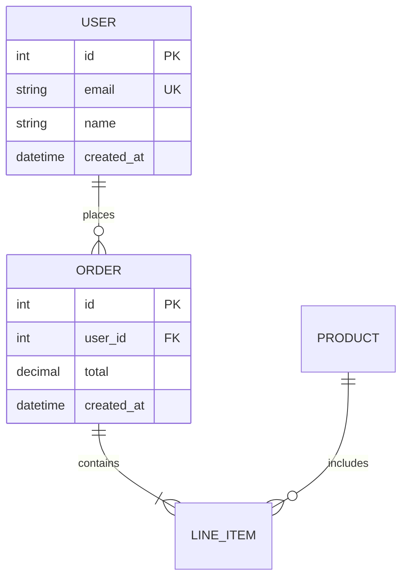
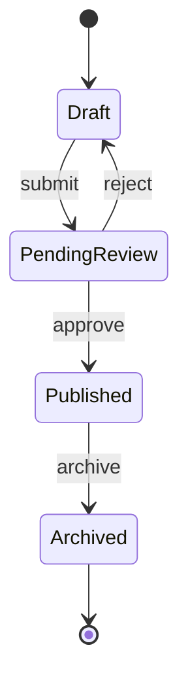
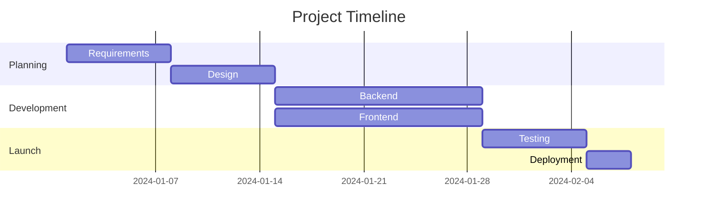
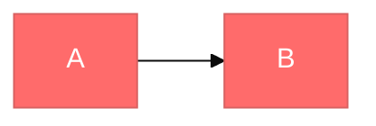

# Mermaid Diagramming

Create professional software diagrams using Mermaid's text-based syntax. Mermaid renders diagrams from simple text definitions, making them version-controllable, easy to update, and maintainable alongside code.

---

## Diagram Type Selection Guide

Choose the right diagram type for the task:

| Type | Best For |
|------|----------|
| **Class Diagrams** | Domain modeling, OOP design, entity relationships |
| **Sequence Diagrams** | API flows, authentication, component interactions |
| **Flowcharts** | Processes, algorithms, user journeys, business logic |
| **ERD** | Database schemas, data modeling |
| **C4 Diagrams** | System context, containers, components, architecture levels |
| **State Diagrams** | State machines, lifecycle states |
| **Git Graphs** | Version control branching strategies |
| **Gantt Charts** | Project timelines and scheduling |
| **Pie/Bar Charts** | Data distribution and comparison |

---

## Core Syntax

All Mermaid diagrams follow this pattern:

```mermaid
diagramType
  definition content
```

**Key principles:**
- First line declares the diagram type
- Use `%%` for comments
- Line breaks and indentation improve readability but aren't required
- Unknown words or misspellings break diagrams silently — validate in [Mermaid Live Editor](https://mermaid.live)

---

## Quick Start Examples

### Class Diagram (Domain Model)



### Sequence Diagram (API Flow)



### Flowchart (User Journey)



### ERD (Database Schema)



### State Diagram



### Gantt Chart



---

## Configuration and Theming

Configure diagrams using frontmatter:



**Available themes:** `default`, `forest`, `dark`, `neutral`, `base`

**Look options:**
- `look: classic` — Traditional Mermaid style
- `look: handDrawn` — Sketch-like appearance

---

## Best Practices

1. **Start Simple** — Begin with core entities, add details incrementally
2. **Use Meaningful Names** — Clear labels make diagrams self-documenting
3. **Keep Focused** — One diagram per concept; split large diagrams into multiple focused views
4. **Add Context** — Include titles (`title: <text>`) and notes to explain purpose
5. **Version Control** — Store `.mmd` files alongside code for easy updates
6. **Validate First** — Use [Mermaid Live Editor](https://mermaid.live) to confirm syntax before finalizing
7. **Comment Extensively** — Use `%%` to explain complex relationships

---

## Common Pitfalls

- **Breaking characters** — Avoid `{}` in comments; use escape sequences for special characters in labels
- **Syntax errors** — Misspellings break diagrams; validate in Mermaid Live
- **Overcomplexity** — Split complex diagrams into multiple focused views
- **Missing relationships** — Document all important connections between entities

---

## Reference Files

For in-depth guidance on specific diagram types, see:

- [references/class-diagrams.md](references/class-diagrams.md) — Domain modeling, relationships (association, composition, aggregation, inheritance), multiplicity, methods/properties
- [references/sequence-diagrams.md](references/sequence-diagrams.md) — Actors, participants, messages (sync/async), activations, loops, alt/opt/par blocks, notes
- [references/flowcharts.md](references/flowcharts.md) — Node shapes, connections, decision logic, subgraphs, styling
- [references/erd-diagrams.md](references/erd-diagrams.md) — Entities, relationships, cardinality, keys, attributes
- [references/c4-diagrams.md](references/c4-diagrams.md) — System context, container, component diagrams, boundaries
- [references/architecture-diagrams.md](references/architecture-diagrams.md) — Cloud services, infrastructure, CI/CD deployments
- [references/advanced-features.md](references/advanced-features.md) — Themes, styling, configuration, layout options

---

## Exporting and Rendering

**Native support in:**
- GitHub/GitLab — Automatically renders in Markdown
- VS Code — With Markdown Mermaid extension
- Notion, Obsidian, Confluence — Built-in support

**Export options:**
- [Mermaid Live Editor](https://mermaid.live) — Online editor with PNG/SVG export
- Mermaid CLI: `npm install -g @mermaid-js/mermaid-cli` then `mmdc -i input.mmd -o output.png`
- Docker: `docker run --rm -v $(pwd):/data minlag/mermaid-cli -i /data/input.mmd -o /data/output.png`
