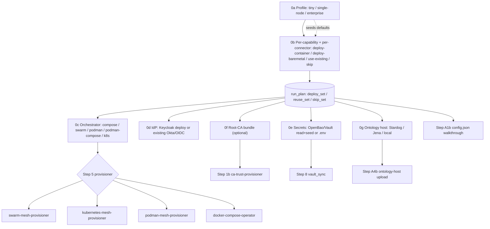

# Agent OS Genesis — Day 0 Bootstrap & Multi-Service Wiring Orchestrator

> Renamed from `day0_bootstrap_orchestrator`; the **`day0`** alias still applies.

Agent-first, idempotent unfolding of the homelab from bare hosts to a fully wired
Docker Swarm. This is the repeatable "day-0 (re)install" entrypoint for the Agent OS
in `agent-utilities`: it consumes the Ansible inventory (`~/.config/agent-utilities/inventory.yaml`)
and the `workspace.yml` service manifest, drives the convergence via MCP tools (preferring
the MCP path, with a full-mesh RSA key fallback), and records the resulting topology in the
Knowledge Graph.

## Verified topology (source of truth)

| Host | IP | Swarm role | Notes |
|------|-----|-----------|-------|
| R820 | 10.0.0.13 | **Manager** | Caddy ingress (host-mode 80/443), most MCP servers |
| R710 | 10.0.0.11 | Worker | GitLab CE + registry, high-RAM JVM workloads |
| R510 | 10.0.0.10 | Worker | storage/NAS, arr-stack, Immich DB |
| RW710 | 10.0.0.12 | Worker | misc MCPs |
| GR1080 | 10.0.0.16 | Worker | GPU (CUDA) workloads |
| GB10 | 10.0.0.18 | Worker | Grace-Blackwell; vLLM |

> Placement is **hardware-determined** (Step 4), never hardcoded. The table is the
> expected steady state; the planner may relocate services based on live capacity.

## Networking contract (matches `networks/compose.yml`)

| Network | Subnet | Flags | Purpose |
|---------|--------|-------|---------|
| `internet` | 172.16.0.0/20 | overlay, attachable | outbound egress |
| `caddy` | 172.16.16.0/20 | overlay, attachable, **internal** | service mesh behind ingress |
| `vpn` | 172.16.32.0/20 | overlay, attachable, mtu 1380 | VPN-routed services |
| `cloudflare` | 172.16.48.0/20 | overlay, attachable, **internal** | cloudflare connector |
| `ingress` (custom) | 172.20.0.0/16 | overlay, `--ingress` | replaces Swarm's default ingress |
| `adguard_vlan` | 10.0.0.0/8 | macvlan (`eno4`) | Technitium static IP 10.0.0.199 |

## DNS policy

All `*.arpa` resolve to the **Caddy ingress at `10.0.0.13`** (wildcard `*.arpa` + explicit
`portainer`), which routes by Host header via its static Caddyfile. Intentional exceptions
that point directly at a host/macvlan IP are preserved: `adguard.arpa`/Technitium → 10.0.0.199,
`home-assistant` → its macvlan IP, and per-node `dozzle*`/`container-manager-*` agent records.

> **Troubleshooting:** see [`references/TROUBLESHOOTING.md`](references/TROUBLESHOOTING.md) — a
> symptom→diagnosis→fix runbook for swarm quorum loss, manager re-IP / advertise-addr,
> worker rejoin, DNS `.arpa` repointing, and the **caddy overlay VIP-corruption pitfall**
> (do NOT change a live overlay's subnet in place).

## Failure-handling policy

- **Missing upstream images** — several `*-mcp` services have no image in `registry.arpa` /
  Docker Hub yet. Pre-scan each stack's `image:` for availability; **skip gracefully and add to
  a deferred report** (service → missing image). Never abort a tier for a missing image.
- **First-time / untested stacks** (`apache-jena`/Fuseki, `camunda`, `archimate`/Archi, `kafka`)
  are deployed as **canaries**: deploy in isolation, gate on a health check (env/volumes/ports/
  depends_on sanity + container healthy), and surface logs on failure rather than continuing blindly.

---

## Deployment profiles (agent-utilities day-0)

This orchestrator is **profile-driven**. Step 0 selects a profile, which gates
the remaining steps so the same workflow scales from a laptop to a full swarm:

| Profile | Scope | Steps run |
|---|---|---|
| **tiny** | One host, **zero external infra** — the KG runs in-process. | Step 0 → Step A1 only (collapses to `agent-utilities/scripts/bootstrap.sh`). |
| **single-node-prod** | One host, durable: Postgres/pggraph KG + gateway + the `single-node-prod` connector slice + Caddy; optional OpenBao/Langfuse. No swarm. | Step 0, a Caddy/Portainer subset of Step 7, Step 8 (OpenBao optional), Steps A1–A4. |
| **enterprise** | Full multi-node swarm + all integrations + the entire `*-mcp` fleet. | All steps (1–16 + A1–A6). |

Each integration is an independent toggle gathered in Step 0 —
`pggraph`, `kafka`, `openbao`, `keycloak`, `langfuse` — and any step that depends
on a disabled integration is skipped and reported.

## Single-package deploy mode (skill-guided, per connector)

This skill also deploys **one** `agents/*` package on its own — the entry point every
connector's `README.md` references so an operator who lands on (say) `gitlab-api`,
`servicenow-api`, or `mattermost-mcp` can stand **just that MCP/agent server** up,
skill-guided, without the whole fleet. It is a **subset of the same machinery**: the
full genesis already does the heavy lifting (run plan, install modes, secrets, certs,
messaging), so a single-package deploy is genesis with a one-item run plan.

**Invoke:** "deploy `<package>` with agent-os-genesis" (or `--package <name>`). The flow:

1. **Resolve the package** from `references/connector-catalog.md` (package, console
   script `<name>-mcp` / `<name>-agent`, image, required secret env keys, profiles).
2. **Pick the install method** (the per-item run-plan action + variant from Step 0):
   - **bare-metal, prod** — `uvx <name>-mcp` (ephemeral) or `uv tool install <package>`.
   - **bare-metal, dev** — `uv pip install -e ".[all]"` / `pip install -e` against the
     cloned package (editable working tree, for development/testing).
   - **container, prod** — pull `knucklessg1/<name>:latest`, deploy via the chosen
     orchestrator (compose / swarm / podman / podman-compose / k8s).
   - **container, dev** — deploy the package's **`compose.dev.yml`** (source-mounted at
     `/src`, pip-install-at-start, pinned to the source node — edits go live on restart).
3. **Seed its secrets** — `graph_configure action=vault_sync config_key=<package>` with
   the catalog's secret env keys: reads existing, prompts only for the missing, returns
   `vault://apps/<package>/<KEY>` refs for the env/config.
4. **Apply cert trust** (Step 1b) if a `ca_bundle` was given, and **register the MCP
   server** (`graph_configure action=register_mcp`) so the multiplexer/IDE can reach it.
5. **(Optional) messaging** — wire the agent→user channels (Step A4c) if the operator
   wants this single agent to reach them.
6. **Verify** — `agent-utilities doctor` + a live `tools/list`/`tools/call` against the
   deployed endpoint.

The orchestrator, IdP, secrets-store, CA, and dev/prod variant choices are exactly the
Step 0 axes — only the run plan is narrowed to the one package. This is what the
per-package README block (see `references/package-deploy-readme.md`) points operators to.

## Steps

### Step 0: deployment-profile + adaptive run plan
Resolve **what to deploy vs. reuse vs. skip** — interactive for *preferences*,
automated for *provisioning*. The operator answers a small set of plain questions;
genesis derives the detailed plan. Read defaults from
`~/.config/agent-utilities/inventory.yaml` (`deployment_profile`) when present. The
repo's **`genesis.yaml`** (root of agent-utilities) is the machine-readable manifest —
profiles, host preflight, the platform deps + MCP `servers` fleet (it references
`deploy/mcp-fleet.registry.yml`), UI `components`, and `ide_targets`; each carries
`install_modes` and a per-profile `default_action`. **Loop it rather than hard-coding.**

**0a. Profile** — `tiny` · `single-node-prod` · `enterprise` (the coarse default that
pre-fills everything below). Then run the host preflight before touching anything:
`agent-utilities-doctor --preflight --profile 
` (or MCP `graph_configure
action=preflight config_key=
`) — **no Rust needed** (engine ships as a wheel);
Docker/Podman/k8s only above tiny.

**0b. Per-capability deploy/reuse/skip matrix** — for each **platform dependency**
(Postgres/pg-age, ontology store, secrets vault, IdP, ingress proxy, DNS,
observability, event bus) and each **connector** (the `agents/*` fleet, see
`references/connector-catalog.md`), pick exactly one **action**:
`deploy-container` · `deploy-baremetal` (pypi/uvx) · `use-existing` (operator supplies
endpoint/creds) · `skip`. Defaults come from the profile's `default_action`, so the
operator only overrides the exceptions. This is what makes genesis fit *any*
environment: an enterprise that already runs Postgres + an ingress proxy marks those
`use-existing` (→ genesis skips pg-age and Caddy, just wires the endpoints); a homelab
leaves them `deploy-container`. The resolved **run plan** (`deploy_set` / `reuse_set`
/ `skip_set`) gates every later step — a `skip`/`use-existing` capability's deploy
sub-step is bypassed and only its wiring runs.

**0c. Orchestrator** (for `deploy-container` items) — first-class choice of
`docker-compose` · `docker-swarm` · `podman` · `podman-compose` · `kubernetes`
(**default kubernetes for enterprise**, swarm for single-node, compose/podman for
tiny). Drives Steps 5/6/11 to the matching provisioner
(`swarm-mesh-provisioner` | `kubernetes-mesh-provisioner` | `podman-mesh-provisioner`
| `docker-compose-operator`). Podman supports **rootful or rootless** (asked when
podman is chosen). Mutually exclusive per node.

**0d. Identity provider** — `keycloak (deploy-if-absent)` · `okta (existing org)` ·
`other-oidc (existing)`. Okta/other-OIDC are SaaS/already-run, so genesis only wires
to them (sets `AUTH_JWT_JWKS_URI` to their JWKS, provisions the fleet OIDC client);
keycloak is deployed only when no IdP exists. See Step 8/14.

**0e. Secrets store** — OpenBao/HashiCorp Vault (same Vault API, both first-class) vs
`.env` fallback. If a Vault is reachable, genesis prefers it and **reads existing
secrets** before prompting (Step 8, `vault_sync`).

**0f. Enterprise root-CA bundle** (optional) — a PEM path/content for a corporate /
self-signed CA. If supplied, the cert-trust step (Step 1b) bakes it in everywhere so
no self-signed errors occur.

**0g. Ontology host** — where the OWL ontology is hosted: `stardog` · `apache-jena`
(Fuseki) · `local` (in-process SPARQL). Default stardog for enterprise, local for
tiny. Drives the ontology-host step (Step A4b).

**0h. Messaging channels** — which channel(s) the agent uses to reach the end user
(agent-utilities has a native multi-channel messaging subsystem, CONCEPT:ECO-4.0):
`slack` · `teams` · `telegram` · `mattermost` · `discord` · `whatsapp` · `matrix` ·
`signal` · … (17 backends). Pick **one or more**; each picked channel's token is seeded
to the secrets store and added to `MESSAGING_ENABLED_BACKENDS` so all configured
channels connect. Also pick a **reach mode**: `last-active` (default — the agent
replies on the user's most-recent channel, others stay available) or **`broadcast`**
(opt-in — a message fans out to *all* configured channels at once). Drives the
messaging-setup step (Step A4c).

> **Install-mode variants (prod vs. dev) — applies to every `deploy-*` item in 0b.**
> `deploy-container` → **prod** (pre-built registry image) or **dev** (`compose.dev.yml`,
> source-mounted at `/src`, pip-install-at-start, edits live on container restart).
> `deploy-baremetal` → **prod** (`uvx` / `uv tool install <pkg>` from PyPI) or **dev**
> (`uv pip install -e` / `pip install -e ".[all]"`, editable working tree). Production
> defaults to prod variants; pass `--dev` (or set the item's `install_variant: dev`) to
> select the editable path for development/testing.

- Outputs: `deployment_profile`; `run_plan` {deploy_set, reuse_set, skip_set} with a
  per-item `install_mode` + `install_variant` ∈ {prod, dev}; `orchestrator` ∈
  {docker-compose, docker-swarm, podman, podman-compose, kubernetes} (+ `podman_rootless`
  bool); `idp` ∈ {keycloak, okta, other-oidc} (+ existing JWKS/issuer when not keycloak);
  `secrets_store` ∈ {vault, env}; `ca_bundle` (optional path); `ontology_host` ∈ {stardog,
  apache-jena, local}; `messaging` {channels: [...], reach_mode ∈ {last-active, broadcast}};
  integration toggles {pggraph, kafka, openbao, keycloak, langfuse} (derived from the run plan).
- Expected: `run-plan-resolved` — gates every subsequent step (each step honors the
  deploy/reuse/skip action + install variant for the capabilities it touches).

### Step 1: ssh-bootstrap
[depends_on: Step 0] (profiles: single-node-prod, enterprise — skipped for tiny)
Verify connectivity across inventory hosts and establish passwordless **full-mesh** SSH keys
(every host → every host) as an RSA fallback. Prefer MCP tool usage; the mesh is the safety net.
- Target hosts: `R510`, `R710`, `RW710`, `R820`, `GR1080`, `GB10`
- Requires: `tunnel-manager-mcp`, `systems-manager-mcp`
- Expected: `mesh-reachable`

### Step 1b: ca-trust-provisioner
[depends_on: Step 1] (conditional: only when Step 0 supplied a `ca_bundle`)
Bake the enterprise / self-signed **root-CA bundle** into every host trust store and
emit the CA env contract (`REQUESTS_CA_BUNDLE` / `SSL_CERT_FILE` / `NODE_EXTRA_CA_CERTS`
/ `GIT_SSL_CAINFO`) + the private-registry trust, via the **`ca-trust-provisioner`**
skill — so subsequent steps (registry/GitLab/Vault/IdP pulls, connector HTTPS calls)
never fail with self-signed-cert errors. The emitted env contract is handed to the
deploy steps (7/11/A2/A3) so each service stack injects it. If no bundle was supplied,
auto-detect the system bundle and skip host changes.
- Requires: `tunnel-manager-mcp` (+ skill `ca-trust-provisioner`)
- Expected: `ca-trusted, ca-env-contract` (skipped → `ca-default`)

### Step 2: network-topology-sweep
[depends_on: Step 1]
Scan subnets, NICs, active links, and VLAN profiles on reachable hosts (confirm `eno4` exists for the Technitium macvlan).
- Requires: `tunnel-manager-mcp`, `systems-manager-mcp`
- Expected: `topology-mapped`

### Step 3: hardware-profile-sweep
[depends_on: Step 1]
Discover CPU models/cores, free RAM, disk partitions, and GPU/accelerator devices per host.
- Requires: `systems-manager-mcp`, `tunnel-manager-mcp`
- Expected: `hardware-profiled`

### Step 4: deployment-planner
[depends_on: Step 2, Step 3]
Run the **Deployment Planner** to compute hardware-driven placement: classify services into tiers
(T0–T6), score candidate nodes by capacity/affinity/density, and emit a deterministic manifest.
Bind GPU→GR1080, storage/NAS→R510, JVM/RAM-heavy (`kafka`, `camunda`, `apache-jena`, `archimate`)→
highest-free-RAM node, manager/edge (Caddy)→R820. This manifest drives node labels and compose constraints.
- Inputs: hardware profiles (Step 3), topology (Step 2), `workspace.yml` service list
- Outputs: `golden-deployment.yaml` (node roles, service→node map, network plan)
- Requires: `systems-manager-mcp`, `tunnel-manager-mcp`, `container-manager-mcp`
- Expected: `placement-manifest`

### Step 5: mesh-provisioner (swarm | kubernetes | podman | compose)
[depends_on: Step 4]
Stand up the cluster substrate. Branch on the Step 0 `orchestrator` choice — all paths are idempotent and re-runnable.

**`orchestrator == swarm` (default) → `swarm-mesh-provisioner`.**
Converge the swarm + networks via the **Ansible bootstrap playbook** (`networks/bootstrap/swarm.yml`,
driven by `inventory.yaml`; `-e reset_swarm=true` for a destructive clean rebuild):
- `docker swarm init` on **R820 (10.0.0.13)**; join workers `R510`, `R710`, `RW710`, `GR1080`, `GB10`.
- Remove Swarm's auto-created default ingress and create the **custom ingress** `172.20.0.0/16`.
- Create overlay networks per the networking contract: `internet`, `caddy` (internal), `vpn` (mtu 1380), `cloudflare` (internal).
- Expected: `swarm-ready, networks-created`

**`orchestrator == kubernetes` → `kubernetes-mesh-provisioner`.**
Stand up RKE2 + Cilium (the Swarm parallel; **requires NIC bonds applied first** so Cilium's tunnel
egress is deterministic):
- RKE2 **server** on **R820 (10.0.0.13)** with `cni: cilium`; join **agents** `R710`, `R510`, `RW710`, `GR1080` (and `GB10` as a tainted arm64 GPU agent once its throttled-vLLM soak passes).
- Cilium runs **kube-proxy-free** (eBPF) — this removes the IPVS kernel path that hard-reset GB10 under Swarm; expose the ingress via a `CiliumLoadBalancerIPPool` + `L2Announcement` VIP (reuse `10.0.0.13` so Technitium needs no change).
- NVIDIA device-plugin on the GPU nodes; configure `registries.yaml` → `registry.arpa` + internal CA on every node.
- Expected: `cluster-ready, cilium-healthy, gpu-advertised`

**`orchestrator == podman` / `podman-compose` → `podman-mesh-provisioner`.**
Provision a Podman control plane (rootful or rootless per `podman_rootless`): enable
the Podman API socket, wire `podman-compose` (`COMPOSE_TOOL=podman-compose`), and
register remote hosts as Podman **system connections over SSH** (same shared inventory,
no exposed daemon). Steps 6/11 then target Podman via `container-manager-mcp`
(`CONTAINER_MANAGER_TYPE=podman`).
- Expected: `podman-ready, hosts-connected`

**`orchestrator == docker-compose` → `docker-compose-operator`.**
Single-host (or compose-over-SSH) path: no clustering — deploy stacks directly with
the compose operator. Steps 6 (labels) is a no-op; Step 11 deploys via compose.
- Expected: `compose-ready`

- Requires: `container-manager-mcp`, `tunnel-manager-mcp`

### Step 6: node-labeling
[depends_on: Step 5]
Apply the `name=<HOST>` label to every node plus role labels from the planner (`gpu=true`, `storage=true`,
`edge=true`, etc.). The label keys are identical across orchestrators so the planner's placement
(`node.labels.name==X` → Swarm constraint **or** k8s `nodeAffinity`) resolves either way.
- **swarm:** `docker node update --label-add name=<HOST>` (via `container-manager-mcp update_node`).
- **kubernetes:** `kubectl label node <HOST> name=<HOST>` (or `container-manager-mcp update_node` with
  `CONTAINER_MANAGER_TYPE=kubernetes`), plus the `gpu=true:NoSchedule` taint on GPU nodes.
- Requires: `container-manager-mcp`, `tunnel-manager-mcp`
- Expected: `nodes-labeled`

### Step 7: core-edge-deploy
[depends_on: Step 6]
Bring up the bootstrap-critical core **in dependency order**, resolving the registry/GitLab chicken-and-egg
(registry + GitLab must use a publicly pullable base for first boot):
1. `registry` (so `registry.arpa/*` pulls resolve) → 2. `gitlab` (R710) → 3. `technitium-dns` (macvlan, static `10.0.0.199`) → 4. `caddy` (R820, host-mode 80/443) → 5. `portainer`.
- Requires: `portainer-mcp`, `container-manager-mcp`, `technitium-dns-mcp`, `caddy-mcp`
- Expected: `core-edge-up`

### Step 8: secret-vault-manager + seed-initial-secrets
[depends_on: Step 7]
Stand up the secrets store and **seed the initial secrets so Claude can self-provision
the rest of the run** (honor the Step 0 `secrets_store` + `idp` choices):
- **Vault (OpenBao / HashiCorp Vault — first-class, same API):** when `secrets_store=vault`,
  deploy/init/unseal OpenBao (KV2 at `apps/`) **or** wire to an existing Vault
  (`use-existing`). Mint the write-capable `agent-apps-rw` token.
- **Seed the bootstrap secrets first** (so later automated steps can authenticate):
  the Vault token, private-registry creds, the IdP client secret, and the DB password.
  Use `graph_configure action=vault_sync` (CONCEPT:OS-5.43) per service — it **reads
  existing** `apps/<service>` secrets to skip re-prompting and **seeds** only what's
  missing, returning `vault://apps/<service>/<KEY>` refs to drop into config.json
  (Step A1b). When `secrets_store=env`, the same reconcile writes the service `.env`.
- **IdP:** when `idp=keycloak`, deploy Keycloak (OIDC/SAML); when `idp=okta`/`other-oidc`,
  skip the deploy — only capture the existing issuer/JWKS for Step 14/A4.
- Requires: `openbao-mcp`, `keycloak-mcp` (keycloak deploy only), `graph-os` (vault_sync)
- Expected: `secrets-store-up, initial-secrets-seeded, idp-resolved`

### Step 9: gitlab-repository-seeder
[depends_on: Step 8]
On GitLab CE, auto-provision projects from `workspace.yml`, seed stack compose files, and mint scoped PATs.
- Requires: `gitlab-mcp`
- Expected: `repos-seeded, pats-issued`

### Step 10: portainer-gitops-bind
[depends_on: Step 9]
Bind Portainer stacks to their GitLab repositories using the PATs (GitOps auto-sync).
- Requires: `portainer-mcp`
- Expected: `gitops-bound`

### Step 11: tiered-service-deploy
[depends_on: Step 10]
Deploy all stacks per the placement manifest in dependency tiers (T0→T6), applying the failure-handling policy:
**pre-scan each stack's `image:` for availability → skip+report missing-image `*-mcp` stacks; deploy first-time
stacks (`apache-jena`/Fuseki, `camunda`, `archimate`, `kafka`) as health-gated canaries**.

The T0→T6 tiering, missing-image tolerance, and canary policy are
**orchestrator-agnostic**. On `orchestrator == kubernetes`, render each stack
with the deployment-planner emitter (`emit_manifests.py --target kubernetes`,
SKILL Step 7b) and deploy the resulting `k8s/` manifests via the
`portainer-agent` MCP Kubernetes GitOps stack (`create_kubernetes_stack_from_repository`)
or `kubectl apply`. The arr-suite gluetun pattern below becomes a native
**shared-netns Pod** (gluetun + apps in one Pod) rather than a standalone compose.
- T0 Critical edge (DNS, Caddy, VPN, registry) → already up (Step 7), verify
- T1 Core platform (Portainer, GitLab, Keycloak, OpenBao, LGTM)
- T2 Business apps (Twenty, ERPNext, Plane, Mattermost, Firefly, **Camunda**, **Archi**)
- T3 Lifestyle/utility (Mealie, wger, Gramps, FreshRSS, Calibre, Reitti)
- T4 AI/ML (vLLM→GB10, Ollama, XTTS, Faster-Whisper) → GPU nodes
- T5 Agent MCP servers (stateless) — **tolerate missing images**
- T6 Media/NAS-bound (arr-suite, Jellyfin, Immich) → R510
  - **arr-suite VPN hardening (REQUIRED):** deploy the arr-suite with the **gluetun-namespace +
    fail-closed kill-switch** pattern (every app `network_mode: service:gluetun`, `FIREWALL=on`),
    **not** the legacy `add-vpn-gateway` route-override (which leaks the host IP on the startup race
    and when the tunnel drops). Because Swarm can't do `network_mode: service:`, the arr-suite runs
    as a **standalone compose on R510** with Caddy repointed to its published ports. Full recipe +
    NordVPN/credential + arr-MCP gotchas: [`references/arr-stack-vpn-hardening.md`](references/arr-stack-vpn-hardening.md).
  - **ONE Keycloak realm (`homelab`), no sprawl:** every app AND the MCP/agent fleet use the
    single `homelab` realm; `master` = super-admin only; never create extra realms unless the end
    user asks. Fleet still-on-`master` → `homelab` migration procedure (waves of 5, dual-trust,
    lock-out/recovery caveats, `keycloak-mcp` special case):
    [`references/keycloak-realm-consolidation.md`](references/keycloak-realm-consolidation.md).
  - **FreshRSS world-model intake + Caddy/Keycloak web SSO (REQUIRED for the RSS source + any
    `*.arpa` web SSO):** install/enable the FreshRSS API + seed curated feeds + deploy the
    `freshrss-mcp` connector, and gate app web UIs with **`caddy-security` (greenpau) OIDC**.
    ⚠️ host the auth **per-app** (`.arpa` is a public suffix → a shared `Domain=arpa` cookie is
    rejected → redirect loop); keep token/API paths (`/api/*`) bypassed so ingestion isn't
    redirected. Eight gates must line up (realm-as-URL-path, `homelab` realm + remove
    `rsa-enc-generated` RSA-OAEP key, host-only cookie, policy `crypto key verify`, `email` claim,
    `/portal`→`/`, `X-WebAuth-User` from `given_name`, app `trusted_sources`) + `registry.arpa`
    routes through Caddy (pre-pull image before cutover). Full recipe + ordered checklist:
    [`references/freshrss-and-sso.md`](references/freshrss-and-sso.md).
- Data platform (**Kafka**, **Apache-Jena**/Fuseki) → highest-RAM node, canary-gated
- Requires: `portainer-mcp`, `container-manager-mcp`
- Expected: `services-deployed, deferred-report` (arr-suite: `vpn-egress-enforced, kill-switch-verified`)

### Step 12: dns-migration-utility
[depends_on: Step 11] (conditional: only when migrating from a legacy resolver — AdGuard Home, Pi-hole, bind9, dnsmasq)
Extract, clean, and convert legacy resolver configurations into unified A/CNAME records before the
authoritative cutover. Skip on greenfield installs with no legacy DNS to import.
- Requires: `systems-manager-mcp`
- Expected: `legacy-dns-normalized` (or `skipped-greenfield`)

### Step 13: dns-record-manager
[depends_on: Step 12]
Apply the DNS policy in Technitium: wildcard `*.arpa` → `10.0.0.13`, explicit `portainer` → `10.0.0.13`,
preserve intentional direct records (`adguard`→.199, `home-assistant`, per-node agents). Verify resolution.
- Requires: `technitium-dns-mcp`
- Expected: `dns-synced`

### Step 14: keycloak-oidc-wiring
[depends_on: Step 13]
Register OIDC SSO clients in Keycloak for SSO-enabled services; store their secrets in OpenBao KV2.
**MCP fleet auth (CONCEPT:OS-5.32):** also create the **`mcp-multiplexer` confidential
client** (audience `agent-services`) via `keycloak-client-onboarder` and store its secret
in OpenBao — this is the service identity the multiplexer uses to reach jwt children
(Step A2). Then load the **baseline eunomia policy** (allow the multiplexer principal,
deny `unknown`) via `eunomia-policy-manager` at `eunomia.arpa` — eunomia fails CLOSED, so
this MUST exist before any MCP enforces jwt.
- Requires: `keycloak-mcp`, `openbao-mcp` (+ skills `keycloak-client-onboarder`, `eunomia-policy-manager`)
- Expected: `sso-wired, mcp-multiplexer-client-created, eunomia-baseline-loaded`

### Step 14b: credential-rotation-policy
[depends_on: Step 14] (profiles: single-node-prod, enterprise — skipped for tiny)
Establish recurring, policy-driven secret rotation via the
`automated-credential-rotation` skill, now that secrets exist in OpenBao (Step 8/14):
- Build the rotation **catalog** (each secret's OpenBao path, provider, consumers, and
  `cadence_days` — 6-month baseline) from the secrets provisioned in Step 14 (Keycloak
  client secrets, GitLab/GitHub PATs, DB/LLM/OTEL keys).
- **Validate dry-run first**: `rotation_lib.py plan --catalog …` renders a value-free
  plan; confirm no secret material appears in any output.
- Schedule the recurring rotation (off-peak, 6-month cadence) via the `schedule` skill;
  high-stakes secrets (Keycloak client, DB, registry) require an approval window before
  `execute`. Rotation uses Keycloak `regenerate_client_secret_by_client_id`, writes new
  values to OpenBao, propagates to consumers via Portainer `update_stack`, verifies, and
  revokes the old — never echoing a value.
- Requires: `openbao-mcp`, `keycloak-mcp`, `portainer-mcp` (+ skills
  `automated-credential-rotation`, `schedule`)
- Expected: `rotation-catalog-registered, rotation-schedule-armed, dry-run-validated`

### Step 14c: ciso-assistant-bootstrap
[depends_on: Step 11] (conditional: only when the `ciso-assistant` stack is in the manifest)
Bootstrap the deployed **CISO Assistant** GRC stack so its API is usable headlessly —
**no SMTP required** (the superuser email is only a login identifier, never mailed):
- Run `services/ciso-assistant/bootstrap.sh` from a swarm manager. It waits for the
  backend `/api/health/`, sets the superuser (`CISO_ADMIN_EMAIL`, default
  `admin@ciso.arpa`) password (reused from OpenBao if already present), mints a
  **long-lived (10-year) Knox API token**, and persists `DJANGO_SECRET_KEY` + admin
  creds + `CISO_ASSISTANT_TOKEN` to **OpenBao** (`secret/services/ciso-assistant`, via
  the write-capable `OPENBAO_TOKEN` from Step 8/14) **and** the stack `.env`. Idempotent.
- Capture the emitted `CISO_ASSISTANT_URL` / `CISO_ASSISTANT_TOKEN` and inject them into
  the **graph-os** environment (Step A2/A4) so the agent-utilities `ciso_assistant` KG
  connector (KG-2.110 extractor / KG-2.111 writeback) can sync the GRC estate into the KG
  and reconcile it with Egeria + Camunda via the `ALIGNED_WITH` crosswalk.
- The stack's `compose.yml` already puts the backend on the `caddy` overlay and the repo
  carries the `ciso.arpa` Caddyfile route; ensure the central Caddy is reloaded (Step 7/13).
- Requires: `portainer-mcp`/`container-manager-mcp` (docker exec), `openbao-mcp`, `caddy-mcp`
- Expected: `ciso-superuser-set, ciso-token-minted, ciso-token-in-openbao, ciso-connector-wired`

### Step 15: observability-and-backups
[depends_on: Step 14]
Stand up the full LGTM observability standard (CONCEPT:OS-5.23) + Borgmatic backups:
- node-exporter + cAdvisor (global) already give every host + every container metrics.
- Generate the MCP scrape/probe targets and dashboards from the fleet registry:
  `agent-utilities/scripts/gen_prometheus_mcp_targets.py` + `gen_grafana_dashboards.py`.
- Deploy the LGTM stack carrying: the `mcp-fleet` (`/metrics`) + `blackbox-mcp` (`/health`)
  Prometheus jobs, the global `promtail` (container logs → Loki), the full `rules.yml`
  alert set (→ Mattermost), and the provisioned Grafana datasources + dashboards
  (Fleet Overview / Per-Service / Host & Infra).
- Drive per-service wiring via `service-observability-provisioner`.
- Requires: `systems-manager-mcp`, `portainer-mcp` (+ skill `service-observability-provisioner`)
- Expected: `observability-up, mcp-fleet-scraped, dashboards-provisioned, alerts-loaded, backups-scheduled`

### Step 16: graph-os
[depends_on: Step 15]
Materialize the full topology in the Knowledge Graph (`HostNode`, `ContainerStackNode`,
`PlatformService`, network + placement edges), including the **deferred/skipped report** so missing-image
services are tracked for later push+validation.
- Requires: `graph-os`
- Expected: `topology-ingested`

---

## Steps — agent-utilities core (A-series)

These steps install and wire **agent-utilities itself** (its deps, the graph-os
MCP + multiplexer, the `*-mcp` connector fleet, and the integrations). They are
profile-gated; the **tiny** profile runs only Step A1.

### Step A1: agent-utilities-install
[depends_on: Step 0]
Install agent-utilities dependencies on the target host(s): `uv sync` (or
`pip install -e ".[all]"`). For **tiny**, write the zero-infra `.env`
(`GRAPH_BACKEND=tiered`) and run `agent-utilities/scripts/bootstrap.sh` (which
also runs a KG smoke test) — the tiny profile **stops here**.
- **Install mode is per Step 0 `install_mode`:** `deploy-baremetal` → `uv tool install
  agent-utilities` (prod) or `pip/uv install -e ".[all]"` (dev/test, editable);
  `deploy-container` → pull the pre-built `graph-os` image (Step A2). Prefer **pypi for
  production**, editable installs for development.
- Requires: `systems-manager-mcp`
- Expected: `agent-utilities-installed` (tiny: `bootstrap-verified`)

### Step A1b: config-walkthrough
[depends_on: Step A1]
Generate and tune the complete **`config.json`** (XDG path) for the resolved run plan —
auto-tuned by default, every item overridable. Uses the existing config machinery:
- `graph_configure action=generate_config config_key=<profile>` writes a COMPLETE
  config.json (every ~261 fields defaulted/auto-sized) seeded by the profile + run plan.
- Present `graph_configure action=config_reference` (every option grouped by subsystem)
  so the operator can **override any value**; apply overrides live with
  `action=set_config` (honoring `restart_required` for engine-rebuild keys).
- Drop in the `vault://apps/<service>/<KEY>` refs from Step 8 (`vault_sync`) for every
  secret-bearing field instead of inline values.
- Finish with `graph_configure action=config_doctor` + `agent-utilities doctor` → green
  (config complete, secret refs resolvable, durability rules hold, IdP detected).
- Requires: `graph-os`
- Expected: `config-generated, config-validated`

### Step A2: graph-os-and-multiplexer
[depends_on: Step A1] (profiles: single-node-prod, enterprise)
Deploy the **agent-utilities `graph-os` MCP server** (`knucklessg1/agent-utilities`,
container `command: graph-os`, streamable-http :8000) as a Portainer GitOps stack
pinned to the **KG host node (R820)** with `KG_DAEMON_ROLE=host` — it owns the
single consolidated KG daemon. Also start `mcp-multiplexer` federating graph-os +
the connector fleet, and (optionally) the REST gateway `graph-os-daemon` (:8100).
For durable profiles, point `GRAPH_DB_URI` at the pggraph tier (Step A4).

**Multiplexer outbound auth (CONCEPT:OS-5.32):** set `MCP_CLIENT_AUTH=oidc-client-credentials`,
`OIDC_CLIENT_ID=mcp-multiplexer`, `OIDC_CLIENT_SECRET` (OpenBao ref from Step 13),
`OIDC_AUDIENCE=agent-services` on the multiplexer so it mints + attaches a Keycloak service
token to every jwt child. Without this, children with `AUTH_TYPE=jwt` are unreachable (401)
through the multiplexer. The multiplexer itself stays at its own inbound-auth posture (do
NOT flip it to a jwt child — it is the client).

**Shared agent-utilities config volume (CONCEPT: OS-5.x):** seed an **external**
named volume `agent_utilities_config` (and `agent_utilities_data`) on the KG host
with the bare-metal `~/.config/agent-utilities/config.json`, and mount it at
`/root/.config/agent-utilities` in graph-os. This is the single source of
config (models, backends, secrets, OTel/Langfuse) — the same volume a bare-metal
install reads. Any **config-aware** `*-mcp` (those that use agent-utilities
models / KG / secrets — e.g. `data-science-mcp`, `scholarx-mcp`,
`repository-manager-mcp`, `emerald-exchange-mcp`) mounts the **same** volume and
is **co-located on the KG host** so the node-local named volume resolves (or back
it with a shared/NFS driver). Thin API-wrapper connectors (github, gitlab,
servicenow, …) do **not** need it — they take their own creds via stack env.
- Requires: `graph-os`, `container-manager-mcp`, `portainer-mcp`
- Expected: `graph-os-up, multiplexer-up, config-volume-seeded`

### Step A3: mcp-fleet-deploy
[depends_on: Step A2] (profiles: single-node-prod, enterprise)
Deploy the `*-mcp` connector fleet from
`agent-utilities/deploy/mcp-fleet.registry.yml`, filtered to services whose
`profiles:` include the active profile. Each is a per-service Portainer stack
(streamable-http, container port `8000` → its registry `host_port`) bound to Git
for GitOps auto-sync via `portainer-sync-agent`. Apply the missing-image
Failure-handling policy. (Regenerate the registry with
`python agent-utilities/scripts/gen_mcp_fleet_registry.py --agents-dir <…>/agents`.)

**Auth + deploy artifact (CONCEPT:OS-5.32 / OS-5.23):** the generated composes ship
`AUTH_TYPE=jwt` + eunomia by default (from `gen_mcp_service_stacks.py` / `gen_editable_compose.py`),
and every service exposes unauthenticated `/metrics` + `/health`. Deploy the **editable**
`compose.dev.yml` (set Portainer `ConfigFilePath=compose.dev.yml`): one container per MCP,
source-mounted at `/src`, pinned to the source node — edits go live on restart. Children
are reachable because the multiplexer presents its service token (Step A2). Flip jwt in
**phased waves** (read-only → data → sensitive; `portainer-mcp` last; never the multiplexer),
verifying multiplexer reachability after each wave.

**Gotchas baked in from live rollout (see `references/TROUBLESHOOTING.md`):**
- **eunomia needs the fastmcp-3.x compat build** (§9): without `apply_fastmcp_enabled_compat()`
  in the deployed agent-utilities, every `tools/call` on a eunomia service errors. Don't flip
  `EUNOMIA_TYPE=remote` onto images that predate that build.
- **Stack env is inert unless the compose passes it** (§10): set BOTH the stack Env value AND
  `- VAR=${VAR}` in the compose `environment:` (tokens, connector URLs).
- **Healthcheck port must equal `PORT`** (§11): a mismatch crash-loops the service to 502;
  prefer a `socket.create_connection(('localhost', PORT))` check.
- **Mount the connector's working data** (§13): repository-manager → workspace +
  `WORKSPACE_PATH`; container/tunnel-manager → `inventory.yaml` + `~/.ssh`. A missing import
  module is a packaging fix (add dep + rebuild), not a mount.
- After restarting any child, **reconnect the multiplexer** before re-validating (§12) — stale
  sessions hang tool calls 300s.
- Requires: `portainer-mcp`, `container-manager-mcp`
- Expected: `mcp-fleet-deployed, auth-on, metrics-exposed, deferred-report`

### Step A4: integrations-wiring
[depends_on: Step A3] (toggle-gated)
Wire **only the enabled** integrations into the agent-utilities config: `pggraph`
(`GRAPH_DB_URI`), `kafka` (`QUEUE_BACKEND=kafka` + `KAFKA_BOOTSTRAP_SERVERS`),
`openbao`/vault (`SECRETS_VAULT_URL` + `VAULT_AUTH_METHOD`), **IdP**
(`AUTH_JWT_JWKS_URI` + `KG_AUTH_REQUIRED` — set to the resolved issuer's JWKS, whether
**Keycloak** (deployed) or an existing **Okta** org (`…/oauth2/<server>/v1/keys`) /
other OIDC; provision the fleet OIDC client against that issuer), `langfuse`
(`LANGFUSE_*` + `ENABLE_OTEL`). `agent-utilities doctor` is IdP-agnostic and names the
detected IdP. Disabled toggles are skipped and reported.
- Requires: `openbao-mcp`, `keycloak-mcp` (keycloak only) / `okta-agent` (okta)
- Expected: `integrations-wired`

### Step A4b: ontology-host
[depends_on: Step A4]
Configure **where the OWL ontology is hosted** (Step 0 `ontology_host`) and **upload
the canonical ontology** there, via the **`database-environment-setup`** skill +
`OntologyPublisher`:
- `stardog` (default enterprise) → `graph_configure action=push_to_stardog` for the
  TBox + register Stardog as a `role="mirror"` connection so the platform hosts/consumes it.
- `apache-jena` (Fuseki) → `OntologyPublisher.push_to_jena_fuseki` (Graph Store Protocol).
- `local` (default tiny) → in-process SPARQL; no external upload.
An operator may supply an **existing** Stardog/Postgres URI+creds (`use-existing`) and
this step configures everything — including the ontology upload — automatically
(`graph_configure action=setup_databases`). The single canonical ontology
(`ontology.ttl` + all imported domain modules) is the validated, connected library
(see agent-utilities `docs/architecture/ontology_library.md`).
- Requires: `graph-os` (+ skill `database-environment-setup`)
- Expected: `ontology-hosted, ontology-uploaded`

### Step A4c: messaging-channels
[depends_on: Step A4] (conditional: only when Step 0 picked ≥1 messaging channel)
Configure the agent→user **messaging** channels (Step 0 `messaging`) so the agent can
reach the operator. agent-utilities already ships the multi-channel send core
(`MessagingService.reach_user` / MCP `graph_reach` / REST `/graph/reach`,
CONCEPT:ECO-4.0) — this step only **provisions** it; it adds no engine code:
- For each picked channel, **seed its token** via `graph_configure action=vault_sync`
  (CONCEPT:OS-5.43) into `apps/messaging` (or the service `.env`), reusing read-existing
  so a re-run never re-prompts. Channel keys: `MESSAGING_SLACK_TOKEN`
  (+`MESSAGING_SLACK_APP_TOKEN`), `MESSAGING_TEAMS_APP_ID`+`MESSAGING_TEAMS_APP_SECRET`,
  `MESSAGING_TELEGRAM_TOKEN`, `MESSAGING_MATTERMOST_TOKEN`+`MESSAGING_MATTERMOST_URL`,
  `MESSAGING_DISCORD_TOKEN`, … (see the messaging config guide).
- Set **`MESSAGING_ENABLED_BACKENDS`** to the full picked list (`set_config`) so **every**
  configured channel auto-connects — having Teams, Slack, and Telegram all set means all
  three come up and are usable.
- **Reach mode:** `last-active` (default) needs only `MESSAGING_DEFAULT_PLATFORM` +
  `MESSAGING_DEFAULT_CHANNEL` (the fallback when no last-active channel is recorded) —
  fully functional today. **`broadcast`** (opt-in) sets `MESSAGING_REACH_MODE=broadcast`
  so a single `reach_user` fans out to all `MESSAGING_ENABLED_BACKENDS` at once; this is
  honored by the messaging engine's fan-out (the `MessagingService` reach-mode behavior).
  > **Dependency note:** broadcast fan-out is delivered in the messaging subsystem
  > (`agent_utilities/messaging/*`); this step writes the agreed `MESSAGING_REACH_MODE`
  > contract. If the engine fan-out is not yet present, `last-active` is the working
  > default and `broadcast` activates as soon as that lands. Do not edit `messaging/*` here.
- **Instant push via webhook + ZERO open ports (CONCEPT:ECO-4.66, recommended).** Inbound
  defaults to long-polling (near-real-time, no ingress). For true push with **no inbound
  port opened**, use an **outbound tunnel** — **Cloudflare Tunnel is the default and needs
  NO edge-ingress node**: run `cloudflared` on this host (it dials out; Cloudflare is the
  edge), map a hostname → `http://127.0.0.1:${MESSAGING_WEBHOOK_PORT:-8443}`, then set
  `MESSAGING_WEBHOOK_BASE_URL=https://hooks.<domain>` (+ `MESSAGING_WEBHOOK_SECRET` via
  `vault_sync`). The bot then registers a `setWebhook` receiver on the LOCAL port with
  `secret_token` validation. Alternatives (same code path): self-hosted **pangolin** tunnel,
  or **public Caddy** + Keycloak `forward_auth` (webhook path exempt, locked by
  signature + Telegram IP allowlist + CrowdSec). Gate human routes with **Cloudflare Access
  / Keycloak**; keep secrets in **OpenBao**. See `agent-utilities` docs/architecture/
  messaging_security.md. Empty `MESSAGING_WEBHOOK_BASE_URL` ⇒ polling (no ingress).
- **Fleet delegation via graph-os + multiplexer (CONCEPT:ECO-4.75).** Wire the chat agent
  to reach the WHOLE fleet by delegating through graph-os — the agent never carries per-
  connector tools. Set TWO MCP servers on the messaging agent (the same surface Claude
  uses): **graph-os** for `graph_orchestrate` + KG, and the **mcp-multiplexer** for dynamic
  `find_tools`/`load_tools` over every connector (github/gitlab/…):
  - `MESSAGING_MCP_URL=http://<served-graph-os>/sse` (the served graph-os MCP, e.g. the
    local `kg_server --transport sse` on `127.0.0.1:8100`).
  - `MESSAGING_MCP_CONFIG=<a config file>` whose single `mcp-multiplexer` server runs
    `python -m agent_utilities.mcp.multiplexer --config <fleet mcp_config.json>`
    (`MCP_MULTIPLEXER_MODE=dynamic`). **No secrets in this file** — OIDC is inherited from
    the daemon's process env.
  - **Fleet auth (jwt-protected fleet):** the messaging daemon loads OIDC client-credentials
    into its env at startup (`MCP_CLIENT_AUTH=oidc-client-credentials` + `OIDC_CLIENT_ID/
    SECRET/AUDIENCE/TOKEN_URL`), sourced **env → OpenBao `apps/mcp-multiplexer` → local
    Claude MCP config**. **Inject them from OpenBao** (`graph_configure action=vault_sync
    config_key=mcp-multiplexer` into the messaging unit env) so the spawned multiplexer AND
    every nested `graph_orchestrate`-spawned agent (via `_spawn_auth_headers`) authenticate.
    Never put these in a plaintext file — OpenBao is the source of truth.
  - **Chat tool policy:** the agent auto-runs the delegation surface (`graph_orchestrate`,
    `graph_search`, `find_tools`, `load_tools`) and read-only fleet tools from a chat message;
    mutating tools stay gated and the spawned specialist's own actions remain governed by the
    ActionPolicy gate (OS-5.24). No extra config — it's the default policy.
- **Verify:** `graph_reach action=status` lists every configured channel as connected;
  a test `graph_reach action=reach_user text="genesis: messaging online"` reaches the
  operator (last-active/default), or — in broadcast mode — all configured channels. For
  delegation, the daemon log shows `[ECO-4.75] fleet auth: loaded …` and the chat agent can
  fetch e.g. GitHub issues via `graph_orchestrate`/the multiplexer.
- Requires: `graph-os`, `mcp-multiplexer` (+ OpenBao for fleet OIDC)
- Expected: `messaging-configured, channels-connected` (broadcast: `+broadcast-mode-set`;
  webhook: `+webhook-push-via-tunnel`; delegation: `+graphos-fleet-delegation`)

### Step A5: mcp-config-rewire (streamable-http, no stdio)
[depends_on: Step A3] (profiles: single-node-prod, enterprise)
Once the fleet is deployed, **back up** every `mcp_config*.json` (workspace +
`~/.config/agent-utilities/mcp_config.json`) to a timestamped dir, then **rewire**
each connector entry from a local **stdio** spawn
(`{"command": ".venv/bin/<name>", ...}`) to the deployed **streamable-http**
endpoint (`{"transport": "streamable-http", "url": "http://<name>.arpa/mcp"}`).
We no longer run the connectors as stdio servers. `graph-os` likewise points at
its R820 streamable-http endpoint. Only rewire entries whose container is live
(use the deferred/skipped report from Step A3); leave the rest stdio until
deployed. Reload the multiplexer.
**Auth note (CONCEPT:OS-5.32):** rewired entries are remote `streamable-http` children that
enforce jwt — leave their `headers` empty; the multiplexer's service token (Step A2) is
attached automatically. Do NOT bake per-child bearer tokens into `mcp_config.json`.
- Requires: `container-manager-mcp`
- Expected: `mcp-config-rewired, stdio-retired`

### Step A6: verify auth + observability end-state
[depends_on: Step A5] (profiles: single-node-prod, enterprise)
Assert the realized end-state (CONCEPT:OS-5.32 / OS-5.23):
- Each jwt MCP rejects unauthenticated calls: `curl -s -o /dev/null -w '%{http_code}'
  -X POST http://<svc>.arpa/mcp` → `401`.
- The multiplexer can call a tool on a jwt child (service token attached) → success.
- **Validate at the TOOL-CALL level, not just `initialize`** — `initialize`/`tools/list`
  passing hides per-call failures (eunomia, missing module, bad URL). Run a full host-side MCP
  session with the A0 token (`initialize`→`initialized`→`tools/list`→`tools/call`) per service;
  see `references/TROUBLESHOOTING.md` §8. In particular, after enabling `EUNOMIA_TYPE=remote`,
  confirm a real `tools/call` returns data and NOT `'FunctionTool' object has no attribute
  'enabled'` (the fastmcp-3.x eunomia break — §9; requires the agent-utilities compat build).
- `/metrics` returns Prometheus exposition: `curl http://<svc>.arpa/metrics`; a tool call
  increments the per-tool counter.
- Prometheus shows `up{job="mcp-fleet"}==1` and `probe_success{job="blackbox-mcp"}==1` for
  live services; Grafana "MCP Fleet Overview" is populated; stopping a service fires
  `McpServiceDown`/`McpProbeFailed` to Mattermost.
- Requires: `portainer-mcp`, `systems-manager-mcp`
- Expected: `auth-enforced, multiplexer-reachable, metrics-live, dashboards-populated, alerts-firing`

## Execution

Run this workflow as a dependency-ordered DAG. Steps with no unmet `depends_on` run in parallel; dependents run after their prerequisites complete.

- **Run first (in parallel):** Step 0 — deployment-profile + adaptive run plan; Step 1 — ssh-bootstrap
- **After level 0:** Step 1b — ca-trust-provisioner (conditional: `ca_bundle` supplied); Step 2 — network-topology-sweep; Step 3 — hardware-profile-sweep
- **After level 1:** Step 4 — deployment-planner
- **After level 2:** Step 5 — mesh-provisioner (per `orchestrator`: swarm | kubernetes | podman | compose)
- **After level 3:** Step 6 — node-labeling
- **After level 4:** Step 7 — core-edge-deploy
- **After level 5:** Step 8 — secret-vault-manager + seed-initial-secrets
- **After level 6:** Step 9 — gitlab-repository-seeder
- **After level 7:** Step 10 — portainer-gitops-bind
- **After level 8:** Step 11 — tiered-service-deploy
- **After level 9:** Step 12 — dns-migration-utility (conditional: legacy-resolver migration only)
- **After level 10:** Step 13 — dns-record-manager
- **After level 11:** Step 14 — keycloak-oidc-wiring
- **After level 12 (in parallel):** Step 14b — credential-rotation-policy; Step 15 — observability-and-backups
- **After level 13:** Step 16 — graph-os
- **agent-utilities core (A-series), after Step 0 / once hosts are ready:** A1 — install → A1b — config-walkthrough → A2 — graph-os+multiplexer → A3 — mcp-fleet-deploy → A4 — integrations-wiring → A4b — ontology-host → A4c — messaging-channels → A5 — mcp-config-rewire → A6 — verify (tiny stops after A1).

Every step honors the Step 0 **run plan**: a capability marked `use-existing` skips
its deploy sub-step and runs only wiring; `skip` is omitted entirely; the
`orchestrator` selects the Step 5 provisioner branch.

**Execution:** If graph-os is reachable, offload the whole DAG via `graph_orchestrate action=execute_workflow` (or the `kg-delegation-router` skill) for true parallel/swarm execution. Otherwise execute the steps natively in dependency order: run steps with no unmet `depends_on` in parallel, then their dependents.
