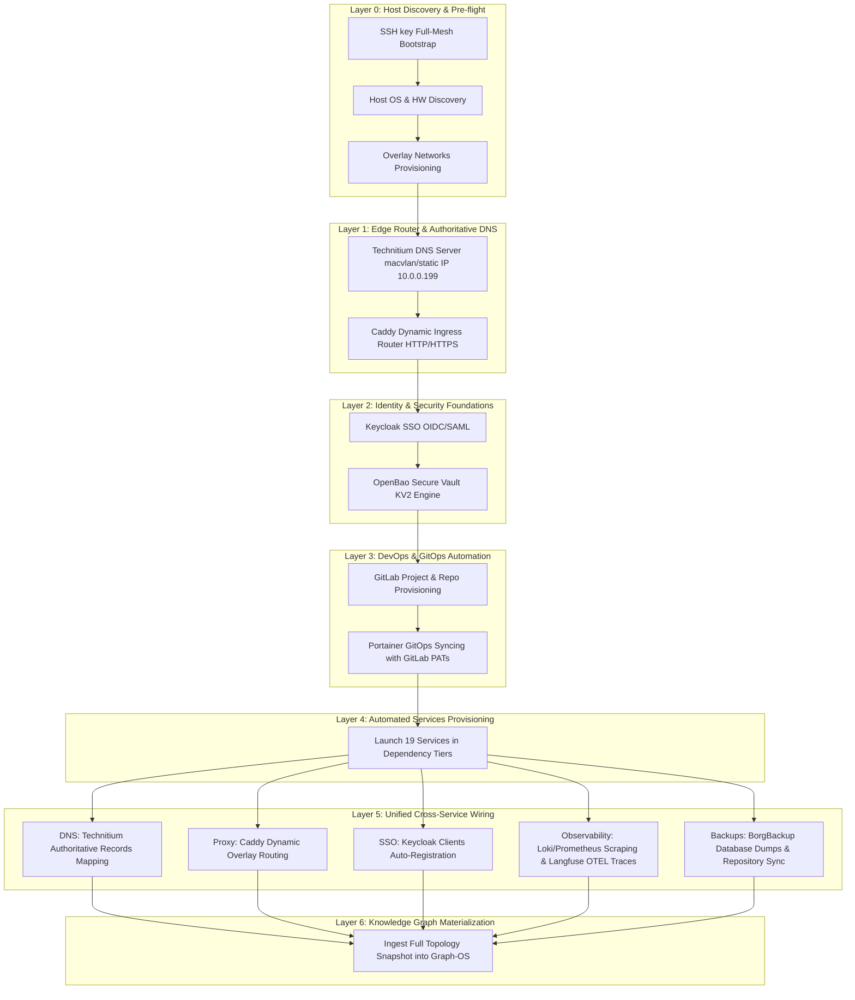

# Day 0 Bootstrap & Multi-Service Wiring Orchestrator

This advanced workflow skill outlines the exact sequential phases and integration steps to automate a complete, top-down deployment and service wiring operation starting from a single Day 0 server.

## 🚀 Architectural Vision: Top-Down Single-Click Integration

---

## 🛠️ The 19 Integrated Services Matrix

All 19 services will be systematically deployed, managed via Portainer Swarm stacks, backed up, and integrated into Keycloak SSO:

| # | Service Name | Target Node | Role / Category | Primary Domain | Integration & Security |
|---|---|---|---|---|---|
| 1 | **Portainer CE** | `R710` (Swarm Mgr) | Container Orchestration UI | `portainer.arpa` | Dynamic DNS + Direct Auth |
| 2 | **GitLab CE** | `RW710` (Swarm Worker)| Local Git / GitOps Repo | `gitlab.arpa` | Keycloak SSO + OpenBao Token Store |
| 3 | **Technitium DNS**| `R710` (macvlan) | Authoritative Primary DNS | `adguard.arpa` (DNS VM) | Primary Recursive Resolver |
| 4 | **Caddy Ingress** | `RW710` (Host Ports) | Reverse Proxy / SSL Ingress | Dynamic Routing | Self-Signed Internal TLS CA |
| 5 | **Keycloak** | `RW710` | Identity Provider (SSO) | `keycloak.arpa` | OIDC / SAML Gateway |
| 6 | **OpenBao** | `R710` | Key-Value Secret Storage | `openbao.arpa` | Vault-API for Env-Config injection |
| 7 | **Twenty CRM** | `RW710` | Enterprise Customer CRM | `twenty.arpa` | Keycloak SSO + DB Persistent Vol |
| 8 | **ERPNext** | `RW710` | ERP / Asset Management | `erpnext.arpa` | Keycloak SSO + MariaDB Cluster |
| 9 | **Plane CE** | `RW710` | Agile Project Tracking | `plane.arpa` | Keycloak SSO + MinIO Object Store |
| 10| **Mattermost** | `RW710` | Chat & Team Collaboration | `mattermost.arpa` | Keycloak SSO + DB State Persistent |
| 11| **Uptime Kuma** | `RW710` | Heartbeat & Uptime Monitor | `uptime.arpa` | OAuth2-Proxy SSO + Metric Scraping |
| 12| **Prometheus** | `RW710` (LGTM) | Metric Storage Backend | `prometheus.arpa` | NodeExporter / Cadvisor Targets |
| 13| **Grafana** | `RW710` (LGTM) | Data Dashboards & UI | `grafana.arpa` | Keycloak SSO + Loki datasource |
| 14| **BorgBackup** | `R820` (Storage Node)| Backup Repository | `borgbackup.arpa` | Borgmatic schedule + OpenBao encryption |
| 15| **Faster Whisper**| `R820` (GPU Node) | AI Audio-to-Text Transcription | `whisper.arpa` | Core-Whisper HuggingFace Caching |
| 16| **Firefly-III** | `R820` | Financial Management | `firefly.arpa` | Keycloak SSO + Ledger exports |
| 17| **Netboot.xyz** | `R820` | PXE Network Installation | `netboot.arpa` | DHCP Option 66/67 Next-Server |
| 18| **Ollama** | `GR1080` (AI Node) | Local LLM Engine (CUDA) | `ollama.arpa` | OpenTelemetry Tracer + Port 11434 |
| 19| **XTTS** | `GR1080` (AI Node) | Coqui Voice Cloning Server | `xtts.arpa` | Dynamic Audio-API endpoint |
| 20| **Reitti** | `R710` | Public Transport Router | `reitti.arpa` | Ingress Route Mapping |

---

## Steps

### Step 1: ssh-bootstrap
Verify connection parameters across inventory hosts. Establish passwordless full-mesh SSH key distribution:
- Target hosts: `R510`, `R710`, `RW710`, `R820`, `GR1080`
- Requires: `tunnel-manager-mcp`, `systems-manager-mcp`

### Step 2: network-topology-sweep
[depends_on: Step 1]
Scan subnets, physical NIC interfaces, active subnets, and VLAN configuration profiles on reachable hosts:
- Requires: `tunnel-manager-mcp`, `systems-manager-mcp`

### Step 3: hardware-profile-sweep
[depends_on: Step 1]
Discover CPU models, free physical RAM capacity, disk partitions, and active GPU/accelerator devices:
- Requires: `systems-manager-mcp`, `tunnel-manager-mcp`

### Step 4: swarm-mesh-provisioner
[depends_on: Step 2]
Initialize Docker Swarm Mode on Manager (`R710`) and join the workers (`R510`, `RW710`, `R820`, `GR1080`). Provision global attachable Swarm Overlay network `overlay-net`:
- Requires: `container-manager-mcp`, `tunnel-manager-mcp`

### Step 5: dns-record-manager
[depends_on: Step 4]
Deploy primary authoritative **Technitium DNS** Server using a macvlan driver on `R710` (binding statically to IP `10.0.0.199`):
- Requires: `technitium-dns-mcp`

### Step 6: portainer-sync-agent
[depends_on: Step 5]
Deploy **Portainer CE** on the Swarm manager. Configure administrative credentials and enable local Swarm endpoints:
- Requires: `portainer-mcp`

### Step 7: secret-vault-manager
[depends_on: Step 6]
Deploy security foundation stacks on Swarm nodes. Launch, initialize, and unseal **OpenBao Secure Vault**, mount KV2 engines, and configure **Keycloak Identity Provider**:
- Requires: `openbao-mcp`

### Step 8: gitlab-repository-seeder
[depends_on: Step 7]
Deploy **GitLab CE** on Swarm. Auto-provision projects for all 19 target platforms, seed repositories with stack compose files, and generate scoped PATs:
- Requires: `gitlab-mcp`

### Step 9: portainer-sync-agent
[depends_on: Step 8]
Configure Portainer stack GitOps synchronizations. Bind application stacks to GitLab repositories using the generated Personal Access Tokens:
- Requires: `portainer-mcp`

### Step 10: portainer-sync-agent
[depends_on: Step 9]
Concurrently provision all 19 services in dependency-tiered execution phases:
- Tier 1: Core Storage & DB (MinIO, MariaDB, Postgres, Redis)
- Tier 2: Business Apps (Twenty CRM, ERPNext, Plane, Mattermost, Firefly-III, Reitti)
- Tier 3: Platform AI engines (Faster Whisper, Netboot.xyz, Ollama, XTTS, Uptime Kuma)
- Requires: `portainer-mcp`

### Step 11: dns-record-manager
[depends_on: Step 10]
Synchronize authoritative zone records and routing configurations. Register A records in Technitium DNS for all `.arpa` domain names:
- Requires: `technitium-dns-mcp`

### Step 12: secret-vault-manager
[depends_on: Step 11]
Register OIDC single sign-on clients in Keycloak. Store secure environment credentials in OpenBao KV2:
- Requires: `openbao-mcp`

### Step 13: systems-manager-mcp
[depends_on: Step 12]
Deploy Loki/Prometheus scraping adapters and configure Borgmatic scheduled backups to target storage mounts:
- Requires: `systems-manager-mcp`

### Step 14: graph-os
[depends_on: Step 13]
Materialize the full Day 0 topology snapshot in the Graph-OS Knowledge Graph, aligning with BFO-infrastructure classes:
- Requires: `graph-os`

