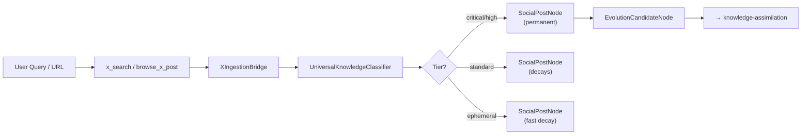

# X Posts to KG Ingestion Workflow

Searches X posts for a given query and ingests the content, author metadata,
engagement statistics, and extracted concepts directly into the Knowledge Graph.
Uses the `UniversalKnowledgeClassifier` for importance scoring and
`XIngestionBridge` for structured persistence.

## Architecture



## Execution Steps

### Step 0: x-search-agent
Search X using `x_search` for a topic query, or browse a specific post URL
using `browse_x_post` with `auto_ingest=True`.

**For topic search:**
```
Use x_search with query: "{{task}}"
```

**For specific post:**
```
Use browse_x_post with url: "{{task}}", auto_ingest: true
```

When `auto_ingest=True`, the browse tool automatically:
1. Retrieves the post via xAI Responses API (grok-4.3)
2. Classifies content via UniversalKnowledgeClassifier
3. Creates SocialPostNode + Person + KBConcept nodes
4. Creates EvolutionCandidateNode if evolution potential ≥ 0.6

Expected: posts with content, engagement metrics, classification results

### Step 1: graph-os
For search results (not auto-ingested), manually ingest each result into the KG
using the XIngestionBridge pattern.

For each result from Step 0:

1. Create SocialPost node:
```
Use mcp_graph-os_graph_write with action: "add_node",
node_type: "SocialPost",
node_id: "social:x:<post_id>",
properties: '{
  "post_id": "<id>",
  "author_handle": "<handle>",
  "content_text": "<text>",
  "post_url": "<url>",
  "post_type": "tweet|article|thread",
  "importance_score": <classifier_score>,
  "is_permanent": <true|false>,
  "evolution_potential": <score>
}'
```

2. Create Person node and link:
```
Use mcp_graph-os_graph_write with action: "add_node",
node_type: "Person", node_id: "person:x:<handle>"

Use mcp_graph-os_graph_write with action: "add_edge",
source_id: "social:x:<id>", target_id: "person:x:<handle>",
rel_type: "CREATED_BY_PERSON"
```

3. For each extracted concept, create KBConcept + ABOUT edge

4. For X Articles (long-form content), fetch full article:
```
Use read_url_content with url: "<article_url>"
```
Then ingest via:
```
Use mcp_graph-os_graph_ingest with action: "ingest", target_path: "<url>"
```
Link SocialPost → Article via PROMOTES_RESEARCH edge.

Expected: cypher, ingest, concepts linked
Depends On: Step 0

## X Article Detection

X Articles are long-form posts (up to ~100K chars) that the xAI API returns
as tweets but contain article links. The bridge detects these by:

1. Content length > 3000 characters
2. URL patterns matching `x.com/*/articles/*`

When detected, the article is fetched via browser/read_url_content and
ingested through the full KBIngestionEngine pipeline, producing:
- `Article` node with summary, content, word count
- `KBConcept` nodes for extracted concepts
- `KBFact` nodes for atomic facts
- `PROMOTES_RESEARCH` edge from the originating SocialPost

## Classification Tiers

| Tier | Importance | Permanent | Decay | Evolution |
|------|-----------|-----------|-------|-----------|
| Critical | ≥ 0.9 | ✅ | None | Auto-trigger |
| High Value | 0.7–0.9 | ✅ | None | Flagged |
| Standard | 0.4–0.7 | ❌ | 5%/day | No |
| Ephemeral | ≤ 0.3 | ❌ | 10%/day | No |

## References

- [knowledge-assimilation](../../research/knowledge-assimilation/SKILL.md) — Full evolution pipeline
- [x-assistant guide](../../../../agent-utilities/docs/guides/x-assistant.md) — Architecture docs
